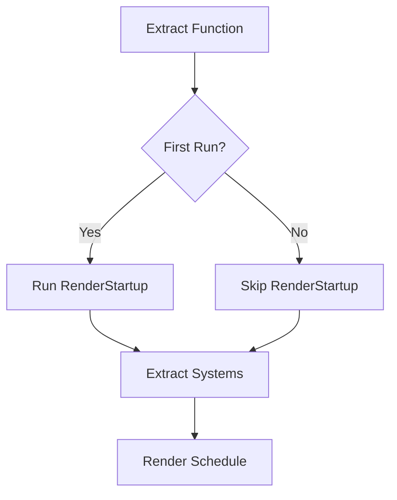

+++
title = "#19926 Run `RenderStartup` in/before extract instead of after it."
date = "2025-07-07T00:00:00"
draft = false
template = "pull_request_page.html"
in_search_index = true

[taxonomies]
list_display = ["show"]

[extra]
current_language = "en"
available_languages = {"en" = { name = "English", url = "/pull_request/bevy/2025-07/pr-19926-en-20250707" }, "zh-cn" = { name = "中文", url = "/pull_request/bevy/2025-07/pr-19926-zh-cn-20250707" }}
labels = ["C-Bug", "A-Rendering", "A-ECS", "D-Straightforward"]
+++

## Run `RenderStartup` in/before extract instead of after it

### Basic Information
- **Title**: Run `RenderStartup` in/before extract instead of after it.
- **PR Link**: https://github.com/bevyengine/bevy/pull/19926
- **Author**: andriyDev
- **Status**: MERGED
- **Labels**: C-Bug, A-Rendering, A-ECS, S-Ready-For-Final-Review, D-Straightforward
- **Created**: 2025-07-02T18:23:35Z
- **Merged**: 2025-07-07T01:53:02Z
- **Merged By**: alice-i-cecile

### Description Translation
# Objective

- Fixes #19910.

## Solution

- First, allow extraction function to be FnMut instead of Fn. FnMut is a superset of Fn anyway, and we only ever call this function once at a time (we would never call this in parallel for different pairs of worlds or something).
- Run the `RenderStartup` schedule in the extract function with a flag to only do it once.
- Remove all the `MainRender` stuff.

One sad part here is that now the `RenderStartup` blocks extraction. So for pipelined rendering, our simulation will be blocked on the first frame while we set up all the rendering resources. I don't see this as a big loss though since A) that is fundamentally what we want here - extraction **has to** run after `RenderStartup`, and the only way to do better is to somehow run `RenderStartup` in parallel with the first simulation frame, and B) without `RenderStartup` the **entire** app was blocked on initializing render resources during Plugin construction - so we're not really losing anything here.

## Testing

- I ran the `custom_post_processing` example (which was ported to use `RenderStartup` in #19886) and it still works.

## The Story of This Pull Request

This PR addresses a scheduling issue in Bevy's rendering pipeline where the `RenderStartup` schedule was running after the extraction phase. The core problem was that extraction systems might depend on resources initialized during `RenderStartup`, but due to the execution order, those resources weren't available during extraction. This caused #19910 where rendering setup wasn't properly completed before extraction began.

The solution required three coordinated changes. First, we modified the extract function signature from `Fn` to `FnMut` to allow it to maintain internal state. This change enables the second part: running `RenderStartup` conditionally within the extract function using a captured boolean flag. The flag ensures `RenderStartup` executes only once, before any extraction logic. Finally, we eliminated the custom `MainRender` schedule that previously managed `RenderStartup` execution, as it became redundant.

Here's how the closure captures the state:
```rust
let mut should_run_startup = true;
render_app.set_extract(move |main_world, render_world| {
    if should_run_startup {
        render_world.run_schedule(RenderStartup);
        should_run_startup = false;
    }
    // ... extraction logic ...
});
```

This approach ensures `RenderStartup` runs exactly once before extraction, resolving the resource dependency issue. The tradeoff is that the first frame's extraction is now blocked on `RenderStartup` initialization. However, this is acceptable since: 1) extraction fundamentally requires `RenderStartup` resources, and 2) without this change, the entire app was blocked during plugin initialization anyway.

During implementation, we needed to update related systems that interact with the extract function. The `take_extract` method now returns a mutable closure, requiring callers to use `as_mut()` instead of `as_ref()` when invoking the default extract function. We documented this change in the migration guide since it affects custom rendering setups.

Testing confirmed the solution works using the `custom_post_processing` example, which depends on proper `RenderStartup` timing. The changes maintain backward compatibility for most users while fixing the core scheduling issue.

## Visual Representation



## Key Files Changed

### 1. `crates/bevy_app/src/sub_app.rs` (+4/-4)
Changed extract function type to support mutable state required for conditional `RenderStartup` execution.

**Key Changes:**
```diff
- type ExtractFn = Box<dyn Fn(&mut World, &mut World) + Send>;
+ type ExtractFn = Box<dyn FnMut(&mut World, &mut World) + Send>;

pub fn set_extract<F>(&mut self, extract: F) -> &mut Self
where
-   F: Fn(&mut World, &mut World) + Send + 'static,
+   F: FnMut(&mut World, &mut World) + Send + 'static,
{
    self.extract = Some(Box::new(extract));
    self
}

- let default_fn = app.take_extract();
+ let mut default_fn = app.take_extract();
app.set_extract(move |main, render| {
    // ...
-   if let Some(f) = default_fn.as_ref() {
+   if let Some(f) = default_fn.as_mut() {
        f(main, render);
    }
});
```

### 2. `crates/bevy_render/src/lib.rs` (+14/-19)
Implemented core scheduling changes by running `RenderStartup` in extract and removing `MainRender`.

**Key Changes:**
```diff
- // Removed MainRender schedule
- #[derive(ScheduleLabel, Clone, Debug, PartialEq, Eq, Hash, Default)]
- pub struct MainRender;
- impl MainRender {
-   pub fn run(world: &mut World, mut run_at_least_once: Local<bool>) {
-       if !*run_at_least_once {
-           let _ = world.try_run_schedule(RenderStartup);
-           *run_at_least_once = true;
-       }
-       let _ = world.try_run_schedule(Render);
-   }
- }

// Update schedule assignment
- render_app.update_schedule = Some(MainRender.intern());
+ render_app.update_schedule = Some(Render.intern());

// Added conditional RenderStartup in extract
+ let mut should_run_startup = true;
render_app.set_extract(move |main_world, render_world| {
+   if should_run_startup {
+       render_world.run_schedule(RenderStartup);
+       should_run_startup = false;
+   }
    // ... existing extraction logic ...
});
```

### 3. `release-content/migration-guides/extract_fn_is_mut.md` (+10/-0)
Added migration note for `take_extract` return type change.

**New File Content:**
```markdown
---
title: `take_extract` now returns `dyn FnMut` instead of `dyn Fn`.
pull_requests: [19926]
---

Previously, `set_extract` accepted any `Fn`. Now we accept any `FnMut`. For callers of
`set_extract`, there is no difference since `Fn: FnMut`.

However, callers of `take_extract` will now be returned
`Option<Box<dyn FnMut(&mut World, &mut World) + Send>>` instead.
```

## Further Reading
1. [Bevy's ECS Scheduling Documentation](https://bevyengine.org/learn/book/getting-started/ecs/#schedules) - Understanding Bevy's schedule execution model
2. [Rust Closures: Fn, FnMut, FnOnce](https://doc.rust-lang.org/book/ch13-01-closures.html) - Differences between closure traits
3. [Original Issue #19910](https://github.com/bevyengine/bevy/issues/19910) - Problem description and context
4. [PR #19886](https://github.com/bevyengine/bevy/pull/19886) - Example migration that helped validate this fix