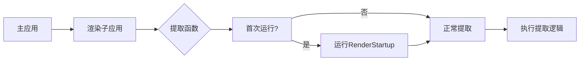

+++
title = "#19926 Run `RenderStartup` in/before extract instead of after it."
date = "2025-07-07T00:00:00"
draft = false
template = "pull_request_page.html"
in_search_index = false

[extra]
current_language = "zh-cn"
available_languages = {"en" = { name = "English", url = "/pull_request/bevy/2025-07/pr-19926-en-20250707" }, "zh-cn" = { name = "中文", url = "/pull_request/bevy/2025-07/pr-19926-zh-cn-20250707" }}
+++

# PR 分析报告：Run `RenderStartup` in/before extract instead of after it

## 基本信息
- **标题**: Run `RenderStartup` in/before extract instead of after it.
- **PR 链接**: https://github.com/bevyengine/bevy/pull/19926
- **作者**: andriyDev
- **状态**: MERGED
- **标签**: C-Bug, A-Rendering, A-ECS, S-Ready-For-Final-Review, D-Straightforward
- **创建时间**: 2025-07-02T18:23:35Z
- **合并时间**: 2025-07-07T01:53:02Z
- **合并人**: alice-i-cecile

## 描述翻译
### 目标
- 修复 #19910。

### 解决方案
- 首先，允许提取函数是 FnMut 而不是 Fn。FnMut 是 Fn 的超集，我们一次只调用这个函数一次（我们不会为不同的世界对并行调用这个函数）。
- 在提取函数中运行 `RenderStartup` 调度，使用一个标志确保只运行一次。
- 移除所有 `MainRender` 相关的代码。

这里的一个遗憾是现在 `RenderStartup` 会阻塞提取过程。对于流水线渲染(pipelined rendering)，我们的模拟会在第一帧被阻塞，同时我们设置所有渲染资源。我不认为这是一个重大损失，因为 A) 这本质上是我们想要的 - 提取**必须**在 `RenderStartup` 之后运行，更好的方法只能是通过某种方式让 `RenderStartup` 与第一帧模拟并行运行；B) 在没有 `RenderStartup` 的情况下，**整个**应用程序在插件构造期间初始化渲染资源时都会被阻塞 - 所以我们并没有真正损失什么。

### 测试
- 我运行了 `custom_post_processing` 示例（在 #19886 中被迁移以使用 `RenderStartup`），它仍然正常工作。

## PR 技术分析

### 问题背景
这个 PR 解决了一个关键问题：渲染资源初始化(`RenderStartup`)与数据提取(extraction)的顺序问题。在原始实现中：
1. `RenderStartup` 在 `MainRender` 调度中运行
2. `MainRender` 在提取阶段之后执行
3. 这导致第一帧提取时渲染资源尚未初始化（如管线、纹理等）
4. 结果：第一帧无法正确访问渲染资源，导致错误行为

### 解决方案设计
核心思路是将 `RenderStartup` 移动到提取阶段之前运行：
1. 将提取函数类型从 `Fn` 改为 `FnMut`，允许在闭包中保存状态
2. 在提取函数开始处添加条件逻辑，仅在首次运行时执行 `RenderStartup`
3. 完全移除 `MainRender` 调度机制

工程权衡考虑：
- **优势**：确保渲染资源在提取前初始化，解决第一帧问题
- **代价**：首次提取会阻塞直到 `RenderStartup` 完成
- **合理性**：原始实现中整个应用都在初始化时阻塞，现在只是将阻塞移到第一帧提取，实际影响更小

### 具体实现
关键变更集中在三个文件：

**1. `crates/bevy_app/src/sub_app.rs`**
```diff
- type ExtractFn = Box<dyn Fn(&mut World, &mut World) + Send>;
+ type ExtractFn = Box<dyn FnMut(&mut World, &mut World) + Send>;

  pub fn set_extract<F>(&mut self, extract: F) -> &mut Self
  where
-     F: Fn(&mut World, &mut World) + Send + 'static,
+     F: FnMut(&mut World, &mut World) + Send + 'static,
  {
      self.extract = Some(Box::new(extract));
      self
  }
```
- 为什么改：需要支持在闭包中保存状态（`should_run_startup` 标志）
- 兼容性：`Fn` 自动实现 `FnMut`，现有代码无需修改

**2. `crates/bevy_render/src/lib.rs`**
```diff
- pub struct MainRender;
- impl MainRender {
-     pub fn run(world: &mut World, mut run_at_least_once: Local<bool>) {
-         if !*run_at_least_once {
-             let _ = world.try_run_schedule(RenderStartup);
-             *run_at_least_once = true;
-         }
-         let _ = world.try_run_schedule(Render);
-     }
- }

  unsafe fn initialize_render_app(app: &mut App) {
      ...
-     render_app.update_schedule = Some(MainRender.intern());
+     render_app.update_schedule = Some(Render.intern());
      
      ...
-         .add_systems(MainRender, MainRender::run)
```
- 移除 `MainRender` 调度：不再需要这个间接层
- 直接使用 `Render` 调度作为更新调度

核心逻辑变更：
```rust
let mut should_run_startup = true;
render_app.set_extract(move |main_world, render_world| {
    if should_run_startup {
        render_world.run_schedule(RenderStartup);
        should_run_startup = false;
    }
    
    // 原有的提取逻辑...
});
```
- 使用闭包状态控制 `RenderStartup` 只运行一次
- 确保渲染资源在提取前初始化

**3. 新增迁移指南 `release-content/migration-guides/extract_fn_is_mut.md`**
```markdown
---
title: `take_extract` now returns `dyn FnMut` instead of `dyn Fn`.
pull_requests: [19926]
---

Previously, `set_extract` accepted any `Fn`. Now we accept any `FnMut`. For callers of
`set_extract`, there is no difference since `Fn: FnMut`.

However, callers of `take_extract` will now be returned
`Option<Box<dyn FnMut(&mut World, &mut World) + Send>>` instead.
```
- 文档化 API 变更
- 说明向后兼容性：`Fn` 自动满足 `FnMut` 约束

### 技术洞察
1. **闭包状态管理**：使用 `FnMut` 允许闭包捕获并修改外部变量（`should_run_startup`），这是实现"只运行一次"逻辑的关键
2. **调度系统整合**：将 `RenderStartup` 直接整合到提取流程，简化调度层次
3. **流水线渲染影响**：首次提取阻塞不可避免，因为提取依赖 `RenderStartup` 初始化的资源
4. **错误处理改进**：原始问题(#19910)是典型初始化顺序问题，此方案从根本上解决该问题

### 影响评估
1. **正确性**：确保渲染资源在提取前初始化，解决第一帧渲染问题
2. **性能**：首次提取有额外开销，但后续帧不受影响
3. **架构简化**：移除 `MainRender` 调度，减少系统复杂性
4. **兼容性**：`Fn` 到 `FnMut` 的变更保持向后兼容

## 组件关系图



## 关键文件变更

### `crates/bevy_app/src/sub_app.rs`
```diff
# File: crates/bevy_app/src/sub_app.rs
# Before:
type ExtractFn = Box<dyn Fn(&mut World, &mut World) + Send>;

pub fn set_extract<F>(&mut self, extract: F) -> &mut Self
where
    F: Fn(&mut World, &mut World) + Send + 'static,
{
    self.extract = Some(Box::new(extract));
    self
}

# After:
type ExtractFn = Box<dyn FnMut(&mut World, &mut World) + Send>;

pub fn set_extract<F>(&mut self, extract: F) -> &mut Self
where
    F: FnMut(&mut World, &mut World) + Send + 'static,
{
    self.extract = Some(Box::new(extract));
    self
}
```
- **变更原因**：支持在提取闭包中保存状态（首次运行标志）
- **影响**：使能在闭包中存储运行状态，为后续添加 `RenderStartup` 逻辑铺路

### `crates/bevy_render/src/lib.rs`
```diff
# File: crates/bevy_render/src/lib.rs
# Before:
pub struct MainRender;
impl MainRender {
    pub fn run(world: &mut World, mut run_at_least_once: Local<bool>) {
        if !*run_at_least_once {
            let _ = world.try_run_schedule(RenderStartup);
            *run_at_least_once = true;
        }
        let _ = world.try_run_schedule(Render);
    }
}

unsafe fn initialize_render_app(app: &mut App) {
    // ...
    render_app.update_schedule = Some(MainRender.intern());
    // ...
        .add_systems(MainRender, MainRender::run)
    
    render_app.set_extract(|main_world, render_world| {
        // 直接执行提取逻辑...
    });
}

# After:
unsafe fn initialize_render_app(app: &mut App) {
    // ...
    render_app.update_schedule = Some(Render.intern());
    // ... (移除MainRender相关代码)
    
    let mut should_run_startup = true;
    render_app.set_extract(move |main_world, render_world| {
        if should_run_startup {
            render_world.run_schedule(RenderStartup);
            should_run_startup = false;
        }
        // 原有的提取逻辑...
    });
}
```
- **核心变更**：直接在提取闭包中添加 `RenderStartup` 执行逻辑
- **架构简化**：完全移除 `MainRender` 调度和相关系统
- **状态管理**：使用闭包捕获的 `should_run_startup` 控制初始化只执行一次

### `release-content/migration-guides/extract_fn_is_mut.md`
```markdown
# 文件内容
---
title: `take_extract` now returns `dyn FnMut` instead of `dyn Fn`.
pull_requests: [19926]
---

Previously, `set_extract` accepted any `Fn`. Now we accept any `FnMut`. For callers of
`set_extract`, there is no difference since `Fn: FnMut`.

However, callers of `take_extract` will now be returned
`Option<Box<dyn FnMut(&mut World, &mut World) + Send>>` instead.
```
- **目的**：记录 API 变更
- **关键信息**：`take_extract` 返回类型变更，但 `set_extract` 保持兼容

## 延伸阅读
1. [Bevy 调度系统文档](https://docs.rs/bevy/latest/bevy/app/struct.App.html#method.add_systems)
2. [Rust Fn/FnMut/FnOnce 区别](https://doc.rust-lang.org/std/ops/trait.FnMut.html)
3. [原始 issue #19910](https://github.com/bevyengine/bevy/issues/19910)
4. [相关 PR #19886](https://github.com/bevyengine/bevy/pull/19886) (迁移 custom_post_processing 示例)