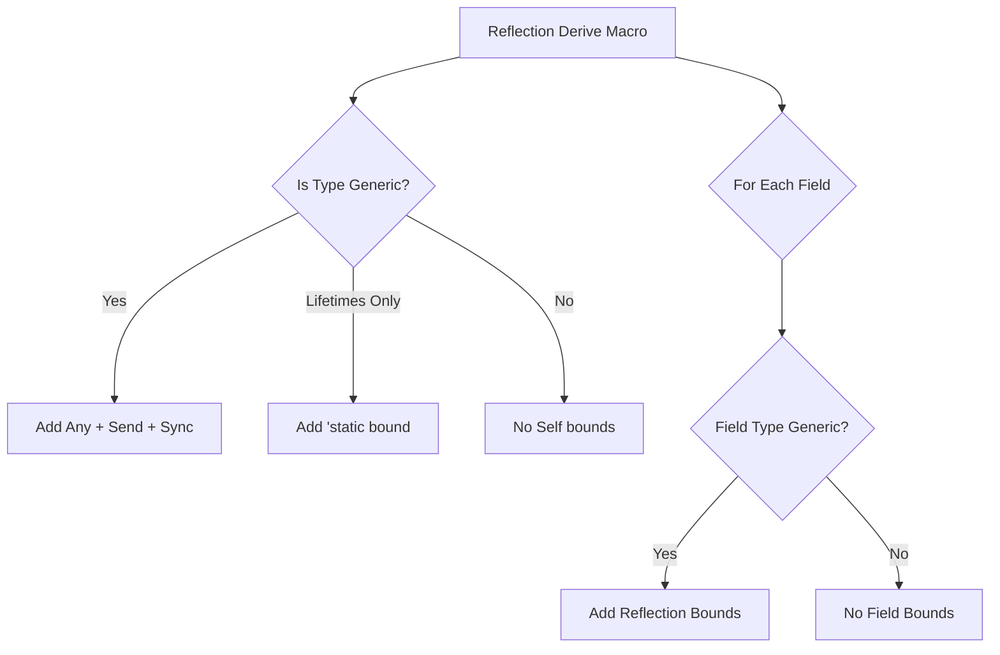

+++
title = "#19929 bevy_reflect: Avoid trait bounds on non-generic types"
date = "2025-07-07T00:00:00"
draft = false
template = "pull_request_page.html"
in_search_index = true

[taxonomies]
list_display = ["show"]

[extra]
current_language = "en"
available_languages = {"en" = { name = "English", url = "/pull_request/bevy/2025-07/pr-19929-en-20250707" }, "zh-cn" = { name = "中文", url = "/pull_request/bevy/2025-07/pr-19929-zh-cn-20250707" }}
labels = ["C-Performance", "C-Code-Quality", "A-Reflection", "D-Macros"]
+++

# Technical Report: PR #19929 - bevy_reflect: Avoid trait bounds on non-generic types

## Basic Information
- **Title**: bevy_reflect: Avoid trait bounds on non-generic types
- **PR Link**: https://github.com/bevyengine/bevy/pull/19929
- **Author**: nnethercote
- **Status**: MERGED
- **Labels**: C-Performance, C-Code-Quality, S-Ready-For-Final-Review, A-Reflection, X-Uncontroversial, D-Macros
- **Created**: 2025-07-03T00:45:16Z
- **Merged**: 2025-07-07T20:14:33Z
- **Merged By**: alice-i-cecile

## Description Translation
# Objective

All the derived reflection methods currently have multiple trait bounds on non-generic field types, which serve no purpose. The are emitted because "emit bounds on all fields" is easier than "emit bounds on fields that need them". But improving things isn't too hard.

Similarly, lots of useless `Any + Send + Sync` bounds exist on non-generic types.

Helps a lot with #19873.

## Solution

Remove the unnecessary bounds by only emitting them if the relevant type is generic.

## Testing

I used `cargo expand` to confirm the unnecessary bounds are no longer produced.

`-Zmacro-stats` output tells me this reduces the size of the `Reflect` code produced for `bevy_ui` by 21.2%.

## The Story of This Pull Request

### Problem Identification
The Bevy reflection system's derive macros were generating unnecessary trait bounds in `where` clauses. Specifically:
1. Non-generic field types received reflection trait bounds (`TypePath`, `FromReflect`, etc.) even though they didn't require them
2. Non-generic types received `Any + Send + Sync` bounds that served no purpose

This happened because the macro implementation took a simpler approach of applying bounds to all fields rather than selectively applying them only where needed. While functional, this caused:
- Code bloat in derived implementations
- Longer compile times
- Potential confusion about actual requirements

The problem was particularly noticeable in large projects like `bevy_ui`, where macro expansion size increased significantly due to these redundant bounds.

### Solution Approach
The solution involved modifying the `bevy_reflect` derive macro to conditionally apply bounds:
1. For the `Self` type:
   - Add `Any + Send + Sync` only if the type is generic over types
   - Add `'static` bound only if generic over lifetimes but not types
   - Add no bounds for non-generic types
   
2. For field types:
   - Only apply reflection bounds if the field type contains any of the struct's generic type parameters
   - Use token stream analysis to detect generic field types

Additionally, we removed redundant `Any + Send + Sync` bounds from atomic type implementations in `core/sync.rs` since these types are non-generic.

### Implementation Details
The core changes occurred in the `where_clause_options.rs` file where we:
1. Replaced the unconditional `required_bounds` with conditional logic
2. Added token stream analysis to detect generic field types
3. Refactored the `where` clause generation to:
   - Preserve existing user-defined bounds
   - Conditionally add `Self` bounds
   - Conditionally add field bounds

For atomic types in `sync.rs`, we removed the redundant `where T: Any + Send + Sync` constraints since atomic types are concrete and non-generic.

### Technical Insights
The key innovation was the `is_any_ident_in_token_stream` function that determines if a field type is generic by:
1. Collecting all type parameter identifiers from the struct
2. Scanning the field type's token stream for these identifiers
3. Only applying bounds if any identifiers are found

This approach avoids complex type analysis while correctly identifying when a field type depends on generic parameters. The implementation makes pragmatic tradeoffs between precision and complexity.

### Impact and Benefits
- **21.2% reduction** in generated `Reflect` code size for `bevy_ui`
- Cleaner, more focused trait bounds in derived implementations
- Reduced compile times due to smaller macro expansions
- Maintained backward compatibility with existing reflection attributes
- Sets foundation for further reflection optimizations (#19873)

The changes demonstrate how selective trait bound application can significantly reduce generated code size without sacrificing functionality.

## Visual Representation



## Key Files Changed

### 1. `crates/bevy_reflect/derive/src/where_clause_options.rs` (+107/-53)
**Purpose:** Implements conditional trait bound generation for reflection derives.

**Key Changes:**
- Added type genericity detection for `Self` bounds
- Implemented token-based generic field detection
- Removed unconditional `required_bounds`

**Code Snippet (Conditional Self Bounds):**
```rust
let generics = self.meta.type_path().generics();
if generics.type_params().next().is_some() {
    // Generic over types? We need `Any + Send + Sync`.
    let this = self.meta.type_path().true_type();
    generic_where_clause.extend(quote! { #this: #FQAny + #FQSend + #FQSync, });
} else if generics.lifetimes().next().is_some() {
    // Generic only over lifetimes? We need `'static`.
    let this = self.meta.type_path().true_type();
    generic_where_clause.extend(quote! { #this: 'static, });
}
```

**Code Snippet (Generic Field Detection):**
```rust
fn is_any_ident_in_token_stream(idents: &[Ident], token_stream: TokenStream) -> bool {
    for token_tree in token_stream {
        match token_tree {
            TokenTree::Ident(ident) => {
                if idents.contains(&ident) {
                    return true;
                }
            }
            TokenTree::Group(group) => {
                if is_any_ident_in_token_stream(idents, group.stream()) {
                    return true;
                }
            }
            TokenTree::Punct(_) | TokenTree::Literal(_) => {}
        }
    }
    false
}
```

### 2. `crates/bevy_reflect/src/impls/core/sync.rs` (+5/-18)
**Purpose:** Remove redundant bounds from atomic type implementations.

**Key Changes:**
- Eliminated `where T: Any + Send + Sync` constraints
- Simplified trait implementations for atomic types

**Code Snippet (Before):**
```rust
impl GetTypeRegistration for $ty
where
    $ty: Any + Send + Sync,
{
    // Implementation
}
```

**Code Snippet (After):**
```rust
impl GetTypeRegistration for $ty {
    // Implementation without unnecessary bounds
}
```

### 3. `crates/bevy_reflect/derive/src/lib.rs` (+5/-5)
**Purpose:** Updated documentation to reflect new where clause behavior.

**Code Snippet (Documentation Update):**
```diff
- /// //   Self: Any + Send + Sync,
- /// //   Vec<Foo>: FromReflect + TypePath,
+ /// //   Foo<T, U>: Any + Send + Sync,
+ /// //   Vec<Foo>: FromReflect + ...,
```

### 4. `crates/bevy_reflect/src/lib.rs` (+5/-0)
**Purpose:** Added dead code allowances for test structs.

**Code Snippet:**
```rust
#[expect(dead_code, reason = "Bar is never constructed")]
```

## Further Reading
1. [Rust Procedural Macros Guide](https://doc.rust-lang.org/reference/procedural-macros.html)
2. [TokenStream Processing](https://docs.rs/proc-macro2/latest/proc_macro2/struct.TokenStream.html)
3. [Bevy Reflection Documentation](https://docs.rs/bevy_reflect/latest/bevy_reflect/)
4. [Trait Bound Optimization Patterns](https://github.com/rust-lang/api-guidelines/discussions/29)