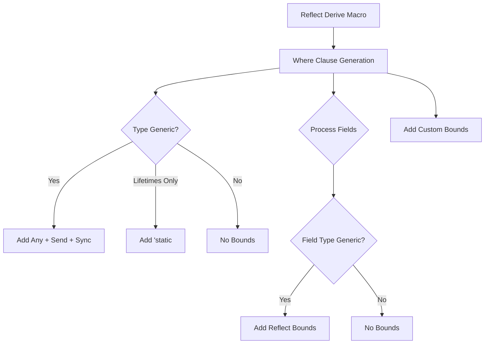

+++
title = "#19929 bevy_reflect: Avoid trait bounds on non-generic types"
date = "2025-07-07T00:00:00"
draft = false
template = "pull_request_page.html"
in_search_index = false

[extra]
current_language = "zh-cn"
available_languages = {"en" = { name = "English", url = "/pull_request/bevy/2025-07/pr-19929-en-20250707" }, "zh-cn" = { name = "中文", url = "/pull_request/bevy/2025-07/pr-19929-zh-cn-20250707" }}
labels = ["C-Performance", "C-Code-Quality", "A-Reflection", "D-Macros"]
+++

# bevy_reflect: Avoid trait bounds on non-generic types

## Basic Information
- **Title**: bevy_reflect: Avoid trait bounds on non-generic types
- **PR Link**: https://github.com/bevyengine/bevy/pull/19929
- **Author**: nnethercote
- **Status**: MERGED
- **Labels**: C-Performance, C-Code-Quality, S-Ready-For-Final-Review, A-Reflection, X-Uncontroversial, D-Macros
- **Created**: 2025-07-03T00:45:16Z
- **Merged**: 2025-07-07T20:14:33Z
- **Merged By**: alice-i-cecile

## Description Translation
### 目标

当前所有派生的反射方法在非泛型字段类型上都有多个 trait 约束，这些约束没有实际作用。它们之所以被生成，是因为"在所有字段上生成约束"比"只在需要约束的字段上生成"更容易实现。但改进这一点并不困难。

类似地，在非泛型类型上存在大量无用的 `Any + Send + Sync` 约束。

这有助于解决 #19873。

### 解决方案

通过仅在相关类型是泛型时才生成约束，从而移除不必要的约束。

### 测试

我使用 `cargo expand` 确认了不必要的约束不再生成。

`-Zmacro-stats` 的输出显示，这为 `bevy_ui` 生成的 `Reflect` 代码大小减少了 21.2%。

## The Story of This Pull Request

在 Bevy 的反射系统中，使用 `#[derive(Reflect)]` 宏自动为类型实现反射 trait 时，会生成一系列 trait 约束。这些约束包括：
- 为类型自身添加 `Any + Send + Sync` 约束
- 为类型参数添加 `TypePath` 约束
- 为活跃字段添加 `TypePath`、`FromReflect` 等约束

然而，这些约束对于非泛型类型和字段是多余的，因为它们：
1. 不提供实际价值（非泛型类型已满足这些约束）
2. 增加编译时间和代码膨胀
3. 在某些情况下导致不必要的编译错误（如 #19873）

问题根源在于宏的约束生成逻辑过于简单：它为所有类型统一生成约束，而不是区分泛型和非泛型类型。具体表现有：
- 非泛型类型被添加 `Any + Send + Sync` 约束，虽然它们已经隐式满足
- 非泛型字段类型被添加反射相关约束（`TypePath`、`FromReflect` 等），即使它们不需要
- 宏生成的约束可能形成递归依赖链，导致编译失败

解决方案的核心是重构约束生成逻辑，使其更智能：
1. 只为泛型类型添加 `Any + Send + Sync` 约束
   - 纯生命周期泛型类型添加 `'static` 约束
   - 非泛型类型不添加额外约束
2. 只为包含泛型参数的字段添加反射约束
3. 保留用户通过 `#[reflect(where)]` 添加的自定义约束

实现的关键在 `WhereClauseOptions` 结构：
- 通过检查泛型参数列表判断类型是否泛型
- 对字段类型，检查其 token stream 是否包含类型参数标识符
- 只有包含泛型参数的字段才生成反射约束

```rust
// 判断字段类型是否包含泛型参数
fn is_any_ident_in_token_stream(idents: &[Ident], token_stream: TokenStream) -> bool {
    for token_tree in token_stream {
        match token_tree {
            TokenTree::Ident(ident) => {
                if idents.contains(&ident) {
                    return true;
                }
            }
            TokenTree::Group(group) => {
                if is_any_ident_in_token_stream(idents, group.stream()) {
                    return true;
                }
            }
            _ => {}
        }
    }
    false
}
```

这个检查确保只为泛型字段添加约束：
```rust
let is_generic = is_any_ident_in_token_stream(&type_param_idents, ty.to_token_stream());
is_generic.then(|| {
    quote!(#ty: #reflect_bound + TypePath + MaybeTyped + RegisterForReflection)
})
```

同时优化了原子类型(`AtomicBool`等)的实现，移除了冗余的 `where` 约束：
```rust
// 修改前
impl GetTypeRegistration for AtomicBool where AtomicBool: Any + Send + Sync { ... }

// 修改后
impl GetTypeRegistration for AtomicBool { ... }
```

测试验证：
1. 使用 `cargo expand` 确认约束生成正确
2. `-Zmacro-stats` 显示 `bevy_ui` 的反射代码减少 21.2%
3. 更新单元测试确保边界情况覆盖

此优化减少了生成的代码量，提高了编译效率，同时解决了特定场景下的编译错误。约束生成逻辑现在更精确，只添加必要的约束，使宏的行为更符合开发者预期。

## Visual Representation



## Key Files Changed

### crates/bevy_reflect/derive/src/where_clause_options.rs (+107/-53)
重构了 where 子句生成逻辑，引入泛型类型检测：
```rust
// 判断类型是否为泛型
let generics = self.meta.type_path().generics();
if generics.type_params().next().is_some() {
    // 为泛型类型添加 Any + Send + Sync
    let this = self.meta.type_path().true_type();
    generic_where_clause.extend(quote! { #this: #FQAny + #FQSend + #FQSync, });
} else if generics.lifetimes().next().is_some() {
    // 纯生命周期泛型添加 'static
    let this = self.meta.type_path().true_type();
    generic_where_clause.extend(quote! { #this: 'static, });
}

// 检测字段类型是否包含泛型参数
let is_generic = is_any_ident_in_token_stream(&type_param_idents, ty.to_token_stream());
is_generic.then(|| {
    quote!(#ty: #reflect_bound + TypePath + MaybeTyped + RegisterForReflection)
})
```

### crates/bevy_reflect/src/impls/core/sync.rs (+5/-18)
移除了原子类型实现的冗余约束：
```rust
// 修改前
impl GetTypeRegistration for $ty where $ty: Any + Send + Sync { ... }

// 修改后
impl GetTypeRegistration for $ty { ... }
```

### crates/bevy_reflect/derive/src/lib.rs (+5/-5)
更新文档注释以反映新的约束行为：
```diff
-//   Vec<Foo>: FromReflect + TypePath,
+//   Vec<Foo>: FromReflect + ...,
```

### crates/bevy_reflect/src/lib.rs (+5/-0)
为测试添加 dead_code 抑制：
```rust
#[expect(dead_code, reason = "Bar is never constructed")]
struct Bar;
```

## Further Reading
1. [Rust 过程宏开发指南](https://doc.rust-lang.org/reference/procedural-macros.html)
2. [Bevy 反射系统文档](https://docs.rs/bevy_reflect/latest/bevy_reflect/)
3. [TokenStream 处理技巧](https://docs.rs/proc-macro2/latest/proc_macro2/struct.TokenStream.html)