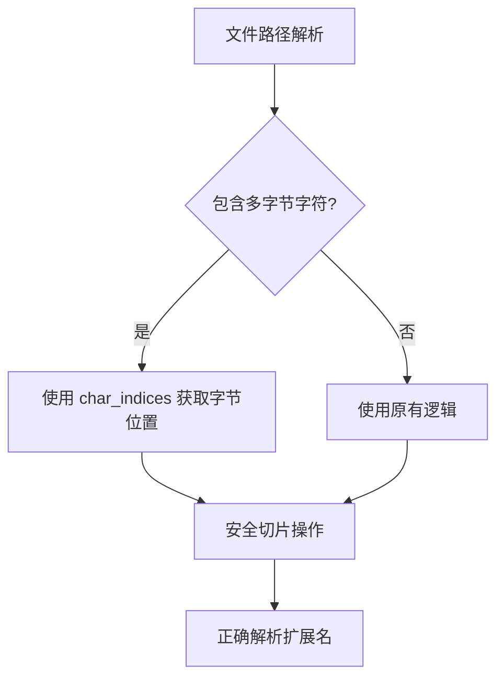

+++
title = "#19933 fix panic looking for extension in multibyte unicode paths"
date = "2025-07-05T00:00:00"
draft = false
template = "pull_request_page.html"
in_search_index = false

[extra]
current_language = "zh-cn"
available_languages = {"en" = { name = "English", url = "/pull_request/bevy/2025-07/pr-19933-en-20250705" }, "zh-cn" = { name = "中文", url = "/pull_request/bevy/2025-07/pr-19933-zh-cn-20250705" }}
+++

# fix panic looking for extension in multibyte unicode paths

## 基本信息
- **标题**: fix panic looking for extension in multibyte unicode paths
- **PR链接**: https://github.com/bevyengine/bevy/pull/19933
- **作者**: robtfm
- **状态**: 已合并
- **标签**: C-Bug, D-Trivial, A-Assets, P-Crash, S-Ready-For-Final-Review
- **创建时间**: 2025-07-03T12:00:04Z
- **合并时间**: 2025-07-03T22:47:26Z
- **合并人**: alice-i-cecile

## 描述翻译
### Objective

```
2025-07-03T11:48:34.039501Z ERROR panic: thread 'IO Task Pool (6)' panicked at 'byte index 9 is not a char boundary; it is inside '个' (bytes 7..10) of `展示_个人收款码.png`': [...]\crates\bevy_asset\src\path.rs:475
```

### Solution
char_indices

## PR 分析报告

### 问题背景
在 Bevy 的 Asset 系统中处理包含多字节 Unicode 字符（如中文）的文件路径时，当尝试解析文件扩展名会出现 panic。具体错误发生在 `path.rs` 文件的第 475 行，系统尝试在非字符边界位置分割字节序列（如中文字符'个'占 3 个字节）。典型崩溃场景是处理类似 `展示_个人收款码.png` 的文件名时，系统错误地将索引位置 9 识别为字符边界，但实际上该位置位于多字节字符中间。

问题的核心是 UTF-8 编码特性：单个 Unicode 字符可能占用 1-4 个字节。原始实现使用 `chars().enumerate()` 遍历字符，但返回的索引是字符计数而非字节位置。当使用字符索引进行字符串切片时，如果索引落在多字节字符中间，会导致无效的字节边界访问。

### 解决方案
将字符遍历方法从 `chars().enumerate()` 替换为 `char_indices()`。关键区别在于：
- `chars().enumerate()` 返回 `(字符索引, char)`
- `char_indices()` 返回 `(字节位置, char)`

通过获取每个字符的实际字节偏移量，确保后续字符串切片操作始终在有效的 UTF-8 边界执行。

### 实现分析
修改集中在 `iter_secondary_extensions` 函数，该函数负责解析复合扩展名（如 `tar.gz`）。原始实现错误地使用字符索引进行切片：

```rust
// 修改前：使用字符索引导致多字节字符处理错误
full_extension.chars().enumerate().filter_map(|(i, c)| {
    if c == '.' {
        Some(&full_extension[i + 1..]) // 危险：i 是字符索引而非字节位置
    } else {
        None
    }
})
```

修改后实现使用字节位置确保安全分割：

```rust
// 修改后：使用字节位置保证字符边界安全
full_extension.char_indices().filter_map(|(i, c)| {
    if c == '.' {
        Some(&full_extension[i + 1..]) // i 现在是正确的字节偏移量
    } else {
        None
    }
})
```

### 技术要点
1. **UTF-8 边界安全**：Rust 的字符串切片要求索引必须是有效的 UTF-8 字符边界。`char_indices` 提供每个字符的起始字节位置，确保 `i + 1` 始终指向下一个字符的有效起始位置。
2. **零成本抽象**：该修改保持原有算法逻辑不变，仅替换遍历方法，未引入额外开销。
3. **错误预防**：修复了特定场景下的 panic，但未改变函数的核心行为或接口。

### 影响评估
1. **稳定性提升**：彻底解决多字节路径处理时的崩溃问题
2. **国际化支持**：确保非 ASCII 路径（中文、日文、表情符号等）被正确处理
3. **最小改动**：单文件单行修改，维护成本低且无破坏性变更风险

## 关键文件变更

### crates/bevy_asset/src/path.rs
**变更描述**：修复多字节 Unicode 路径扩展名解析时的 panic

```rust
// Before:
full_extension.chars().enumerate().filter_map(|(i, c)| {

// After:
full_extension.char_indices().filter_map(|(i, c)| {
```

**技术说明**：
- `chars().enumerate()` 返回字符索引（第几个字符）
- `char_indices()` 返回字节偏移量（字符在字节序列中的起始位置）
- 修改确保 `i + 1` 始终是有效的 UTF-8 边界位置

## 技术图示



## 延伸阅读
1. Rust 字符串处理官方文档：  
   https://doc.rust-lang.org/std/string/struct.String.html
2. UTF-8 编码原理：  
   https://en.wikipedia.org/wiki/UTF-8
3. Rust 字符边界安全规范：  
   https://doc.rust-lang.org/std/primitive.str.html#method.is_char_boundary

## 完整代码变更
```diff
diff --git a/crates/bevy_asset/src/path.rs b/crates/bevy_asset/src/path.rs
index 3f780e3fb7b64..ed189a683b35d 100644
--- a/crates/bevy_asset/src/path.rs
+++ b/crates/bevy_asset/src/path.rs
@@ -480,7 +480,7 @@ impl<'a> AssetPath<'a> {
     }
 
     pub(crate) fn iter_secondary_extensions(full_extension: &str) -> impl Iterator<Item = &str> {
-        full_extension.chars().enumerate().filter_map(|(i, c)| {
+        full_extension.char_indices().filter_map(|(i, c)| {
             if c == '.' {
                 Some(&full_extension[i + 1..])
             } else {
```