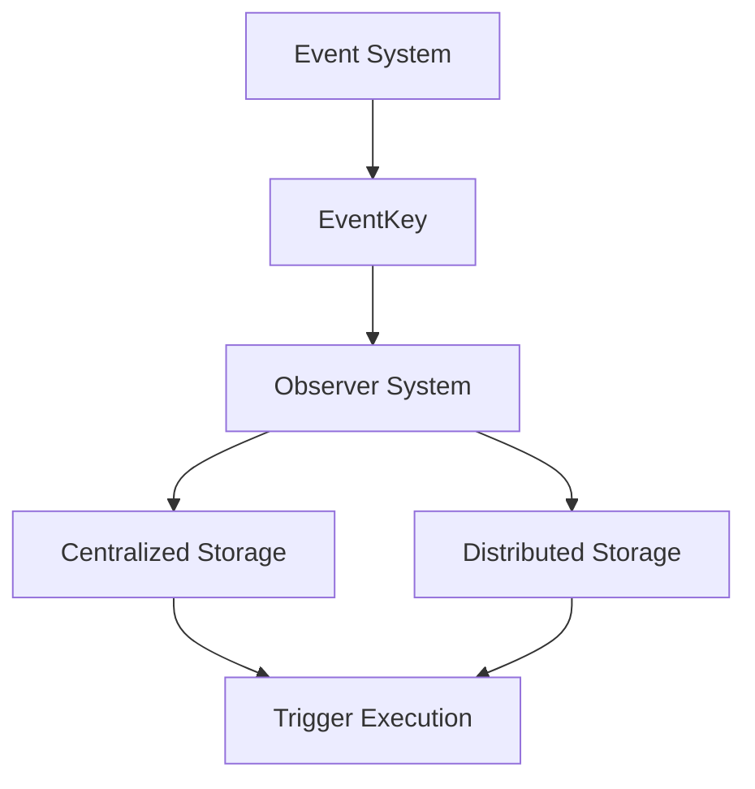

+++
title = "#19935 Observer trigger refactor"
date = "2025-07-05T00:00:00"
draft = false
template = "pull_request_page.html"
in_search_index = true

[taxonomies]
list_display = ["show"]

[extra]
current_language = "en"
available_languages = {"en" = { name = "English", url = "/pull_request/bevy/2025-07/pr-19935-en-20250705" }, "zh-cn" = { name = "中文", url = "/pull_request/bevy/2025-07/pr-19935-zh-cn-20250705" }}
labels = ["A-ECS", "C-Code-Quality"]
+++

# Observer Trigger Refactor: Introducing EventKey for Clearer Event Identification

## Basic Information
- **Title**: Observer trigger refactor
- **PR Link**: https://github.com/bevyengine/bevy/pull/19935
- **Author**: Zeophlite
- **Status**: MERGED
- **Labels**: A-ECS, C-Code-Quality, S-Ready-For-Final-Review, M-Needs-Release-Note
- **Created**: 2025-07-03T16:12:43Z
- **Merged**: 2025-07-04T16:47:14Z
- **Merged By**: alice-i-cecile

## Description Translation
# Objective

- The usage of ComponentId is quite confusing: events are not components. By newtyping this, we can prevent stupid mistakes, avoid leaking internal details and make the code clearer for users and engine devs reading it.
- Adopts https://github.com/bevyengine/bevy/pull/19755

## The Story of This Pull Request

### The Problem and Context
The core issue stemmed from Bevy's internal use of `ComponentId` to identify events in its observer system. While technically functional, this approach created conceptual confusion since events are fundamentally different from components. Using the same identifier type for both domains made the code harder to understand and increased the risk of misuse. Developers might mistakenly treat events as components or pass component IDs where event identifiers were expected. This abstraction leakage also made the codebase less maintainable by exposing implementation details that should remain internal to the event system.

### The Solution Approach
The solution introduces a new type `EventKey` that wraps a `ComponentId` while providing a semantically accurate abstraction for event identification. This type-safe wrapper clearly distinguishes events from components at the type level while maintaining the existing internal representation. The implementation follows these key steps:
1. Create `EventKey` as a newtype wrapper around `ComponentId`
2. Update the `Event` trait to use `EventKey` instead of `ComponentId`
3. Refactor all observer-related systems to accept `EventKey`
4. Preserve existing functionality while improving type safety

This approach maintains compatibility with the existing event infrastructure while providing clearer semantics. No performance impact is expected since the newtype wrapper is zero-cost at runtime.

### The Implementation
The implementation systematically replaces `ComponentId` with `EventKey` throughout Bevy's event and observer systems. The `Event` trait methods `register_component_id` and `component_id` are renamed to `register_event_key` and `event_key` respectively, returning `EventKey` instead of `ComponentId`. Lifecycle event constants (ADD, INSERT, etc.) are updated to use `EventKey`:

```rust
// Before:
pub const ADD: ComponentId = ComponentId::new(0);

// After:
pub const ADD: EventKey = EventKey(ComponentId::new(0));
```

The `ObserverDescriptor` struct now stores events as `Vec<EventKey>` instead of `Vec<ComponentId>`, making its purpose clearer. The `Observers` struct's cache now maps `EventKey` to observers rather than `ComponentId`:

```rust
// Before:
cache: HashMap<ComponentId, CachedObservers>

// After:
cache: HashMap<EventKey, CachedObservers>
```

All observer triggering functions now accept `EventKey` instead of `ComponentId`, including critical methods like `invoke` in the centralized storage and `trigger_observers` in the deferred world. The `ObserverTrigger` struct also replaces its `event_type` field with `event_key`.

### Technical Insights
The `EventKey` implementation includes a helper method to access the underlying `ComponentId` when needed for internal operations:

```rust
impl EventKey {
    pub(crate) fn component_id(&self) -> ComponentId {
        self.0
    }
}
```

This preserves the existing internal representation while providing a clean abstraction boundary. The PR leverages Rust's type system to enforce proper usage patterns - developers can no longer accidentally pass a component ID where an event identifier is expected. The changes are comprehensive but focused, affecting approximately 12 files with consistent replacement patterns.

### The Impact
This refactor significantly improves code clarity and type safety in Bevy's event system. By distinguishing event identifiers from component identifiers:
1. The code becomes more self-documenting
2. Potential misuse errors are caught at compile time
3. Internal implementation details are better encapsulated
4. Future extensions to the event system have a clearer foundation

The changes are backward-compatible with existing event usage patterns. While primarily an internal refactor, this improvement makes the codebase more approachable for both engine maintainers and users extending the event system.

## Visual Representation



## Key Files Changed

### `crates/bevy_ecs/src/event/base.rs`
Introduced `EventKey` and updated the `Event` trait methods. Key changes:
```rust
// Before:
fn register_component_id(world: &mut World) -> ComponentId { ... }
fn component_id(world: &World) -> Option<ComponentId> { ... }

// After:
fn register_event_key(world: &mut World) -> EventKey { ... }
fn event_key(world: &World) -> Option<EventKey> { ... }

// New type:
#[derive(Debug, Copy, Clone, Hash, Ord, PartialOrd, Eq, PartialEq)]
pub struct EventKey(pub(crate) ComponentId);
```

### `crates/bevy_ecs/src/lifecycle.rs`
Updated lifecycle event constants to use `EventKey`:
```rust
// Before:
pub const ADD: ComponentId = ComponentId::new(0);

// After:
pub const ADD: EventKey = EventKey(ComponentId::new(0));
```

### `crates/bevy_ecs/src/observer/centralized_storage.rs`
Refactored observer storage to use `EventKey`:
```rust
// Before:
cache: HashMap<ComponentId, CachedObservers>
pub fn get_observers_mut(&mut self, event_type: ComponentId) -> &mut CachedObservers

// After:
cache: HashMap<EventKey, CachedObservers>
pub fn get_observers_mut(&mut self, event_key: EventKey) -> &mut CachedObservers
```

### `crates/bevy_ecs/src/observer/mod.rs`
Updated trigger methods to use `EventKey`:
```rust
// Before:
world.trigger_observers(event_id, ...)

// After:
world.trigger_observers(event_key, ...)
```

### `crates/bevy_ecs/src/observer/system_param.rs`
Updated the `ObserverTrigger` struct:
```rust
// Before:
pub event_type: ComponentId,

// After:
pub event_key: EventKey,
```

## Further Reading
1. [Newtype Pattern in Rust](https://doc.rust-lang.org/rust-by-example/generics/new_types.html)
2. [Bevy ECS Events Documentation](https://docs.rs/bevy_ecs/latest/bevy_ecs/event/index.html)
3. [Related PR #19755: Observer System Refactor](https://github.com/bevyengine/bevy/pull/19755)
4. [Rust API Guidelines on Newtypes](https://rust-lang.github.io/api-guidelines/type-safety.html#newtypes-provide-static-distinctions-c-newtype)