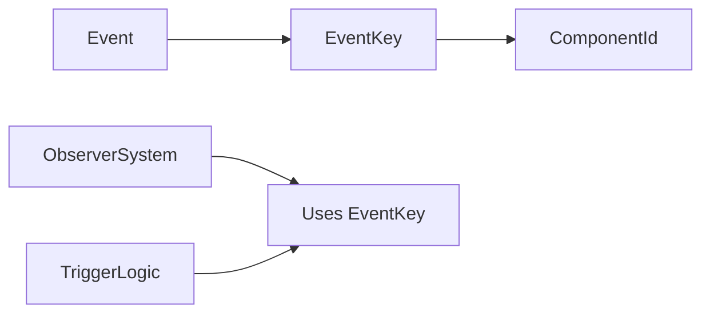

+++
title = "#19935 Observer trigger refactor"
date = "2025-07-05T00:00:00"
draft = false
template = "pull_request_page.html"
in_search_index = false

[extra]
current_language = "zh-cn"
available_languages = {"en" = { name = "English", url = "/pull_request/bevy/2025-07/pr-19935-en-20250705" }, "zh-cn" = { name = "中文", url = "/pull_request/bevy/2025-07/pr-19935-zh-cn-20250705" }}
labels = ["A-ECS", "C-Code-Quality"]
+++

# Observer trigger refactor

## Basic Information
- **Title**: Observer trigger refactor
- **PR Link**: https://github.com/bevyengine/bevy/pull/19935
- **Author**: Zeophlite
- **Status**: MERGED
- **Labels**: A-ECS, C-Code-Quality, S-Ready-For-Final-Review, M-Needs-Release-Note
- **Created**: 2025-07-03T16:12:43Z
- **Merged**: 2025-07-04T16:47:14Z
- **Merged By**: alice-i-cecile

## Description Translation
该PR的目标是：
- 消除使用`ComponentId`表示事件的混淆：事件不是组件。通过新类型包装（newtype）此概念，我们可以防止错误，避免内部细节泄露，使代码对用户和引擎开发者更清晰。
- 采用https://github.com/bevyengine/bevy/pull/19755


## The Story of This Pull Request

### 问题背景
在Bevy ECS系统中，事件（Event）和组件（Component）是两种不同的概念，但观察者（Observer）系统的触发机制却使用`ComponentId`来表示事件类型。这造成了几个问题：
1. 概念混淆：事件不是组件，但使用组件ID表示事件类型
2. 类型安全缺失：可能错误地将组件ID传递给期望事件ID的API
3. 代码可读性差：开发人员需要理解`ComponentId`被重用于事件这一实现细节

例如在原始代码中：
```rust
// 使用ComponentId表示事件类型
fn register_component_id(world: &mut World) -> ComponentId { ... }
```
这种设计暴露了内部实现，并可能引发误用。

### 解决方案
为了解决这些问题，PR引入了`EventKey`新类型来专门表示事件标识符：
```rust
pub struct EventKey(pub(crate) ComponentId);
```
这个新类型封装了原来的`ComponentId`但提供了以下改进：
1. 类型安全：明确区分事件键和组件ID
2. 概念清晰：通过类型名称表明其用途
3. 封装性：隐藏了使用组件ID存储事件的实现细节

关键修改包括：
1. 将`Event` trait中所有使用`ComponentId`的方法改为使用`EventKey`
2. 更新所有事件处理逻辑使用`EventKey`替代`ComponentId`
3. 重命名相关方法以反映新概念（如`component_id()`改为`event_key()`）

### 实现细节
PR系统性地替换了代码库中使用`ComponentId`表示事件的所有位置。例如在`Event` trait中：

```rust
// Before:
fn register_component_id(world: &mut World) -> ComponentId {
    world.register_component::<EventWrapperComponent<Self>>()
}

// After:
fn register_event_key(world: &mut World) -> EventKey {
    EventKey(world.register_component::<EventWrapperComponent<Self>>())
}
```

观察者系统的核心逻辑也相应更新，现在使用`EventKey`来索引观察者：
```rust
// Before:
cache: HashMap<ComponentId, CachedObservers>,

// After:
cache: HashMap<EventKey, CachedObservers>,
```

生命周期事件常量也被更新为使用`EventKey`：
```rust
// Before:
pub const ADD: ComponentId = ComponentId::new(0);

// After:
pub const ADD: EventKey = EventKey(ComponentId::new(0));
```

### 技术考量
1. **向后兼容**：由于`EventKey`是`ComponentId`的简单封装，现有功能完全保持兼容
2. **性能影响**：零成本抽象，运行时性能无变化
3. **错误预防**：类型系统现在能捕获组件ID和事件键的误用
4. **概念清晰**：代码现在明确区分了组件和事件的概念

### 影响
这些修改带来了以下改进：
1. **API清晰度提升**：事件相关方法现在使用`event_key`命名，明确其用途
2. **错误减少**：类型系统防止了组件ID和事件键的混淆使用
3. **维护性增强**：事件处理逻辑不再依赖组件系统的实现细节
4. **文档改进**：代码注释现在准确反映事件处理的实际机制

## Visual Representation



## Key Files Changed

### 1. `crates/bevy_ecs/src/event/base.rs`
**修改原因**：定义`EventKey`新类型并更新`Event` trait
**关键变更**：
```rust
// 新增EventKey定义
#[derive(Debug, Copy, Clone, Hash, Ord, PartialOrd, Eq, PartialEq)]
pub struct EventKey(pub(crate) ComponentId);

// 更新Event trait方法
pub trait Event: Send + Sync + 'static {
    fn register_event_key(world: &mut World) -> EventKey {
        EventKey(world.register_component::<EventWrapperComponent<Self>>())
    }
    
    fn event_key(world: &World) -> Option<EventKey> {
        world
            .component_id::<EventWrapperComponent<Self>>()
            .map(EventKey)
    }
}
```

### 2. `crates/bevy_ecs/src/observer/mod.rs`
**修改原因**：更新观察者触发逻辑使用`EventKey`
**关键变更**：
```rust
// Before:
let event_id = E::register_component_id(self);
unsafe {
    self.trigger_dynamic_ref_with_caller(event_id, &mut event, caller);
}

// After:
let event_key = E::register_event_key(self);
unsafe {
    self.trigger_dynamic_ref_with_caller(event_key, &mut event, caller);
}
```

### 3. `crates/bevy_ecs/src/observer/centralized_storage.rs`
**修改原因**：更新观察者存储使用`EventKey`作为键
**关键变更**：
```rust
// Before:
cache: HashMap<ComponentId, CachedObservers>,

// After:
cache: HashMap<EventKey, CachedObservers>,
```

### 4. `crates/bevy_ecs/src/lifecycle.rs`
**修改原因**：更新生命周期事件常量使用`EventKey`
**关键变更**：
```rust
// Before:
pub const ADD: ComponentId = ComponentId::new(0);

// After:
pub const ADD: EventKey = EventKey(ComponentId::new(0));
```

### 5. `crates/bevy_ecs/src/observer/distributed_storage.rs`
**修改原因**：更新观察者描述符使用`EventKey`
**关键变更**：
```rust
// Before:
pub(super) events: Vec<ComponentId>,

// After:
pub(super) events: Vec<EventKey>,
```

## Further Reading
1. [Newtype Pattern in Rust](https://doc.rust-lang.org/rust-by-example/generics/new_types.html)
2. [Bevy ECS Events Documentation](https://bevyengine.org/learn/book/events/)
3. [Type Safety in System Design](https://www.toptal.com/software/type-safety-and-why-you-should-care)