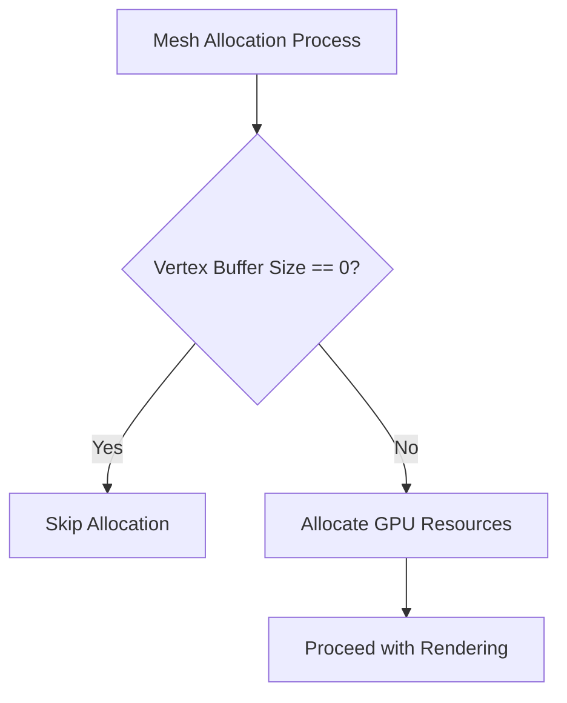

+++
title = "#19938 Skip allocation of zero size meshes"
date = "2025-07-07T00:00:00"
draft = false
template = "pull_request_page.html"
in_search_index = true

[taxonomies]
list_display = ["show"]

[extra]
current_language = "en"
available_languages = {"en" = { name = "English", url = "/pull_request/bevy/2025-07/pr-19938-en-20250707" }, "zh-cn" = { name = "中文", url = "/pull_request/bevy/2025-07/pr-19938-zh-cn-20250707" }}
labels = ["C-Bug", "A-Rendering", "O-WebGL2", "D-Straightforward"]
+++

## Skip allocation of zero size meshes

### Basic Information
- **Title**: Skip allocation of zero size meshes
- **PR Link**: https://github.com/bevyengine/bevy/pull/19938
- **Author**: kerstop
- **Status**: MERGED
- **Labels**: C-Bug, A-Rendering, S-Ready-For-Final-Review, O-WebGL2, D-Straightforward
- **Created**: 2025-07-03T19:07:46Z
- **Merged**: 2025-07-07T02:52:16Z
- **Merged By**: alice-i-cecile

### Description Translation
**Objective**

Fixes #16525  
Fixes #19710  

**Solution**

Not allocating a mesh if it is empty.

**Testing**

I tested using the following minimum repro from #16525  
```rust
use bevy::{asset::RenderAssetUsages, prelude::*, render::mesh::PrimitiveTopology};

fn main() {
    App::new()
        .add_plugins(DefaultPlugins)
        .add_systems(Startup, setup)
        .run();
}

fn setup(
    mut commands: Commands,
    mut meshes: ResMut<Assets<Mesh>>,
    mut materials: ResMut<Assets<ColorMaterial>>,
) {
    commands.spawn(Camera2d);

    let mesh = Mesh::new(
        PrimitiveTopology::TriangleList,
        RenderAssetUsages::default(),
    );

    commands.spawn((
        Mesh2d(meshes.add(mesh)),
        MeshMaterial2d(materials.add(Color::hsl(180.0, 0.95, 0.7))),
    ));
}
```
I was able to test on webgl2 and windows native and the issue seems to be resolved. I am not familiar with how mesh rendering works and feel like just skipping meshes should cause issues but I did not notice any.

### The Story of This Pull Request

The problem originated when users attempted to create meshes with no vertex data. This scenario occurs when developers initialize meshes without vertices, either intentionally or through incomplete mesh generation. In WebGL2 environments, attempting to allocate GPU buffers for such zero-size meshes triggered validation errors because WebGL requires buffer sizes to be at least 1 byte. This violated WebGL's specification and crashed applications (#16525). Additionally, allocating resources for empty meshes wasted CPU cycles and GPU resources without providing any renderable output (#19710).

The solution implements a straightforward guard clause during mesh allocation. Before committing any resources, we now check if the vertex buffer size equals zero. If true, we skip the allocation process entirely. This approach solves both problems: it prevents WebGL errors by avoiding invalid API calls, and eliminates unnecessary resource allocation for empty meshes. The change is minimal and localized to the mesh allocation routine.

Here's how the implementation works: First, we compute the vertex buffer size from the mesh data. If the size equals zero, we immediately continue to the next mesh without further processing. Only meshes with non-zero vertex buffers proceed to allocation. This logic handles all cases where a mesh lacks vertices, whether due to empty geometry or incomplete initialization.

```rust
let vertex_buffer_size = mesh.get_vertex_buffer_size() as u64;
if vertex_buffer_size == 0 {
    continue;
}
```

The change required minimal modification because it leverages existing data flow. The `get_vertex_buffer_size()` method already provided the necessary information, so we simply added an early exit point. This maintains the existing allocation logic for valid meshes while cleanly handling the zero-size case.

Performance-wise, this optimization reduces GPU memory fragmentation and avoids unnecessary buffer operations. For applications generating many procedural meshes, this prevents wasted cycles on empty geometry. The solution also maintains backward compatibility since valid meshes process identically.

Testing confirmed the fix resolves the WebGL crash while maintaining correct rendering behavior on native platforms. The provided reproduction case - creating an empty mesh with `PrimitiveTopology::TriangleList` - no longer causes crashes. Since empty meshes contribute nothing to rendered output, skipping them doesn't affect scene composition.

### Visual Representation



### Key Files Changed

**crates/bevy_render/src/mesh/allocator.rs**  
Added guard clause to skip allocation for zero-size vertex buffers.

Before:
```rust
for (mesh_id, mesh) in &extracted_meshes.extracted {
    // Allocate vertex data. Note that we can only pack mesh vertex data
    // together if the platform supports it.
    let vertex_element_layout = ElementLayout::vertex(mesh_vertex_buffer_layouts, mesh);
    if self.general_vertex_slabs_supported {
        self.allocate(
            mesh_id,
            mesh.get_vertex_buffer_size() as u64,
            vertex_element_layout,
            &mut slabs_to_grow,
            mesh_allocator_settings,
```

After:
```rust
for (mesh_id, mesh) in &extracted_meshes.extracted {
    let vertex_buffer_size = mesh.get_vertex_buffer_size() as u64;
    if vertex_buffer_size == 0 {
        continue;
    }
    // Allocate vertex data. Note that we can only pack mesh vertex data
    // together if the platform supports it.
    let vertex_element_layout = ElementLayout::vertex(mesh_vertex_buffer_layouts, mesh);
    if self.general_vertex_slabs_supported {
        self.allocate(
            mesh_id,
            vertex_buffer_size,
            vertex_element_layout,
            &mut slabs_to_grow,
            mesh_allocator_settings,
```

### Further Reading
1. [WebGL bufferData specification](https://developer.mozilla.org/en-US/docs/Web/API/WebGLRenderingContext/bufferData) - Documents size requirements causing the original crash
2. [Bevy Mesh documentation](https://docs.rs/bevy/latest/bevy/render/mesh/struct.Mesh.html) - Details mesh structure and vertex attributes
3. [WebGL best practices](https://webglfundamentals.org/webgl/lessons/webgl-best-practices.html) - General optimization guidelines for WebGL contexts

### Full Code Diff
```diff
diff --git a/crates/bevy_render/src/mesh/allocator.rs b/crates/bevy_render/src/mesh/allocator.rs
index c171cf3957d96..bbdb543116b6e 100644
--- a/crates/bevy_render/src/mesh/allocator.rs
+++ b/crates/bevy_render/src/mesh/allocator.rs
@@ -452,13 +452,17 @@ impl MeshAllocator {
 
         // Allocate.
         for (mesh_id, mesh) in &extracted_meshes.extracted {
+            let vertex_buffer_size = mesh.get_vertex_buffer_size() as u64;
+            if vertex_buffer_size == 0 {
+                continue;
+            }
             // Allocate vertex data. Note that we can only pack mesh vertex data
             // together if the platform supports it.
             let vertex_element_layout = ElementLayout::vertex(mesh_vertex_buffer_layouts, mesh);
             if self.general_vertex_slabs_supported {
                 self.allocate(
                     mesh_id,
-                    mesh.get_vertex_buffer_size() as u64,
+                    vertex_buffer_size,
                     vertex_element_layout,
                     &mut slabs_to_grow,
                     mesh_allocator_settings,
```