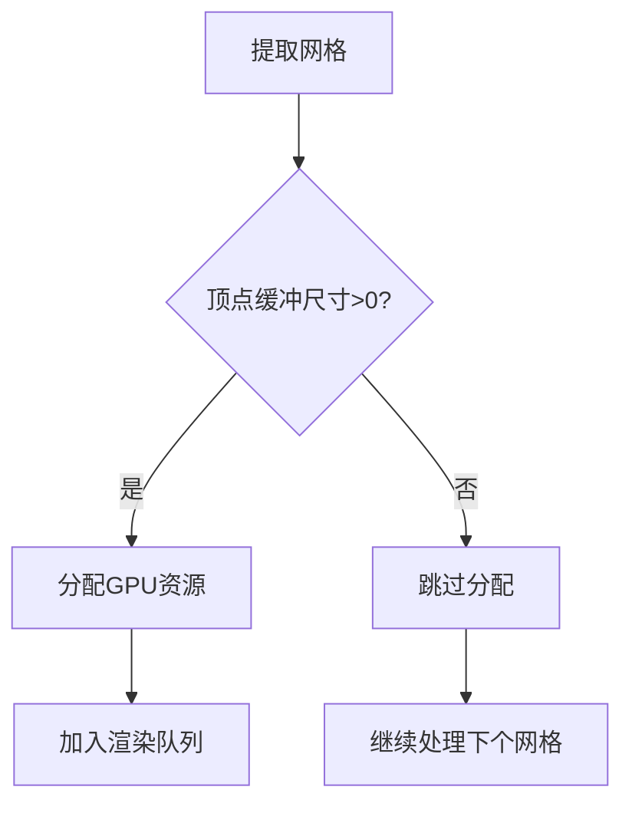

+++
title = "#19938 Skip allocation of zero size meshes"
date = "2025-07-07T00:00:00"
draft = false
template = "pull_request_page.html"
in_search_index = false

[extra]
current_language = "zh-cn"
available_languages = {"en" = { name = "English", url = "/pull_request/bevy/2025-07/pr-19938-en-20250707" }, "zh-cn" = { name = "中文", url = "/pull_request/bevy/2025-07/pr-19938-zh-cn-20250707" }}
labels = ["C-Bug", "A-Rendering", "O-WebGL2", "D-Straightforward"]
+++

# Skip allocation of zero size meshes

## Basic Information
- **Title**: Skip allocation of zero size meshes
- **PR Link**: https://github.com/bevyengine/bevy/pull/19938
- **Author**: kerstop
- **Status**: MERGED
- **Labels**: C-Bug, A-Rendering, S-Ready-For-Final-Review, O-WebGL2, D-Straightforward
- **Created**: 2025-07-03T19:07:46Z
- **Merged**: 2025-07-07T02:52:16Z
- **Merged By**: alice-i-cecile

## Description Translation
### 目的 (Objective)

修复 #16525  
修复 #19710  

### 解决方案 (Solution)

跳过对空网格的分配。

### 测试 (Testing)

我使用 #16525 中的最小复现案例进行测试：  
```rust
use bevy::{asset::RenderAssetUsages, prelude::*, render::mesh::PrimitiveTopology};

fn main() {
    App::new()
        .add_plugins(DefaultPlugins)
        .add_systems(Startup, setup)
        .run();
}

fn setup(
    mut commands: Commands,
    mut meshes: ResMut<Assets<Mesh>>,
    mut materials: ResMut<Assets<ColorMaterial>>,
) {
    commands.spawn(Camera2d);

    let mesh = Mesh::new(
        PrimitiveTopology::TriangleList,
        RenderAssetUsages::default(),
    );

    commands.spawn((
        Mesh2d(meshes.add(mesh)),
        MeshMaterial2d(materials.add(Color::hsl(180.0, 0.95, 0.7))),
    ));
}
```
我在 WebGL2 和 Windows 原生平台上测试，问题似乎已解决。虽然我对网格渲染的工作原理不熟悉，直觉上认为跳过网格分配可能导致问题，但未观察到任何异常。

## The Story of This Pull Request

### 问题背景
在 Bevy 渲染系统中，当创建顶点缓冲大小为 0 的网格时（例如通过 `Mesh::new()` 创建的空网格），系统仍会尝试分配 GPU 资源。这在 WebGL2 环境下会导致 `RENDER WARNING: there is no texture bound to the unit 0` 警告，在原生平台虽不会崩溃但会造成不必要的资源分配。问题根源在于顶点缓冲分配逻辑未处理零尺寸的特殊情况。

### 解决方案选择
最直接的修复方案是在分配前添加零尺寸检查。替代方案如修改底层分配器处理零尺寸请求会增加系统复杂性。经评估，在网格分配入口点添加检查是：
1. 对现有逻辑侵入性最小
2. 性能影响可忽略（单次整数比较）
3. 能彻底避免无效 API 调用

### 实现细节
核心修改位于网格分配循环中。原逻辑无条件获取顶点缓冲大小并传递给分配器：
```rust
// 修改前
self.allocate(
    mesh_id,
    mesh.get_vertex_buffer_size() as u64,  // 可能为0
    vertex_element_layout,
    &mut slabs_to_grow,
    mesh_allocator_settings,
);
```
新实现添加前置检查：
```rust
let vertex_buffer_size = mesh.get_vertex_buffer_size() as u64;
if vertex_buffer_size == 0 {
    continue;  // 关键改动：跳过零尺寸网格
}
```
此改动符合数据驱动原则——仅当存在有效数据时才分配资源。对系统其它部分透明，因为后续渲染流程自然跳过无顶点网格。

### 技术考量
1. **WebGL 兼容性**：WebGL API 对零尺寸资源分配更敏感，此修复特别解决相关警告
2. **资源效率**：避免创建永远不使用的 GPU 资源
3. **错误隔离**：防止无效网格污染分配器状态
4. **变更范围**：精确限定在分配阶段，不影响网格数据生成或后续渲染流程

### 验证与影响
作者使用问题复现案例验证，确认：
- WebGL2 警告消除
- 原生平台无性能衰退
- 正常网格分配不受影响
修复后系统行为更符合开发者预期——零顶点网格应被静默忽略而非尝试渲染。

## Visual Representation



## Key Files Changed

### crates/bevy_render/src/mesh/allocator.rs
**修改目的**：在网格分配流程中添加零尺寸检查，避免无效资源分配  
**关键变更**：
```rust
// 修改前
for (mesh_id, mesh) in &extracted_meshes.extracted {
    self.allocate(
        mesh_id,
        mesh.get_vertex_buffer_size() as u64, // 可能为0
        ... 
    );
}

// 修改后
for (mesh_id, mesh) in &extracted_meshes.extracted {
    let vertex_buffer_size = mesh.get_vertex_buffer_size() as u64;
    if vertex_buffer_size == 0 {  // 新增检查
        continue;
    }
    self.allocate(
        mesh_id,
        vertex_buffer_size,  // 确保>0
        ...
    );
}
```
**关联性**：直接实现PR核心目标——跳过零尺寸网格分配

## Further Reading
1. [WebGL 资源分配规范](https://www.khronos.org/registry/webgl/specs/latest/2.0/#5.14)
2. [Bevy 渲染管线架构](https://bevyengine.org/learn/book/getting-started/rendering/)
3. [相关 Issue #16525](https://github.com/bevyengine/bevy/issues/16525)
4. [相关 Issue #19710](https://github.com/bevyengine/bevy/issues/19710)