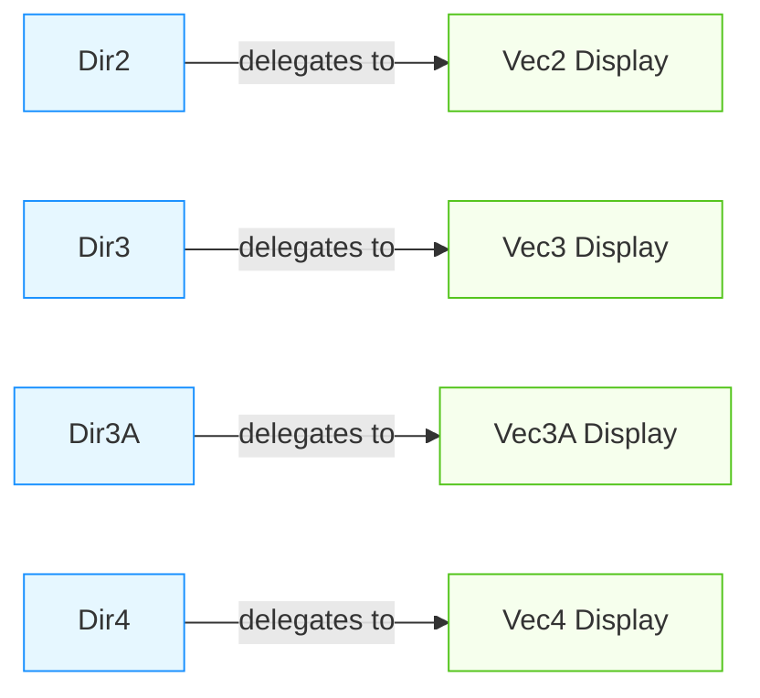

+++
title = "#19942 Implement display for direction"
date = "2025-07-07T00:00:00"
draft = false
template = "pull_request_page.html"
in_search_index = true

[taxonomies]
list_display = ["show"]

[extra]
current_language = "en"
available_languages = {"en" = { name = "English", url = "/pull_request/bevy/2025-07/pr-19942-en-20250707" }, "zh-cn" = { name = "中文", url = "/pull_request/bevy/2025-07/pr-19942-zh-cn-20250707" }}
labels = ["C-Usability", "A-Math", "D-Straightforward"]
+++

# PR Analysis: Implement display for direction

## Basic Information
- **Title**: Implement display for direction
- **PR Link**: https://github.com/bevyengine/bevy/pull/19942
- **Author**: stevehello166
- **Status**: MERGED
- **Labels**: C-Usability, S-Ready-For-Final-Review, A-Math, D-Straightforward
- **Created**: 2025-07-04T01:26:58Z
- **Merged**: 2025-07-07T20:27:43Z
- **Merged By**: alice-i-cecile

## Description Translation
# Objective  
To implement fmt::Display for the direction types. The reason that this would be a good addition is that I often find myself using println! to debug things with directions and adding the extra ":?" was getting a little annoying. It would also be better for any potential CLI apps that might need to output a direction.  

## Solution  
Copied glam's implementation of Display for each length of direction. I.E Vec3's display for Dir3.  

## Testing  

- Did you test these changes? If so, how?  
Yes, I wrote a little script that printed out the different directions and compared it to their vector counterparts.  
Here it is if anyone's interested  
```  
use bevy_math::*;  

fn main() {  
    let dir2 = Dir2::from_xy(0.0, 1.0).unwrap();  
    let dir3 = Dir3::from_xyz(0.0, 1.0, 0.0).unwrap();  
    let dir3a = Dir3A::from_xyz(0.0, 1.0, 0.0).unwrap();  
    let dir4 = Dir4::from_xyzw(0.0, 1.0, 0.0, 0.0).unwrap();  
    let vec2 = Vec2::new(0.0, 1.0);  
    let vec3 = Vec3::new(0.0, 1.0, 0.0);  
    let vec4 = Vec4::new(0.0, 1.0, 0.0, 1.0);  
    println!("{dir2} {dir3} {dir3a} {dir4}");  
    println!("{vec2}, {vec3}, {vec4}")  
}  
```  
- Are there any parts that need more testing?  
Perhaps  

## The Story of This Pull Request

### The Problem and Context
When debugging code that uses Bevy's direction types (`Dir2`, `Dir3`, `Dir3A`, `Dir4`), developers need to output these values to the console. Before this PR, these types only implemented the `Debug` trait, requiring developers to use `println!("{:?}", direction)` syntax. This extra `:?` specifier added friction to debugging workflows and produced output formatted for developers rather than end-users. The lack of `Display` implementations also limited usability in command-line applications where cleaner output is preferred.

### The Solution Approach
The straightforward solution was to implement the `std::fmt::Display` trait for all direction types. The approach mirrored how the underlying `glam` vector types implement `Display` - by delegating directly to the display implementation of their internal vector representation. This ensures consistent formatting between vectors and directions while avoiding any performance overhead since it's a simple pass-through operation.

### The Implementation
The implementation added four `Display` trait implementations - one for each direction type. Each implementation follows the same pattern: it calls `write!` with the formatter and the internal vector representation. The changes were localized to the `direction.rs` file in the math module.

For `Dir2`:
```rust
impl fmt::Display for Dir2 {
    fn fmt(&self, f: &mut fmt::Formatter<'_>) -> fmt::Result {
        write!(f, "{}", self.0)
    }
}
```

For `Dir3`:
```rust
impl fmt::Display for Dir3 {
    fn fmt(&self, f: &mut fmt::Formatter<'_>) -> fmt::Result {
        write!(f, "{}", self.0)
    }
}
```

For `Dir3A`:
```rust
impl fmt::Display for Dir3A {
    fn fmt(&self, f: &mut fmt::Formatter<'_>) -> fmt::Result {
        write!(f, "{}", self.0)
    }
}
```

For `Dir4`:
```rust
impl fmt::Display for Dir4 {
    fn fmt(&self, f: &mut fmt::Formatter<'_>) -> fmt::Result {
        write!(f, "{}", self.0)
    }
}
```

### Testing and Verification
The author validated the changes with a test script that compared direction output against their vector equivalents. The script created instances of each direction type and their vector counterparts, then printed them side-by-side to verify consistent formatting. This approach confirmed that directions now produce clean, user-friendly output without requiring debug formatting specifiers.

### The Impact
These changes provide immediate quality-of-life improvements for developers working with direction types:
1. Simplified debugging: `println!("{direction}")` now works without debug formatting
2. Cleaner output for end-user facing applications
3. Consistent formatting with underlying vector types
4. Zero runtime performance cost since it's a compile-time trait implementation

The implementation follows Rust's best practices by reusing existing display logic from the underlying vector types, maintaining consistency across the math module.

## Visual Representation



## Key Files Changed

### `crates/bevy_math/src/direction.rs`
Added Display trait implementations for all direction types by delegating to their underlying vector representations.

Key modifications:
```rust
// Before: No Display implementation existed
// After: Display implementation added for Dir2
impl fmt::Display for Dir2 {
    fn fmt(&self, f: &mut fmt::Formatter<'_>) -> fmt::Result {
        write!(f, "{}", self.0)
    }
}

// After: Display implementation added for Dir3
impl fmt::Display for Dir3 {
    fn fmt(&self, f: &mut fmt::Formatter<'_>) -> fmt::Result {
        write!(f, "{}", self.0)
    }
}

// After: Display implementation added for Dir3A
impl fmt::Display for Dir3A {
    fn fmt(&self, f: &mut fmt::Formatter<'_>) -> fmt::Result {
        write!(f, "{}", self.0)
    }
}

// After: Display implementation added for Dir4
impl fmt::Display for Dir4 {
    fn fmt(&self, f: &mut fmt::Formatter<'_>) -> fmt::Result {
        write!(f, "{}", self.0)
    }
}
```

These changes implement the Display trait for all direction types by using the existing Display implementations of their underlying vector types (Vec2, Vec3, Vec3A, Vec4).

## Further Reading
1. [Rust Display trait documentation](https://doc.rust-lang.org/std/fmt/trait.Display.html) - Official documentation for implementing custom display formatting
2. [Bevy math module](https://github.com/bevyengine/bevy/tree/main/crates/bevy_math/src) - Source code for Bevy's math primitives
3. [glam vector library](https://crates.io/crates/glam) - The SIMD math library used by Bevy

## Full Code Diff
```diff
diff --git a/crates/bevy_math/src/direction.rs b/crates/bevy_math/src/direction.rs
index f5ecf75c082e5..03cb9f969f1e6 100644
--- a/crates/bevy_math/src/direction.rs
+++ b/crates/bevy_math/src/direction.rs
@@ -4,6 +4,7 @@ use crate::{
 };
 
 use core::f32::consts::FRAC_1_SQRT_2;
+use core::fmt;
 use derive_more::derive::Into;
 
 #[cfg(feature = "bevy_reflect")]
@@ -325,6 +326,12 @@ impl core::ops::Mul<Dir2> for Rot2 {
     }
 }
 
+impl fmt::Display for Dir2 {
+    fn fmt(&self, f: &mut fmt::Formatter<'_>) -> fmt::Result {
+        write!(f, "{}", self.0)
+    }
+}
+
 #[cfg(any(feature = "approx", test))]
 impl approx::AbsDiffEq for Dir2 {
     type Epsilon = f32;
@@ -587,6 +594,12 @@ impl core::ops::Mul<Dir3> for Quat {
     }
 }
 
+impl fmt::Display for Dir3 {
+    fn fmt(&self, f: &mut fmt::Formatter<'_>) -> fmt::Result {
+        write!(f, "{}", self.0)
+    }
+}
+
 #[cfg(feature = "approx")]
 impl approx::AbsDiffEq for Dir3 {
     type Epsilon = f32;
@@ -834,6 +847,12 @@ impl core::ops::Mul<Dir3A> for Quat {
     }
 }
 
+impl fmt::Display for Dir3A {
+    fn fmt(&self, f: &mut fmt::Formatter<'_>) -> fmt::Result {
+        write!(f, "{}", self.0)
+    }
+}
+
 #[cfg(feature = "approx")]
 impl approx::AbsDiffEq for Dir3A {
     type Epsilon = f32;
@@ -1022,6 +1041,12 @@ impl core::ops::Mul<Dir4> for f32 {
     }
 }
 
+impl fmt::Display for Dir4 {
+    fn fmt(&self, f: &mut fmt::Formatter<'_>) -> fmt::Result {
+        write!(f, "{}", self.0)
+    }
+}
+
 #[cfg(feature = "approx")]
 impl approx::AbsDiffEq for Dir4 {
     type Epsilon = f32;
```