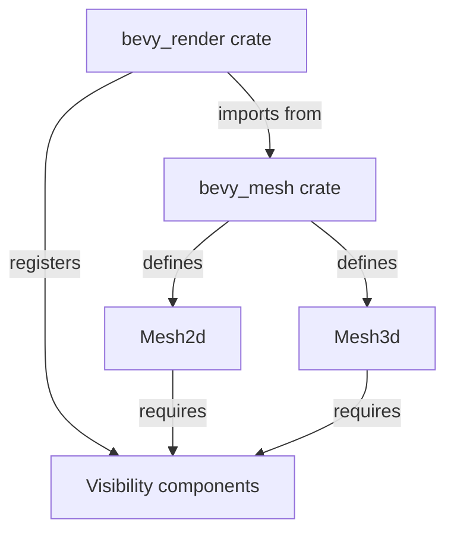

+++
title = "#19943 refactor(mesh): move Mesh3d and Mesh2d into bevy_mesh"
date = "2025-07-05T00:00:00"
draft = false
template = "pull_request_page.html"
in_search_index = true

[taxonomies]
list_display = ["show"]

[extra]
current_language = "en"
available_languages = {"en" = { name = "English", url = "/pull_request/bevy/2025-07/pr-19943-en-20250705" }, "zh-cn" = { name = "中文", url = "/pull_request/bevy/2025-07/pr-19943-zh-cn-20250705" }}
labels = ["A-Rendering", "C-Code-Quality", "X-Contentious", "D-Straightforward"]
+++

## refactor(mesh): move Mesh3d and Mesh2d into bevy_mesh

### Basic Information
- **Title**: refactor(mesh): move Mesh3d and Mesh2d into bevy_mesh
- **PR Link**: https://github.com/bevyengine/bevy/pull/19943
- **Author**: atlv24
- **Status**: MERGED
- **Labels**: A-Rendering, C-Code-Quality, S-Ready-For-Final-Review, X-Contentious, D-Straightforward
- **Created**: 2025-07-04T04:55:51Z
- **Merged**: 2025-07-04T16:43:32Z
- **Merged By**: alice-i-cecile

### Description Translation
# Objective

- another step towards splitting out bevy_camera, this is needed by visibility systems

## Solution

- move mesh stuff into mesh place

## Testing

- 3d_scene looks fine

No migration needed because of the re-export, that can be another PR after i split bevy_camera

### The Story of This Pull Request

This PR addresses a structural issue in Bevy's architecture where mesh-related components were improperly located in the rendering crate. The primary goal was to move `Mesh2d` and `Mesh3d` components from `bevy_render` to `bevy_mesh`, which is their logical home. This change is necessary for upcoming visibility system improvements and part of a larger effort to modularize Bevy by splitting out `bevy_camera`.

The solution required several coordinated changes. First, we moved the components module containing `Mesh2d` and `Mesh3d` from `bevy_render/src/mesh` to `bevy_mesh/src`. Since `bevy_mesh` doesn't have visibility system dependencies, we removed the `Visibility` and `VisibilityClass` requirements from these components. This involved stripping the `#[require(Transform, Visibility, VisibilityClass)]` attributes and `#[component(on_add = ...)]` hooks from both components in their new location.

However, these visibility-related behaviors are still needed. To preserve functionality without creating crate dependencies, we registered the required components and hooks in `ViewPlugin` within `bevy_render`:

```rust
// In bevy_render/src/view/mod.rs
app.world_mut()
    .register_required_components::<Mesh3d, Visibility>()
    .register_required_components::<Mesh3d, VisibilityClass>()
    .register_required_components::<Mesh2d, Visibility>()
    .register_required_components::<Mesh2d, VisibilityClass>()
    .register_component_hooks::<Mesh3d>()
    .on_add(add_visibility_class::<Mesh3d>)
    .register_component_hooks::<Mesh2d>()
    .on_add(add_visibility_class::<Mesh2d>);
```

For consumers, we maintained backward compatibility by re-exporting the components from `bevy_render::mesh` while moving their actual implementation to `bevy_mesh`. The testing confirmed that the 3D scene rendering remained unaffected.

This refactoring improves code organization by:
1. Grouping mesh-related components with their core asset type (`Mesh`)
2. Reducing rendering crate dependencies
3. Clearing the path for future camera system extraction
4. Maintaining existing APIs through re-exports

### Visual Representation



### Key Files Changed

1. **crates/bevy_mesh/src/components.rs** (+3/-8)  
   New home for mesh components with visibility dependencies removed:
```rust
// Before in bevy_render:
#[require(Transform, Visibility, VisibilityClass)]
#[component(on_add = view::add_visibility_class::<Mesh2d>)]
pub struct Mesh2d(pub Handle<Mesh>);

// After in bevy_mesh:
#[require(Transform)]
pub struct Mesh2d(pub Handle<Mesh>);
```

2. **crates/bevy_render/src/view/mod.rs** (+11/-0)  
   Registers visibility requirements for mesh components:
```rust
// Added registration calls:
.register_required_components::<Mesh3d, Visibility>()
.register_required_components::<Mesh3d, VisibilityClass>()
// ...similar for Mesh2d...
.register_component_hooks::<Mesh3d>()
.on_add(add_visibility_class::<Mesh3d>);
```

3. **crates/bevy_render/src/mesh/mod.rs** (+1/-2)  
   Updates imports to use moved components:
```rust
// Changed from:
pub use components::{mark_3d_meshes_as_changed..., Mesh2d, Mesh3d};

// To:
pub use bevy_mesh::{mark_3d_meshes_as_changed..., Mesh2d, Mesh3d};
```

4. **crates/bevy_mesh/src/lib.rs** (+2/-0)  
   Exports the new components module:
```rust
// Added:
mod components;
pub use components::*;
```

5. **crates/bevy_mesh/Cargo.toml** (+1/-0)  
   Added derive_more dependency for component derivation:
```toml
derive_more = { version = "2", default-features = false, features = ["from"] }
```

### Further Reading
1. [Bevy ECS Component Hooks Documentation](https://docs.rs/bevy_ecs/latest/bevy_ecs/component/trait.ComponentHooks.html)
2. [Bevy Modularization RFC](https://github.com/bevyengine/rfcs/pull/45)
3. [DeriveMore Crate Documentation](https://docs.rs/derive_more/latest/derive_more/)

### Full Code Diff
```diff
diff --git a/crates/bevy_mesh/Cargo.toml b/crates/bevy_mesh/Cargo.toml
index 7807acbb9d074..a34b0e7436719 100644
--- a/crates/bevy_mesh/Cargo.toml
+++ b/crates/bevy_mesh/Cargo.toml
@@ -34,6 +34,7 @@ serde = { version = "1", default-features = false, features = [
 hexasphere = "15.0"
 thiserror = { version = "2", default-features = false }
 tracing = { version = "0.1", default-features = false, features = ["std"] }
+derive_more = { version = "2", default-features = false, features = ["from"] }
 
 [dev-dependencies]
 serde_json = "1.0.140"
diff --git a/crates/bevy_render/src/mesh/components.rs b/crates/bevy_mesh/src/components.rs
similarity index 94%
rename from crates/bevy_render/src/mesh/components.rs
rename to crates/bevy_mesh/src/components.rs
index 000de324e3702..cff5eab7e477f 100644
--- a/crates/bevy_render/src/mesh/components.rs
+++ b/crates/bevy_mesh/src/components.rs
@@ -1,7 +1,4 @@
-use crate::{
-    mesh::Mesh,
-    view::{self, Visibility, VisibilityClass},
-};
+use crate::mesh::Mesh;
 use bevy_asset::{AsAssetId, AssetEvent, AssetId, Handle};
 use bevy_derive::{Deref, DerefMut};
 use bevy_ecs::{
@@ -42,8 +39,7 @@ use derive_more::derive::From;
 /// ```
 #[derive(Component, Clone, Debug, Default, Deref, DerefMut, Reflect, PartialEq, Eq, From)]
 #[reflect(Component, Default, Clone, PartialEq)]
-#[require(Transform, Visibility, VisibilityClass)]
-#[component(on_add = view::add_visibility_class::<Mesh2d>)]
+#[require(Transform)]
 pub struct Mesh2d(pub Handle<Mesh>);
 
 impl From<Mesh2d> for AssetId<Mesh> {
@@ -98,8 +94,7 @@ impl AsAssetId for Mesh2d {
 /// ```
 #[derive(Component, Clone, Debug, Default, Deref, DerefMut, Reflect, PartialEq, Eq, From)]
 #[reflect(Component, Default, Clone, PartialEq)]
-#[require(Transform, Visibility, VisibilityClass)]
-#[component(on_add = view::add_visibility_class::<Mesh3d>)]
+#[require(Transform)]
 pub struct Mesh3d(pub Handle<Mesh>);
 
 impl From<Mesh3d> for AssetId<Mesh> {
diff --git a/crates/bevy_mesh/src/lib.rs b/crates/bevy_mesh/src/lib.rs
index 58702d7d8b428..635e36ead4a19 100644
--- a/crates/bevy_mesh/src/lib.rs
+++ b/crates/bevy_mesh/src/lib.rs
@@ -3,6 +3,7 @@
 extern crate alloc;
 extern crate core;
 
+mod components;
 mod conversions;
 mod index;
 mod mesh;
@@ -12,6 +13,7 @@ pub mod primitives;
 pub mod skinning;
 mod vertex;
 use bitflags::bitflags;
+pub use components::*;
 pub use index::*;
 pub use mesh::*;
 pub use mikktspace::*;
diff --git a/crates/bevy_render/src/mesh/mod.rs b/crates/bevy_render/src/mesh/mod.rs
index c981e75ceed35..28e106c8f87e2 100644
--- a/crates/bevy_render/src/mesh/mod.rs
+++ b/crates/bevy_render/src/mesh/mod.rs
@@ -2,7 +2,6 @@ use bevy_math::Vec3;
 pub use bevy_mesh::*;
 use morph::{MeshMorphWeights, MorphWeights};
 pub mod allocator;
-mod components;
 use crate::{
     primitives::Aabb,
     render_asset::{PrepareAssetError, RenderAsset, RenderAssetPlugin, RenderAssets},
@@ -21,7 +20,7 @@ use bevy_ecs::{
         SystemParamItem,
     },
 };
-pub use components::{mark_3d_meshes_as_changed_if_their_assets_changed, Mesh2d, Mesh3d, MeshTag};
+pub use bevy_mesh::{mark_3d_meshes_as_changed_if_their_assets_changed, Mesh2d, Mesh3d, MeshTag};
 use wgpu::IndexFormat;
 
 /// Registers all [`MeshBuilder`] types.
diff --git a/crates/bevy_render/src/view/mod.rs b/crates/bevy_render/src/view/mod.rs
index a348b361c75ea..0ca492c82d381 100644
--- a/crates/bevy_render/src/view/mod.rs
+++ b/crates/bevy_render/src/view/mod.rs
@@ -2,6 +2,7 @@ pub mod visibility;
 pub mod window;
 
 use bevy_diagnostic::FrameCount;
+use bevy_mesh::{Mesh2d, Mesh3d};
 pub use visibility::*;
 pub use window::*;
 
@@ -109,6 +110,10 @@ impl Plugin for ViewPlugin {
             .register_type::<VisibleEntities>()
             .register_type::<ColorGrading>()
             .register_type::<OcclusionCulling>()
+            .register_required_components::<Mesh3d, Visibility>()
+            .register_required_components::<Mesh3d, VisibilityClass>()
+            .register_required_components::<Mesh2d, Visibility>()
+            .register_required_components::<Mesh2d, VisibilityClass>()
             // NOTE: windows.is_changed() handles cases where a window was resized
             .add_plugins((
                 ExtractComponentPlugin::<Hdr>::default(),
@@ -117,6 +122,12 @@ impl Plugin for ViewPlugin {
                 VisibilityPlugin,
                 VisibilityRangePlugin,
             ));
+        app.world_mut()
+            .register_component_hooks::<Mesh3d>()
+            .on_add(add_visibility_class::<Mesh3d>);
+        app.world_mut()
+            .register_component_hooks::<Mesh2d>()
+            .on_add(add_visibility_class::<Mesh2d>);
 
         if let Some(render_app) = app.get_sub_app_mut(RenderApp) {
             render_app.add_systems(
```