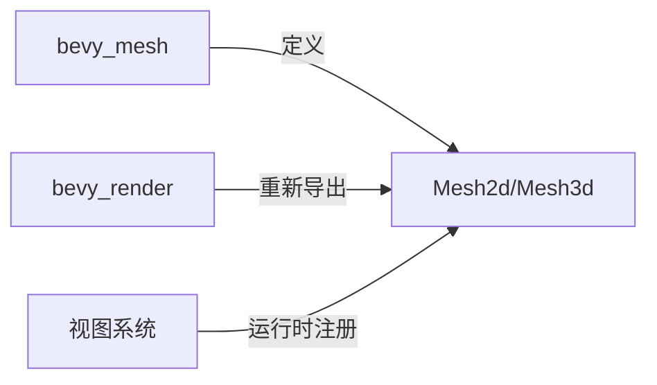

+++
title = "#19943 refactor(mesh): move Mesh3d and Mesh2d into bevy_mesh"
date = "2025-07-05T00:00:00"
draft = false
template = "pull_request_page.html"
in_search_index = false

[extra]
current_language = "zh-cn"
available_languages = {"en" = { name = "English", url = "/pull_request/bevy/2025-07/pr-19943-en-20250705" }, "zh-cn" = { name = "中文", url = "/pull_request/bevy/2025-07/pr-19943-zh-cn-20250705" }}
+++

## refactor(mesh): move Mesh3d and Mesh2d into bevy_mesh

### 基本信息
- **标题**: refactor(mesh): move Mesh3d and Mesh2d into bevy_mesh
- **PR链接**: https://github.com/bevyengine/bevy/pull/19943
- **作者**: atlv24
- **状态**: MERGED
- **标签**: A-Rendering, C-Code-Quality, S-Ready-For-Final-Review, X-Contentious, D-Straightforward
- **创建时间**: 2025-07-04T04:55:51Z
- **合并时间**: 2025-07-04T16:43:32Z
- **合并人**: alice-i-cecile

### 描述翻译
# Objective
- 这是拆分bevy_camera的又一步骤，可见性系统需要此改动

## Solution
- 将网格相关组件移动到网格模块中

## Testing
- 3d_scene场景显示正常

无需迁移处理，因为保留了重新导出(re-export)，这可以在拆分bevy_camera后单独处理

### PR技术分析

#### 问题与背景
在Bevy引擎中，`Mesh2d`和`Mesh3d`组件原本位于`bevy_render`模块中，但可见性系统需要直接访问这些组件。随着架构演进，需要将这些核心组件移动到更合适的模块`bevy_mesh`中。这种模块重构是拆分`bevy_camera`的前置步骤，同时需要确保不影响现有功能。

#### 解决方案
核心方案是将网格组件物理移动到`bevy_mesh`模块：
1. 将`components.rs`文件从`bevy_render/src/mesh`移动到`bevy_mesh/src`
2. 调整组件依赖关系，移除与可见性系统的直接耦合
3. 在`bevy_mesh`中正确导出组件
4. 在`bevy_render`中重新导出(re-export)保持向后兼容
5. 在视图模块注册组件钩子

#### 关键实现细节
主要变化集中在组件依赖关系的解耦上。原始实现中，`Mesh2d`和`Mesh3d`直接依赖`Visibility`和`VisibilityClass`组件：

```rust
// Before (in bevy_render):
#[require(Transform, Visibility, VisibilityClass)]
#[component(on_add = view::add_visibility_class::<Mesh2d>)]
pub struct Mesh2d(pub Handle<Mesh>);
```

重构后移除了这些依赖，使组件更专注于核心功能：

```rust
// After (in bevy_mesh):
#[require(Transform)]
pub struct Mesh2d(pub Handle<Mesh>);
```

可见性相关的注册被转移到视图模块的初始化逻辑中：

```rust
// In bevy_render/src/view/mod.rs
app.world_mut()
    .register_component_hooks::<Mesh3d>()
    .on_add(add_visibility_class::<Mesh3d>);
```

这种改动保持了功能完整性，同时实现了关注点分离。在`bevy_mesh`的lib.rs中新增了组件导出：

```rust
// crates/bevy_mesh/src/lib.rs
mod components;
pub use components::*;
```

而在`bevy_render`中通过重新导出保持兼容性：

```rust
// crates/bevy_render/src/mesh/mod.rs
pub use bevy_mesh::{mark_3d_meshes_as_changed_if_their_assets_changed, Mesh2d, Mesh3d, MeshTag};
```

#### 技术影响
1. **模块边界清晰化**：网格组件现在位于正确的功能模块中
2. **解耦可见性系统**：为后续拆分相机模块奠定基础
3. **零破坏性变更**：通过重新导出保持现有代码兼容
4. **依赖优化**：`bevy_mesh`新增`derive_more`依赖用于组件实现



### 关键文件变更

1. **crates/bevy_mesh/src/components.rs** (+3/-8)
    - 从`bevy_render`移动而来
    - 移除了可见性相关的组件依赖和钩子

```rust
// Before:
#[require(Transform, Visibility, VisibilityClass)]
#[component(on_add = view::add_visibility_class::<Mesh2d>)]
pub struct Mesh2d(pub Handle<Mesh>);

// After:
#[require(Transform)]
pub struct Mesh2d(pub Handle<Mesh>);
```

2. **crates/bevy_render/src/view/mod.rs** (+11/-0)
    - 添加组件注册逻辑
    - 确保可见性系统正确关联网格组件

```rust
// 新增的注册代码
.register_required_components::<Mesh3d, Visibility>()
.register_required_components::<Mesh3d, VisibilityClass>()
.register_required_components::<Mesh2d, Visibility>()
.register_required_components::<Mesh2d, VisibilityClass>()

// 组件钩子注册
app.world_mut()
    .register_component_hooks::<Mesh3d>()
    .on_add(add_visibility_class::<Mesh3d>);
```

3. **crates/bevy_mesh/src/lib.rs** (+2/-0)
    - 添加组件模块并导出

```rust
mod components;
pub use components::*;
```

4. **crates/bevy_render/src/mesh/mod.rs** (+1/-2)
    - 移除本地组件定义
    - 改为从`bevy_mesh`重新导出

```rust
// 移除
mod components;

// 改为重新导出
pub use bevy_mesh::{..., Mesh2d, Mesh3d, ...};
```

5. **crates/bevy_mesh/Cargo.toml** (+1/-0)
    - 添加新依赖`derive_more`
    - 支持组件的`From` trait派生

```toml
derive_more = { version = "2", default-features = false, features = ["from"] }
```

### 延伸阅读
1. [Bevy模块系统设计](https://bevyengine.org/learn/book/getting-started/ecs/)
2. [组件与系统交互原理](https://bevy-cheatbook.github.io/programming/system-order.html)
3. [ECS架构模式](https://en.wikipedia.org/wiki/Entity_component_system)
4. [Rust特性派生指南](https://doc.rust-lang.org/book/ch19-06-macros.html#derive-macros)