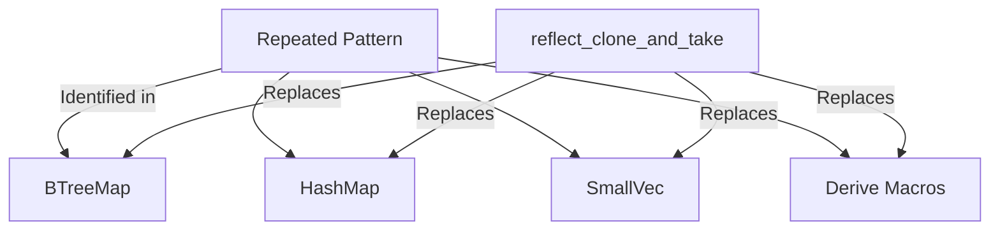

+++
title = "#19944 bevy_reflect: Introduce `reflect_clone_and_take`."
date = "2025-07-07T00:00:00"
draft = false
template = "pull_request_page.html"
in_search_index = true

[taxonomies]
list_display = ["show"]

[extra]
current_language = "en"
available_languages = {"en" = { name = "English", url = "/pull_request/bevy/2025-07/pr-19944-en-20250707" }, "zh-cn" = { name = "中文", url = "/pull_request/bevy/2025-07/pr-19944-zh-cn-20250707" }}
labels = ["C-Performance", "C-Code-Quality", "A-Reflection", "D-Straightforward"]
+++

# Technical Analysis of PR #19944: bevy_reflect: Introduce `reflect_clone_and_take`

## Basic Information
- **Title**: bevy_reflect: Introduce `reflect_clone_and_take`.
- **PR Link**: https://github.com/bevyengine/bevy/pull/19944
- **Author**: nnethercote
- **Status**: MERGED
- **Labels**: C-Performance, C-Code-Quality, S-Ready-For-Final-Review, A-Reflection, X-Uncontroversial, D-Straightforward
- **Created**: 2025-07-04T06:09:13Z
- **Merged**: 2025-07-07T20:19:51Z
- **Merged By**: alice-i-cecile

## Description Translation
# Objective

There is a pattern that appears in multiple places, involving `reflect_clone`, followed by `take`, followed by `map_err` that produces a `FailedDowncast` in a particular form.

## Solution

Introduces `reflect_clone_and_take`, which factors out the repeated code.

## Testing

`cargo run -p ci`

## The Story of This Pull Request

### Problem Identification
The Bevy reflection system had a recurring pattern appearing in multiple locations: cloning reflected values followed by downcasting them to their concrete types. This pattern consistently used three operations in sequence:
1. `reflect_clone()` to create a boxed clone of a reflected value
2. `take()` to attempt downcasting to the concrete type
3. `map_err()` to handle potential downcast failures with a specific error format

This pattern was duplicated across various collection implementations (BTreeMap, HashMap, SmallVec) and derive macros, violating DRY principles. Each instance manually constructed identical `ReflectCloneError::FailedDowncast` errors with the same formatting logic, making the code repetitive and harder to maintain.

### Solution Approach
The solution introduces a new method `reflect_clone_and_take` in the `PartialReflect` trait that encapsulates the repeated pattern. This method:
1. Combines the `reflect_clone`, `take`, and error handling steps
2. Provides standardized error construction
3. Maintains identical functionality to the original pattern
4. Reduces code duplication

The implementation avoids breaking changes by preserving existing behavior while centralizing the error handling logic. The new method was designed as an associated function rather than a trait method to maintain dyn-compatibility.

### Implementation Details
The core implementation adds `reflect_clone_and_take` to `bevy_reflect/src/reflect.rs`:

```rust
// File: crates/bevy_reflect/src/reflect.rs
fn reflect_clone_and_take<T: 'static>(&self) -> Result<T, ReflectCloneError>
where
    Self: TypePath + Sized,
{
    self.reflect_clone()?
        .take()
        .map_err(|_| ReflectCloneError::FailedDowncast {
            expected: Cow::Borrowed(<Self as TypePath>::type_path()),
            received: Cow::Owned(self.reflect_type_path().to_string()),
        })
}
```

This method was then integrated throughout the codebase, replacing the repetitive pattern. For example, in `btree/map.rs`:

```rust
// File: crates/bevy_reflect/src/impls/alloc/collections/btree/map.rs
// Before:
let key = key.reflect_clone()?
    .take()
    .map_err(|_| ReflectCloneError::FailedDowncast {
        expected: Cow::Borrowed(<Self as TypePath>::type_path()),
        received: Cow::Owned(key.reflect_type_path().to_string()),
    })?;

// After:
let key = key.reflect_clone_and_take()?;
```

Similar replacements were made in collection implementations and derive macros. The derive macros in `enum_utility.rs` and `derive_data.rs` were updated to generate code using the new method:

```rust
// File: crates/bevy_reflect/derive/src/derive_data.rs
// Before:
quote! {
    #bevy_reflect_path::PartialReflect::reflect_clone(#accessor)?
        .take()
        .map_err(|value| #bevy_reflect_path::ReflectCloneError::FailedDowncast {
            expected: #bevy_reflect_path::__macro_exports::alloc_utils::Cow::Borrowed(
                <#field_ty as #bevy_reflect_path::TypePath>::type_path()
            ),
            received: #bevy_reflect_path::__macro_exports::alloc_utils::Cow::Owned(
                #bevy_reflect_path::__macro_exports::alloc_utils::ToString::to_string(
                    #bevy_reflect_path::DynamicTypePath::reflect_type_path(&*value)
                )
            ),
        })?
}

// After:
quote! {
    <#field_ty as #bevy_reflect_path::PartialReflect>::reflect_clone_and_take(#accessor)?
}
```

A subtle fix was made in `smallvec.rs` to properly dereference the SmallVec before iteration:

```rust
// File: crates/bevy_reflect/src/impls/smallvec.rs
// Before:
self.iter()
    .map(|value| {
        value.reflect_clone()?.take().map_err(|_| ...)
    })

// After:
(**self)
    .iter()
    .map(PartialReflect::reflect_clone_and_take)
```

### Impact and Benefits
1. **Code Quality**: Reduced duplication by replacing 15+ instances of the same pattern
2. **Maintainability**: Centralized error handling logic for downcast operations
3. **Readability**: Simplified complex reflection cloning operations to single method calls
4. **Consistency**: Ensured uniform error message formatting across the reflection system
5. **Derive Macros**: Improved generated code quality in reflection derives

The changes maintain identical runtime behavior while making the codebase more resilient to future modifications. The pattern consolidation also reduces the cognitive load when working with reflection cloning operations.

## Visual Representation



## Key Files Changed

### `crates/bevy_reflect/src/reflect.rs` (+18/-0)
Added the new `reflect_clone_and_take` method to the `PartialReflect` trait. This method encapsulates the repeated pattern of cloning a reflected value, downcasting it, and handling errors.

```rust
fn reflect_clone_and_take<T: 'static>(&self) -> Result<T, ReflectCloneError>
where
    Self: TypePath + Sized,
{
    self.reflect_clone()?
        .take()
        .map_err(|_| ReflectCloneError::FailedDowncast {
            expected: Cow::Borrowed(<Self as TypePath>::type_path()),
            received: Cow::Owned(self.reflect_type_path().to_string()),
        })
}
```

### `crates/bevy_reflect/src/impls/alloc/collections/btree/map.rs` (+2/-16)
Replaced the manual downcast pattern with `reflect_clone_and_take` for both keys and values in BTreeMap's reflection implementation.

```rust
// Before:
let key = key.reflect_clone()?
    .take()
    .map_err(|_| ReflectCloneError::FailedDowncast {
        expected: Cow::Borrowed(<Self as TypePath>::type_path()),
        received: Cow::Owned(key.reflect_type_path().to_string()),
    })?;

// After:
let key = key.reflect_clone_and_take()?;
```

### `crates/bevy_reflect/src/impls/smallvec.rs` (+6/-11)
Updated SmallVec's reflection implementation to use the new method and fixed the iteration to properly dereference the SmallVec.

```rust
// Before:
self.iter()
    .map(|value| {
        value.reflect_clone()?.take().map_err(|_| ...)
    })

// After:
(**self)
    .iter()
    .map(PartialReflect::reflect_clone_and_take)
```

### `crates/bevy_reflect/derive/src/enum_utility.rs` (+1/-14)
Updated the enum derive macro to generate code using `reflect_clone_and_take` instead of the manual pattern.

```rust
// Before:
quote! {
    #bevy_reflect_path::PartialReflect::reflect_clone(#alias)?
        .take()
        .map_err(|value| ...)?
}

// After:
quote! {
    <#field_ty as #bevy_reflect_path::PartialReflect>::reflect_clone_and_take(#alias)?
}
```

### `crates/bevy_reflect/src/impls/macros/map.rs` (+2/-12)
Updated the HashMap reflection macro to use `reflect_clone_and_take` for both keys and values.

```rust
// Before:
let key = key.reflect_clone()?.take().map_err(|_| ...)?;
let value = value.reflect_clone()?.take().map_err(|_| ...)?;

// After:
let key = key.reflect_clone_and_take()?;
let value = value.reflect_clone_and_take()?;
```

## Further Reading
1. [Bevy Reflection Documentation](https://docs.rs/bevy_reflect/latest/bevy_reflect/): Official docs for Bevy's reflection system
2. [Rust Downcasting Explained](https://doc.rust-lang.org/std/any/trait.Any.html): Rust's core downcasting mechanisms
3. [DRY Principle](https://en.wikipedia.org/wiki/Don%27t_repeat_yourself): Software development principle applied in this PR
4. [Bevy Engine GitHub](https://github.com/bevyengine/bevy): Main repository for further exploration