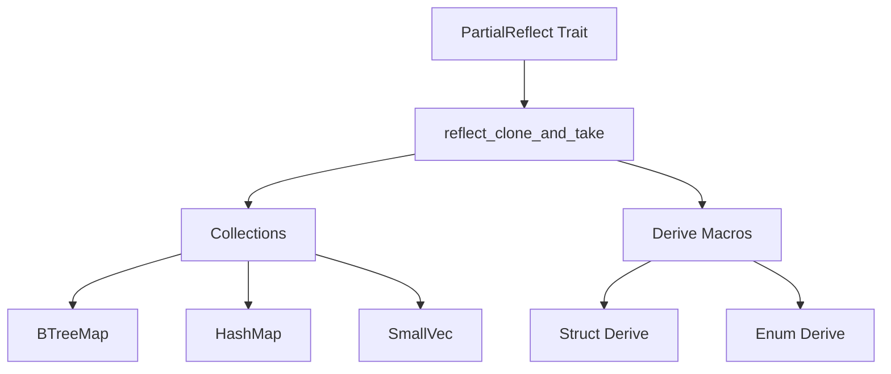

+++
title = "#19944 bevy_reflect: Introduce `reflect_clone_and_take`."
date = "2025-07-07T00:00:00"
draft = false
template = "pull_request_page.html"
in_search_index = false

[extra]
current_language = "zh-cn"
available_languages = {"en" = { name = "English", url = "/pull_request/bevy/2025-07/pr-19944-en-20250707" }, "zh-cn" = { name = "中文", url = "/pull_request/bevy/2025-07/pr-19944-zh-cn-20250707" }}
labels = ["C-Performance", "C-Code-Quality", "A-Reflection", "D-Straightforward"]
+++

# bevy_reflect: Introduce `reflect_clone_and_take`.

## Basic Information
- **Title**: bevy_reflect: Introduce `reflect_clone_and_take`.
- **PR Link**: https://github.com/bevyengine/bevy/pull/19944
- **Author**: nnethercote
- **Status**: MERGED
- **Labels**: C-Performance, C-Code-Quality, S-Ready-For-Final-Review, A-Reflection, X-Uncontroversial, D-Straightforward
- **Created**: 2025-07-04T06:09:13Z
- **Merged**: 2025-07-07T20:19:51Z
- **Merged By**: alice-i-cecile

## Description Translation
# Objective

在多个地方出现了相同的代码模式：先调用 `reflect_clone`，接着调用 `take`，然后使用 `map_err` 生成特定格式的 `FailedDowncast` 错误。

## Solution

引入 `reflect_clone_and_take`，将重复代码提取为公共方法。

## Testing

`cargo run -p ci`

## The Story of This Pull Request

在 Bevy 的反射系统中，存在一个反复出现的模式：当需要克隆反射值并转换为具体类型时，开发者需要编写三段式代码：调用 `reflect_clone` 获取反射值的克隆，调用 `take` 尝试向下转型，最后处理可能的 `FailedDowncast` 错误。这种模式在多个集合类型（如 `BTreeMap`、`HashMap`、`SmallVec`）和派生宏中重复出现，导致代码冗余和维护成本增加。

解决方案是引入 `reflect_clone_and_take` 方法，封装这个通用操作序列。该方法定义在 `PartialReflect` trait 中：

```rust
fn reflect_clone_and_take<T: 'static>(&self) -> Result<T, ReflectCloneError>
where
    Self: TypePath + Sized,
{
    self.reflect_clone()?
        .take()
        .map_err(|_| ReflectCloneError::FailedDowncast {
            expected: Cow::Borrowed(<Self as TypePath>::type_path()),
            received: Cow::Owned(self.reflect_type_path().to_string()),
        })
}
```

这个方法执行三个关键操作：
1. 通过 `reflect_clone` 创建反射值的克隆
2. 通过 `take` 尝试将 `Box<dyn Reflect>` 转换为具体类型 `T`
3. 自动生成标准化的 `FailedDowncast` 错误信息

技术实现上，该方法被设计为关联函数而非 trait 方法，以保持与动态分发（dyn-compatibility）的兼容性。这个设计避免了泛型方法可能导致的动态分发问题。

该 PR 的核心修改是在反射系统的关键位置用新方法替换原有的三段式代码。例如在 `BTreeMap` 的实现中：

```rust
// Before:
let key = key.reflect_clone()?
    .take()
    .map_err(|_| ReflectCloneError::FailedDowncast {
        expected: Cow::Borrowed(<Self as TypePath>::type_path()),
        received: Cow::Owned(key.reflect_type_path().to_string()),
    })?;

// After:
let key = key.reflect_clone_and_take()?;
```

这种替换显著减少了代码量并提高了可读性。在 `SmallVec` 的实现中还修复了一个潜在问题：通过 `(**self).iter()` 确保使用正确的元素类型进行迭代，而不是 `SmallVec` 自身的列表视图。

性能方面，这个改动属于零成本抽象（zero-cost abstraction），因为新方法只是封装了现有操作，没有引入额外开销。实际上，通过减少代码重复，可能带来编译时性能的轻微提升。

该修改影响范围包括：
1. 集合类型的反射实现（BTreeMap/HashMap/Vec）
2. 结构体和枚举的派生宏
3. SmallVec 特殊实现

测试验证通过运行项目完整的 CI 测试套件（`cargo run -p ci`）确保没有破坏现有功能。由于改动本质上是重构而非功能变更，主要风险在于修改点是否完整覆盖所有需要更新的位置。

## Visual Representation



## Key Files Changed

### `crates/bevy_reflect/src/reflect.rs` (+18/-0)
添加了 `reflect_clone_and_take` 核心实现：
```rust
fn reflect_clone_and_take<T: 'static>(&self) -> Result<T, ReflectCloneError>
where
    Self: TypePath + Sized,
{
    self.reflect_clone()?
        .take()
        .map_err(|_| ReflectCloneError::FailedDowncast {
            expected: Cow::Borrowed(<Self as TypePath>::type_path()),
            received: Cow::Owned(self.reflect_type_path().to_string()),
        })
}
```

### `crates/bevy_reflect/derive/src/enum_utility.rs` (+1/-14)
在枚举派生中用新方法替换重复代码：
```rust
// Before:
value.reflect_clone()?.take().map_err(|value| ... )?

// After:
<#field_ty as #bevy_reflect_path::PartialReflect>::reflect_clone_and_take(#alias)?
```

### `crates/bevy_reflect/src/impls/alloc/collections/btree/map.rs` (+2/-16)
在 BTreeMap 反射实现中使用新方法：
```rust
// Before:
let key = key.reflect_clone()?.take().map_err(...)?;

// After:
let key = key.reflect_clone_and_take()?;
```

### `crates/bevy_reflect/src/impls/smallvec.rs` (+6/-11)
修复 SmallVec 实现并简化代码：
```rust
// Before:
self.iter().map(|value| {
    value.reflect_clone()?.take().map_err(...)
})

// After:
(**self).iter().map(PartialReflect::reflect_clone_and_take)
```

### `crates/bevy_reflect/src/impls/macros/map.rs` (+2/-12)
在 map 宏生成的代码中使用新方法：
```rust
// Before:
let key = key.reflect_clone()?.take().map_err(...)?;

// After:
let key = key.reflect_clone_and_take()?;
```

## Further Reading
1. [Bevy Reflection System Documentation](https://docs.rs/bevy_reflect/latest/bevy_reflect/)
2. [Rust Trait Object Downcasting](https://doc.rust-lang.org/std/any/trait.Any.html#method.downcast_ref)
3. [Zero Cost Abstractions in Rust](https://blog.rust-lang.org/2015/05/11/traits.html#zero-cost-abstractions)