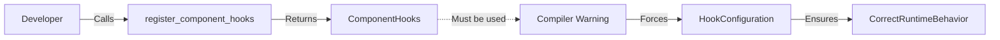

+++
title = "#19945 add must_use to register_component_hooks"
date = "2025-07-05T00:00:00"
draft = false
template = "pull_request_page.html"
in_search_index = true

[taxonomies]
list_display = ["show"]

[extra]
current_language = "en"
available_languages = {"en" = { name = "English", url = "/pull_request/bevy/2025-07/pr-19945-en-20250705" }, "zh-cn" = { name = "中文", url = "/pull_request/bevy/2025-07/pr-19945-zh-cn-20250705" }}
labels = ["C-Bug", "D-Trivial", "A-ECS"]
+++

### Pull Request Analysis: add must_use to register_component_hooks

#### Basic Information
- **Title**: add must_use to register_component_hooks
- **PR Link**: https://github.com/bevyengine/bevy/pull/19945
- **Author**: atlv24
- **Status**: MERGED
- **Labels**: C-Bug, D-Trivial, A-ECS, S-Ready-For-Final-Review
- **Created**: 2025-07-04T07:26:28Z
- **Merged**: 2025-07-04T16:43:47Z
- **Merged By**: alice-i-cecile

#### Description Translation
The original description is in English and remains unchanged:
```
# Objective

- I accidentally left a `register_component_hooks` without actually adding a hook and didnt notice

## Solution

- mark it must_use so it doesnt happen to other people (maybe this is just skill issue on me though)
```

---

### The Story of This Pull Request

#### 1. The Problem and Context
The author encountered a specific development pitfall while working with Bevy's ECS (Entity Component System). When using `World::register_component_hooks`, they accidentally called the method but failed to actually configure any hooks using the returned `ComponentHooks` reference. This oversight went unnoticed because:  
- The method's return value wasn't marked for mandatory use  
- No compiler warnings flagged the unused result  
- The system failed silently at runtime  

This is problematic because `register_component_hooks` exists specifically to configure critical component lifecycle callbacks (like `on_add` or `on_remove`). If these hooks aren't properly configured, essential game logic might break without obvious errors.

#### 2. The Solution Approach
The fix leverages Rust's `#[must_use]` attribute – a compile-time safeguard against ignored return values. By annotating the function:  
- The compiler will now emit warnings when the `ComponentHooks` return value goes unused  
- Developers receive immediate feedback during compilation  
- The cost is minimal: zero runtime overhead  

This approach was chosen over alternatives like runtime panics because:  
- It catches mistakes earlier (at compile time)  
- It maintains existing API contracts  
- It introduces no performance penalties  

#### 3. The Implementation
The change is surgical – a single attribute added to the function declaration in `world/mod.rs`:

```rust
#[must_use]
pub fn register_component_hooks<T: Component>(&mut self) -> &mut ComponentHooks {
```
This modification fits seamlessly into the existing architecture:  
- Preserves all existing functionality  
- Requires no changes to call sites  
- Aligns with Rust's ownership system by enforcing use of the returned mutable reference  

#### 4. Technical Insights
The `#[must_use]` attribute is particularly effective here because:  
- `ComponentHooks` is explicitly designed for mutation (via its `&mut` return type)  
- Ignoring the return value almost always indicates a logic error  
- The attribute's warning can be suppressed explicitly with `let _ = ...` if intentional  

This pattern follows Rust's best practices for APIs where return values represent required follow-up actions. Similar attributes appear throughout Rust's standard library (e.g., `Result` and `Iterator` methods).

#### 5. The Impact
The change provides:  
- **Error prevention**: Catches a specific class of developer mistakes at compile time  
- **API clarity**: Makes the function's purpose more discoverable through compiler feedback  
- **Maintainability**: Reduces future debugging time for similar oversights  

The minimal diff (1 line added, 0 changed) demonstrates how small quality-of-life improvements can meaningfully enhance developer experience without complex modifications.

---

### Visual Representation


---

### Key Files Changed

#### `crates/bevy_ecs/src/world/mod.rs`
**Purpose**: Adds compiler guardrail to prevent accidental misuse of component hook registration.  

**Code Change**:
```rust
// Before:
pub fn register_component_hooks<T: Component>(&mut self) -> &mut ComponentHooks {

// After:
#[must_use]
pub fn register_component_hooks<T: Component>(&mut self) -> &mut ComponentHooks {
```

**Impact**:  
- Compiler now enforces proper usage pattern  
- Existing functionality remains unchanged  
- No migration required for existing code  

---

### Further Reading
1. Rust `#[must_use]` documentation:  
   https://doc.rust-lang.org/reference/attributes/diagnostics.html#the-must_use-attribute  
2. Bevy ECS Component Hooks concept:  
   https://bevyengine.org/learn/book/ecs/component-hooks/  
3. Related Rust Clippy lint (unused_must_use):  
   https://rust-lang.github.io/rust-clippy/master/index.html#unused_must_use  

This PR demonstrates how a single attribute can significantly improve API resilience with minimal code changes, aligning with Rust's philosophy of catching errors at compile time.