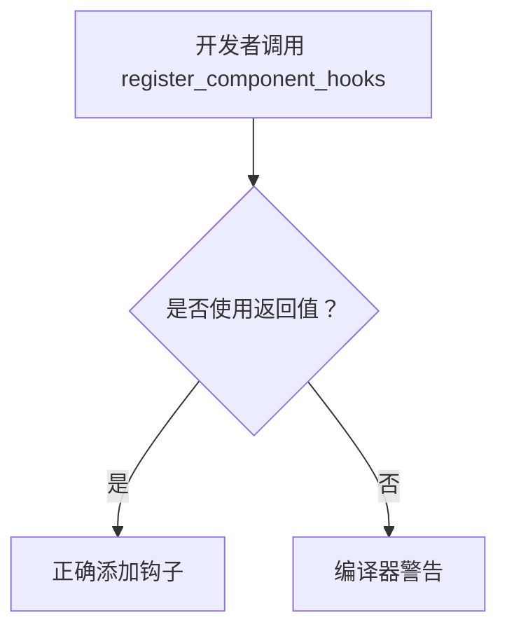

+++
title = "#19945 add must_use to register_component_hooks"
date = "2025-07-05T00:00:00"
draft = false
template = "pull_request_page.html"
in_search_index = false

[extra]
current_language = "zh-cn"
available_languages = {"en" = { name = "English", url = "/pull_request/bevy/2025-07/pr-19945-en-20250705" }, "zh-cn" = { name = "中文", url = "/pull_request/bevy/2025-07/pr-19945-zh-cn-20250705" }}
labels = ["C-Bug", "D-Trivial", "A-ECS"]
+++

## Basic Information
- **Title**: add must_use to register_component_hooks
- **PR Link**: https://github.com/bevyengine/bevy/pull/19945
- **Author**: atlv24
- **Status**: MERGED
- **Labels**: C-Bug, D-Trivial, A-ECS, S-Ready-For-Final-Review
- **Created**: 2025-07-04T07:26:28Z
- **Merged**: 2025-07-04T16:43:47Z
- **Merged By**: alice-i-cecile

## Description Translation
### 目标
- 我意外地调用了`register_component_hooks`却没有实际添加钩子，且没有注意到这个错误

### 解决方案
- 添加`must_use`属性标记，防止其他人遇到同样问题（虽然这可能只是我个人技术不足导致的）

## The Story of This Pull Request

在ECS系统开发中，组件注册是基础操作。开发者atlv24在调试时发现一个隐蔽问题：他调用了`register_component_hooks`方法获取`ComponentHooks`的可变引用，但后续忘记实际添加钩子函数。这个错误没有产生编译错误或运行时警告，导致难以察觉的行为缺失。

问题的核心在于`register_component_hooks`返回`&mut ComponentHooks`但不强制使用返回值。Rust的`#[must_use]`属性正是为此场景设计，它会对未使用返回值的代码发出编译器警告。这种模式在Rust生态中常见，特别是返回重要资源或需要显式处理的类型时。

解决方案直接明确：为函数添加`#[must_use]`属性。修改后，当开发者调用该方法但忽略返回值时，编译器会产生类似以下警告：
```
warning: unused return value of `World::register_component_hooks` that must be used
```

这个改动不影响现有代码逻辑或运行时行为，纯粹是静态分析增强。它针对的是特定开发场景下的易错模式——获取资源引用后未使用。在ECS系统中，组件钩子负责生命周期事件处理，漏掉钩子注册可能导致微妙的逻辑错误。

工程决策上，这个修改体现了防御性编程原则。虽然简单，但能有效防止一类人为错误。考虑到ECS是Bevy的核心模块，这种安全增强对框架可靠性有实际价值。

## Visual Representation



## Key Files Changed

### `crates/bevy_ecs/src/world/mod.rs`
**修改说明**：  
为`register_component_hooks`方法添加`#[must_use]`属性，强制处理返回值

**代码变更**：
```rust
// 修改前：
pub fn register_component_hooks<T: Component>(&mut self) -> &mut ComponentHooks {
    let index = self.register_component::<T>();
    assert!(!self.archetypes.archetypes.iter().any(|a| a.contains(index)), ...);
    self.components.get_hooks_mut(index)
}

// 修改后：
#[must_use]  // 新增属性
pub fn register_component_hooks<T: Component>(&mut self) -> &mut ComponentHooks {
    let index = self.register_component::<T>();
    assert!(!self.archetypes.archetypes.iter().any(|a| a.contains(index)), ...);
    self.components.get_hooks_mut(index)
}
```

**关联性**：  
该修改直接实现PR目标，通过编译器辅助防止未使用返回值的情况

## Further Reading
1. Rust `#[must_use]`官方文档：https://doc.rust-lang.org/reference/attributes/diagnostics.html#the-must_use-attribute
2. Bevy ECS组件生命周期文档：https://bevyengine.org/learn/book/ECS/components/#component-hooks
3. Rust编译器警告机制：https://doc.rust-lang.org/rustc/lints/index.html