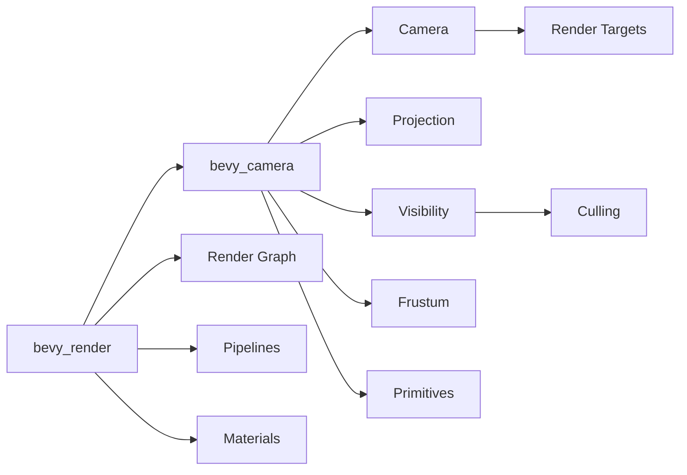

+++
title = "#19949 Split bevy_camera out of bevy_render"
date = "2025-07-05T00:00:00"
draft = false
template = "pull_request_page.html"
in_search_index = true

[taxonomies]
list_display = ["show"]

[extra]
current_language = "en"
available_languages = {"en" = { name = "English", url = "/pull_request/bevy/2025-07/pr-19949-en-20250705" }, "zh-cn" = { name = "中文", url = "/pull_request/bevy/2025-07/pr-19949-zh-cn-20250705" }}
labels = ["A-Rendering", "D-Modest"]
+++

# Technical Analysis of PR #19949: Split bevy_camera out of bevy_render

## Basic Information
- **Title**: Split bevy_camera out of bevy_render
- **PR Link**: https://github.com/bevyengine/bevy/pull/19949
- **Author**: atlv24
- **Status**: MERGED
- **Labels**: A-Rendering, S-Ready-For-Final-Review, M-Needs-Migration-Guide, D-Modest
- **Created**: 2025-07-04T09:50:33Z
- **Merged**: 2025-07-04T23:50:36Z
- **Merged By**: alice-i-cecile

## Description Translation
# Objective

- get closer to being able to load gltfs without using bevy_render

## Solution

- Split bevy_camera out of bevy_render
- Builds on #19943
- Im sorry for the big diff, i tried to minimize it as much as i can by using re-exports. This also prevents most breaking changes, but there are still a couple.

## Testing

- 3d_scene looks good

## The Story of This Pull Request

### The Problem and Context
Bevy's rendering architecture needed refinement to support loading glTF files without requiring the entire renderer. Camera and visibility systems were tightly coupled with `bevy_render`, creating unnecessary dependencies. This made it difficult to use camera-related functionality in contexts where full rendering wasn't required, such as asset processing pipelines.

The camera implementation had grown to include:
- Camera projection systems
- Visibility computation
- Frustum culling
- Render target management
- Viewport configuration

This tight coupling violated separation of concerns principles and made the codebase harder to maintain. The goal was to extract camera functionality into a self-contained crate that could be used independently.

### The Solution Approach
The solution involved creating a new `bevy_camera` crate and migrating all camera-related functionality from `bevy_render`. Key decisions included:
1. Moving camera, projection, and visibility systems to the new crate
2. Preserving existing APIs through re-exports to minimize breaking changes
3. Maintaining the existing camera-driven rendering workflow
4. Decoupling mesh AABB computation from rendering
5. Creating clear boundaries between rendering and camera systems

The extraction was designed to:
- Keep camera-related components (`Camera`, `Projection`, `Visibility`) together
- Move frustum and visibility systems to the new crate
- Maintain existing rendering behavior with minimal changes

### The Implementation
The implementation created a new `bevy_camera` crate with its own `Cargo.toml`, license files, and module structure. Camera-related files were moved from `bevy_render` to `bevy_camera`:

```rust
// New crate structure
crates/bevy_camera/
├── Cargo.toml
├── LICENSE-APACHE
├── LICENSE-MIT
├── src/
│   ├── lib.rs
│   ├── camera.rs
│   ├── clear_color.rs
│   ├── primitives.rs
│   ├── projection.rs
│   └── visibility/
│       ├── mod.rs
│       ├── range.rs
│       └── render_layers.rs
```

Camera systems were refactored to live in the new crate:

```rust
// Before: bevy_render/src/camera/mod.rs
pub fn camera_system(...) { /* implementation */ }

// After: bevy_camera/src/camera.rs
pub fn camera_system(...) { /* implementation */ }
```

Visibility systems were similarly moved:

```rust
// Before: bevy_render/src/view/visibility/mod.rs
pub fn calculate_bounds(...) { /* implementation */ }

// After: bevy_camera/src/visibility/mod.rs
pub fn calculate_bounds(...) { /* implementation */ }
```

The camera plugin was updated to register types and systems:

```rust
// bevy_camera/src/lib.rs
impl Plugin for CameraPlugin {
    fn build(&self, app: &mut App) {
        app.register_type::<Camera>()
            .add_plugins((
                CameraProjectionPlugin,
                visibility::VisibilityPlugin,
                visibility::VisibilityRangePlugin,
            ));
    }
}
```

Critical changes included:
1. **Decoupling mesh and camera**:
```rust
// bevy_camera/src/primitives.rs
pub trait MeshAabb {
    fn compute_aabb(&self) -> Option<Aabb>;
}

impl MeshAabb for Mesh {
    fn compute_aabb(&self) -> Option<Aabb> {
        // Compute AABB from mesh data
    }
}
```

2. **Camera projection system**:
```rust
// bevy_camera/src/projection.rs
pub fn update_frusta(
    mut views: Query<(&GlobalTransform, &Projection, &mut Frustum)>
) {
    for (transform, projection, mut frustum) in &mut views {
        *frustum = projection.compute_frustum(transform);
    }
}
```

3. **Visibility propagation**:
```rust
// bevy_camera/src/visibility/mod.rs
fn visibility_propagate_system(
    changed: Query<(...)>,
    mut visibility_query: Query<(...)>,
    children_query: Query<(...)>
) {
    // Update visibility hierarchy
}
```

### Technical Insights
Key technical aspects of the implementation:
- **Type preservation**: All component types (`Camera`, `Projection`, `Visibility`, etc.) retain identical definitions
- **System ordering**: Camera systems run before visibility systems in `PostUpdate`
- **Render integration**: `bevy_render` imports `bevy_camera` and uses its types through re-exports
- **Minimal breaking changes**: Existing code continues working via re-exports
- **New dependencies**: `bevy_render` now depends on `bevy_camera` in its `Cargo.toml`

The visibility system was particularly complex to extract due to its dependencies on renderer-specific concepts. This was resolved by:
1. Moving `VisibleEntities` and `RenderVisibleEntities` to `bevy_camera`
2. Keeping renderer-specific visibility logic in `bevy_render`
3. Using clear interfaces between camera and rendering systems

### The Impact
The changes significantly improve Bevy's architecture:
1. **Reduced coupling**: Camera systems no longer depend on renderer internals
2. **Better separation**: Clear division between camera/view management and rendering
3. **Improved flexibility**: Enables using cameras without full renderer
4. **Maintainability**: Smaller, focused crates are easier to understand
5. **Compilation**: Potential improvement through reduced dependencies

The extraction enables future work like:
- Camera usage in headless contexts
- Simplified 3D scene processing pipelines
- Specialized camera implementations
- Improved renderer modularization

## Visual Representation



## Key Files Changed

### `crates/bevy_camera/src/visibility/mod.rs` (+948/-0)
New home for visibility systems previously in `bevy_render`. Contains:
- Visibility propagation
- Frustum culling
- Range-based visibility
- Render layer management

```rust
// Visibility component definition
#[derive(Component, Clone, Copy, Reflect, Debug, PartialEq, Eq, Default)]
#[reflect(Component, Default, Debug, PartialEq, Clone)]
pub enum Visibility {
    #[default]
    Inherited,
    Hidden,
    Visible,
}
```

### `crates/bevy_render/src/view/visibility/mod.rs` (+7/-926)
Stub file preserving module structure with re-exports:

```rust
// Preserved for compatibility
pub use bevy_camera::visibility::*;
pub use range::*;
```

### `crates/bevy_camera/src/camera.rs` (+57/-639)
Core camera implementation:

```rust
// Camera component definition
#[derive(Component, Debug, Reflect, Clone)]
#[reflect(Component, Default, Debug, Clone)]
pub struct Camera {
    pub viewport: Option<Viewport>,
    pub target: RenderTarget,
    // ... other fields
}
```

### `crates/bevy_render/src/camera.rs` (+668/-0)
New camera implementation for renderer-specific functionality:

```rust
// Render-specific camera systems
pub fn camera_system(
    mut window_resized_events: EventReader<WindowResized>,
    // ... other parameters
) {
    // Handle window resize events
}
```

### `crates/bevy_camera/src/visibility/range.rs` (+295/-0)
Visibility range implementation:

```rust
// Visibility range component
#[derive(Component, Clone, PartialEq, Default, Reflect)]
#[reflect(Component, PartialEq, Hash, Clone)]
pub struct VisibilityRange {
    pub start_margin: Range<f32>,
    pub end_margin: Range<f32>,
    pub use_aabb: bool,
}
```

## Further Reading
1. [Bevy Engine Architecture](https://bevyengine.org/learn/book/introduction/)
2. [Entity Component System Pattern](https://en.wikipedia.org/wiki/Entity_component_system)
3. [Rendering Separation Concerns](https://gameprogrammingpatterns.com/renderer.html)
4. [glTF Loading Specifications](https://www.khronos.org/gltf/)
5. [Modular Software Design Principles](https://en.wikipedia.org/wiki/Modular_programming)