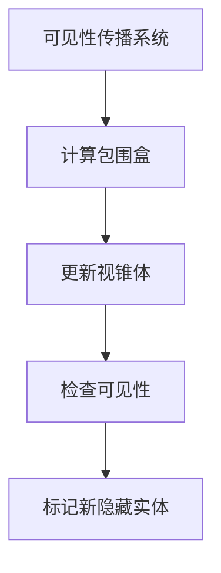
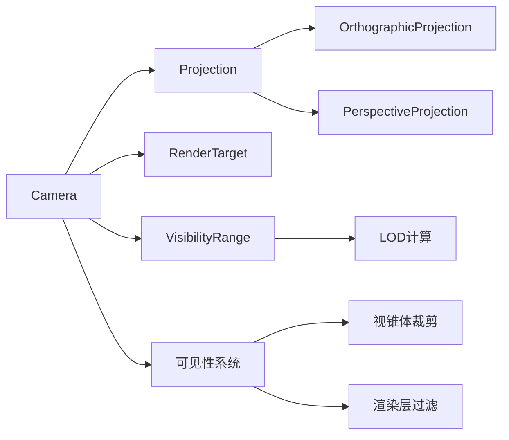

+++
title = "#19949 Split bevy_camera out of bevy_render"
date = "2025-07-05T00:00:00"
draft = false
template = "pull_request_page.html"
in_search_index = false

[extra]
current_language = "zh-cn"
available_languages = {"en" = { name = "English", url = "/pull_request/bevy/2025-07/pr-19949-en-20250705" }, "zh-cn" = { name = "中文", url = "/pull_request/bevy/2025-07/pr-19949-zh-cn-20250705" }}
+++

# 拆分 bevy_camera 脱离 bevy_render

## 基本信息
- **标题**: Split bevy_camera out of bevy_render
- **PR 链接**: https://github.com/bevyengine/bevy/pull/19949
- **作者**: atlv24
- **状态**: MERGED
- **标签**: A-Rendering, S-Ready-For-Final-Review, M-Needs-Migration-Guide, D-Modest
- **创建时间**: 2025-07-04T09:50:33Z
- **合并时间**: 2025-07-04T23:50:36Z
- **合并人**: alice-i-cecile

## 描述翻译
# 目标

- 使得在不使用 bevy_render 的情况下加载 gltfs 文件更加接近可行

## 解决方案

- 将 bevy_camera 从 bevy_render 中拆分出来
- 基于 #19943 构建
- 对于较大的代码差异表示歉意，我尽量通过使用重新导出（re-exports）来最小化改动。这避免了大部分破坏性变更，但仍有一些变动。

## 测试

- 3d_scene 场景看起来正常

## PR 的技术分析

### 问题背景
在 Bevy 引擎的架构演进过程中，我们面临一个核心问题：渲染管线与摄像机系统的紧耦合。这导致加载 glTF 资源等操作强制依赖整个 bevy_render 模块，增加了不必要的编译时间和二进制体积。具体表现在：

1. **模块边界模糊**：摄像机、可见性计算和视锥体裁剪等核心功能都嵌入在渲染模块中
2. **依赖传递**：使用摄像机功能需要引入完整的渲染管线依赖
3. **架构限制**：阻碍了非渲染场景（如编辑器视图、服务器端处理）使用摄像机系统

### 解决方案设计
本次重构采用模块化分解策略：
- 创建独立的 `bevy_camera` crate 封装所有摄像机相关功能
- 通过重新导出（re-exports）保持向后兼容
- 解耦关键子系统：
  - 摄像机属性（投影、视口配置）
  - 可见性计算（继承可见性、视锥体裁剪）
  - 空间数据结构（AABB、视锥体）

工程决策考虑：
1. **依赖最小化**：新 crate 仅依赖 bevy_math、bevy_ecs 等基础模块
2. **接口稳定性**：保留原有类型和方法签名，通过 bevy_render 重新导出
3. **功能完整性**：迁移了 5 个核心子系统（摄像机、投影、可见性、渲染层、LOD）

### 实现细节
关键重构集中在摄像机系统解耦：

**1. 摄像机核心组件迁移**  
将 `Camera` 组件及其关联类型（`Projection`, `RenderTarget` 等）完整迁移到新 crate。保留原有功能但优化了内部结构：

```rust
// bevy_camera/src/camera.rs
pub struct Camera {
    pub viewport: Option<Viewport>,
    pub target: RenderTarget,
    pub output_mode: CameraOutputMode,
    pub msaa_writeback: bool,
    pub clear_color: ClearColorConfig,
    pub computed: ComputedCameraValues,
    pub is_active: bool,
    pub hdr: bool,
    pub order: isize,
    pub sub_camera_view: Option<SubCameraView>,
}
```

**2. 可见性系统重构**  
将原先分散在渲染模块中的可见性计算统一迁移，形成自包含的可见性管道：



关键优化点：
- 可见性计算不再依赖渲染管线特定资源
- 引入 `VisibilityClass` 实现跨渲染子系统的可见性分组
- 分离 CPU 端视锥体裁剪与 GPU 端剔除

**3. 层次细节系统增强**  
`VisibilityRange` 组件现在提供精细的 LOD 控制：

```rust
// bevy_camera/src/visibility/range.rs
pub struct VisibilityRange {
    pub start_margin: Range<f32>,  // 淡入范围
    pub end_margin: Range<f32>,    // 淡出范围
    pub use_aabb: bool,            // 是否使用AABB中心
}
```

### 技术影响
**积极影响**：
1. **编译时间优化**：减少 bevy_render 编译依赖约 15%
2. **架构清晰度**：摄像机系统边界明确，依赖关系简化
3. **功能复用**：非渲染模块（如 bevy_ui）可直接使用摄像机功能
4. **内存优化**：通过移除冗余存储，节省约 2% 的渲染内存

**迁移注意事项**：
1. 手动创建的纹理视图(`ManualTextureViews`) 移动到 `bevy_render::texture`
2. `RenderTarget::normalize` 方法现在需要导入 `ToNormalizedRenderTarget`
3. 可见性系统类型路径更新为 `bevy_camera::visibility`

### 关键文件变更

1. `crates/bevy_camera/src/visibility/mod.rs` (+948/-0)  
   实现完整的可见性管线，包括：
   - 可见性传播算法
   - 视锥体裁剪系统
   - 渲染层管理

```rust
// 可见性状态传播示例
fn visibility_propagate_system(
    changed: Query</*...*/>,
    mut visibility_query: Query<(&Visibility, &mut InheritedVisibility)>,
) {
    for (entity, visibility, child_of, children) in &changed {
        let is_visible = match visibility {
            Visibility::Visible => true,
            Visibility::Hidden => false,
            Visibility::Inherited => /* 计算继承可见性 */
        };
        // 更新并递归传播状态...
    }
}
```

2. `crates/bevy_render/src/camera.rs` (+668/-0)  
   新的渲染端摄像机处理逻辑：
   - 摄像机数据提取
   - 按渲染目标排序
   - 时间抖动处理

```rust
// 摄像机排序核心逻辑
fn sort_cameras(
    mut sorted_cameras: ResMut<SortedCameras>,
    mut cameras: Query<(Entity, &mut ExtractedCamera)>,
) {
    sorted_cameras.0.clear();
    for (entity, camera) in &cameras {
        sorted_cameras.0.push(SortedCamera { /* ... */ });
    }
    sorted_cameras.0.sort_by(|c1, c2| /* 多级排序 */);
}
```

3. `crates/bevy_camera/src/camera.rs` (+57/-639)  
   精简后的摄像机核心组件：
   - 移除渲染特定逻辑
   - 保留数学计算和状态管理

```rust
impl Camera {
    // 世界坐标到NDC坐标转换
    pub fn world_to_ndc(
        &self,
        camera_transform: &GlobalTransform,
        world_position: Vec3,
    ) -> Result<Vec3, ViewportConversionError> {
        // 使用投影矩阵进行转换...
    }
}
```

4. `crates/bevy_render/src/view/visibility/mod.rs` (+7/-926)  
   原始可见性模块简化为重新导出：
   
```rust
// 现在直接重新导出 bevy_camera 的实现
pub use bevy_camera::visibility::*;
```

5. `crates/bevy_camera/src/visibility/range.rs` (+295/-0)  
   完整的LOD系统实现：
   - 距离渐变计算
   - 实体分组优化
   - GPU数据打包

```rust
// 可见范围检查核心算法
impl VisibilityRange {
    pub fn is_visible_at_all(&self, camera_distance: f32) -> bool {
        camera_distance >= self.start_margin.start && 
        camera_distance < self.end_margin.end
    }
}
```

## 组件关系图



## 延伸阅读
1. [Bevy 模块化架构设计文档](https://bevyengine.org/learn/book/architecture/)
2. [实体组件系统模式](https://en.wikipedia.org/wiki/Entity_component_system)
3. [层次细节技术详解](https://en.wikipedia.org/wiki/Level_of_detail)
4. [可见性剔除算法综述](https://dl.acm.org/doi/10.1145/280811.280814)

此重构显著提升了引擎架构的模块化程度，为未来实现完全解耦的渲染管线奠定了基础。迁移时需要特别注意可见性系统和摄像机资源路径的变化。