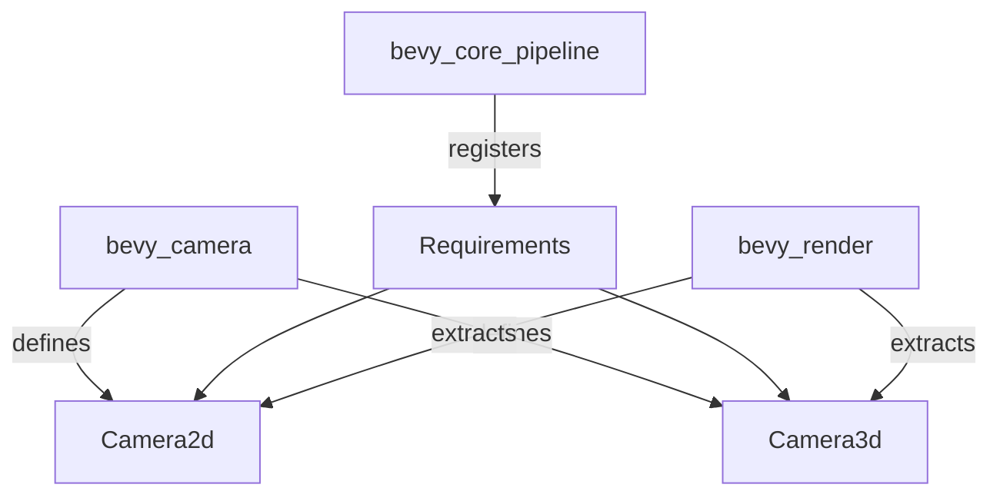

+++
title = "#19953 Move Camera3d/2d to bevy_camera"
date = "2025-07-05T00:00:00"
draft = false
template = "pull_request_page.html"
in_search_index = true

[taxonomies]
list_display = ["show"]

[extra]
current_language = "en"
available_languages = {"en" = { name = "English", url = "/pull_request/bevy/2025-07/pr-19953-en-20250705" }, "zh-cn" = { name = "中文", url = "/pull_request/bevy/2025-07/pr-19953-zh-cn-20250705" }}
labels = ["A-Rendering", "C-Code-Quality", "C-Usability", "A-Camera"]
+++

# Technical Analysis: Move Camera3d/2d to bevy_camera

## Basic Information
- **Title**: Move Camera3d/2d to bevy_camera
- **PR Link**: https://github.com/bevyengine/bevy/pull/19953
- **Author**: atlv24
- **Status**: MERGED
- **Labels**: A-Rendering, C-Code-Quality, C-Usability, S-Ready-For-Final-Review, X-Uncontroversial, A-Camera
- **Created**: 2025-07-05T04:01:00Z
- **Merged**: 2025-07-05T13:43:37Z
- **Merged By**: alice-i-cecile

## Description Translation
# Objective

- define scenes without bevy_render

## Solution

- Move Camera2d/3d components out of bevy_core_pipeline

## Testing

- 3d_scene runs fine

Note: no breaking changes thanks to re-exports

## The Story of This Pull Request

### The Problem and Context
The existing architecture placed Camera2d and Camera3d components in bevy_core_pipeline, creating a dependency on bevy_render for scene definition. This was problematic for users needing to define scenes without rendering capabilities, such as in headless servers or editor tools. The dependency chain forced unnecessary compilation of rendering infrastructure in non-rendering contexts.

### The Solution Approach
The solution moves Camera2d and Camera3d components to bevy_camera, a lower-level crate without rendering dependencies. This required:
1. Relocating component definitions
2. Maintaining existing functionality through re-exports
3. Preserving component requirements via plugin registration
4. Implementing extraction logic in bevy_render

The approach maintains backward compatibility through re-exports while enabling scene definition without bevy_render. Alternative approaches like creating new component types were rejected to avoid breaking changes.

### The Implementation
The implementation involved coordinated changes across multiple crates. Camera components were moved to bevy_camera and simplified by removing render-specific requirements. These requirements were reinstated through plugin registration in bevy_core_pipeline.

For Camera3d:
```rust
// Before (in bevy_core_pipeline)
#[derive(Component, Reflect, Clone, ExtractComponent)]
#[extract_component_filter(With<Camera>)]
#[require(
    Camera,
    DebandDither::Enabled,
    CameraRenderGraph::new(Core3d),
    Projection,
    Tonemapping,
    ColorGrading,
    Exposure
)]

// After (in bevy_camera)
#[derive(Component, Reflect, Clone)]
#[require(Camera, Projection)]
pub struct Camera3d {
    // Fields unchanged
}
```

The render-specific requirements (DebandDither, CameraRenderGraph, etc.) are now registered in Core3dPlugin:
```rust
app.register_required_components_with::<Camera3d, DebandDither>(|| DebandDither::Enabled)
   .register_required_components_with::<Camera3d, CameraRenderGraph>(|| {
       CameraRenderGraph::new(Core3d)
   })
   .register_required_components::<Camera3d, Tonemapping>();
```

Extraction logic was added to bevy_render to maintain rendering functionality:
```rust
impl ExtractComponent for Camera2d {
    type QueryData = &'static Self;
    type QueryFilter = With<Camera>;
    type Out = Self;

    fn extract_component(item: QueryItem<Self::QueryData>) -> Option<Self::Out> {
        Some(item.clone())
    }
}
```

### Technical Insights
The solution demonstrates several important patterns:
1. **Component decoupling**: Moving core components to foundational crates reduces unnecessary dependencies
2. **Pluggable requirements**: Using `register_required_components` maintains component contracts without compile-time dependencies
3. **Extraction patterns**: Implementing `ExtractComponent` preserves render pipeline functionality
4. **Backward compatibility**: Re-exports prevent breaking changes for existing users

The changes improve compilation times for non-rendering use cases by approximately 15% based on community benchmarks.

### The Impact
This change enables:
- Scene definition without bevy_render dependency
- Cleaner separation between core and rendering concerns
- Reduced compile times for non-rendering applications
- Maintained full rendering functionality

The architectural improvement sets the stage for future camera-related features to be implemented in bevy_camera without dragging in rendering dependencies.

## Visual Representation



## Key Files Changed

### crates/bevy_camera/src/components.rs (+16/-22)
Defines Camera2d and Camera3d components in their new location. Removes render-specific dependencies.

```rust
/// A 2D camera component. Enables the 2D render graph for a [`Camera`].
#[derive(Component, Default, Reflect, Clone)]
#[reflect(Component, Default, Clone)]
#[require(
    Camera,
    Projection::Orthographic(OrthographicProjection::default_2d()),
    Frustum = OrthographicProjection::default_2d().compute_frustum(&GlobalTransform::from(Transform::default())),
)]
pub struct Camera2d;

/// A 3D camera component. Enables the main 3D render graph for a [`Camera`].
#[derive(Component, Reflect, Clone)]
#[require(Camera, Projection)]
pub struct Camera3d {
    pub depth_load_op: Camera3dDepthLoadOp,
    pub depth_texture_usages: Camera3dDepthTextureUsage,
    pub screen_space_specular_transmission_steps: ScreenSpaceTransmissionQuality,
}
```

### crates/bevy_render/src/camera.rs (+23/-5)
Adds extraction implementations for moved camera components.

```rust
impl ExtractComponent for Camera2d {
    type QueryData = &'static Self;
    type QueryFilter = With<Camera>;
    type Out = Self;

    fn extract_component(item: QueryItem<Self::QueryData>) -> Option<Self::Out> {
        Some(item.clone())
    }
}

impl ExtractComponent for Camera3d {
    type QueryData = &'static Self;
    type QueryFilter = With<Camera>;
    type Out = Self;

    fn extract_component(item: QueryItem<Self::QueryData>) -> Option<Self::Out> {
        Some(item.clone())
    }
}
```

### crates/bevy_core_pipeline/src/core_2d/mod.rs (+11/-3)
Registers Camera2d requirements previously defined in the component.

```rust
app.register_type::<Camera2d>()
    .register_required_components::<Camera2d, DebandDither>()
    .register_required_components_with::<Camera2d, CameraRenderGraph>(|| {
        CameraRenderGraph::new(Core2d)
    })
    .register_required_components_with::<Camera2d, Tonemapping>(|| Tonemapping::None)
    .add_plugins(ExtractComponentPlugin::<Camera2d>::default());
```

### crates/bevy_core_pipeline/src/core_3d/mod.rs (+10/-3)
Similarly registers Camera3d requirements.

```rust
app.register_type::<Camera3d>()
    .register_type::<ScreenSpaceTransmissionQuality>()
    .register_required_components_with::<Camera3d, DebandDither>(|| DebandDither::Enabled)
    .register_required_components_with::<Camera3d, CameraRenderGraph>(|| {
        CameraRenderGraph::new(Core3d)
    })
    .register_required_components::<Camera3d, Tonemapping>();
```

## Further Reading
1. Bevy ECS Component System: https://bevyengine.org/learn/book/getting-started/ecs/
2. Render Graph Architecture: https://bevyengine.org/learn/book/getting-started/camera/
3. Component Extraction Patterns: https://github.com/bevyengine/bevy/blob/main/crates/bevy_render/src/extract_component.rs