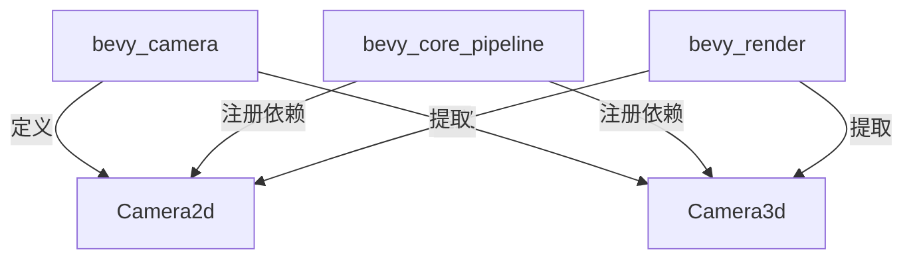

+++
title = "#19953 Move Camera3d/2d to bevy_camera"
date = "2025-07-05T00:00:00"
draft = false
template = "pull_request_page.html"
in_search_index = false

[extra]
current_language = "zh-cn"
available_languages = {"en" = { name = "English", url = "/pull_request/bevy/2025-07/pr-19953-en-20250705" }, "zh-cn" = { name = "中文", url = "/pull_request/bevy/2025-07/pr-19953-zh-cn-20250705" }}
+++

# Move Camera3d/2d to bevy_camera 技术分析报告

## 基本信息
- **标题**: Move Camera3d/2d to bevy_camera
- **PR链接**: https://github.com/bevyengine/bevy/pull/19953
- **作者**: atlv24
- **状态**: MERGED
- **标签**: A-Rendering, C-Code-Quality, C-Usability, S-Ready-For-Final-Review, X-Uncontroversial, A-Camera
- **创建时间**: 2025-07-05T04:01:00Z
- **合并时间**: 2025-07-05T13:43:37Z
- **合并人**: alice-i-cecile

## 描述翻译
### 目标
- 在不依赖 bevy_render 的情况下定义场景

### 解决方案
- 将 Camera2d/3d 组件从 bevy_core_pipeline 移出

### 测试
- 3d_scene 运行正常

注意：通过重新导出(re-exports)避免了破坏性变更

## 这个PR的故事

### 问题与背景
Bevy 引擎的架构中，Camera2d 和 Camera3d 组件原先位于 `bevy_core_pipeline` 模块中。这导致了一个架构问题：任何需要使用相机的场景都必须依赖 `bevy_render` 模块，即使该场景不需要实际的渲染功能。这种依赖关系限制了引擎在非渲染场景中的使用，例如纯逻辑处理或服务器端应用。

主要技术约束：
1. 相机组件与渲染管线紧密耦合
2. 不必要的依赖增加了项目构建复杂性和编译时间
3. 违反关注点分离原则(Separation of Concerns)

### 解决方案方法
PR 选择了直接重构方案：将 Camera2d 和 Camera3d 组件迁移到更基础的 `bevy_camera` 模块中。这种方法：
1. 解除了相机与渲染管线的直接依赖
2. 保持向后兼容性通过重新导出
3. 利用 Bevy 的组件注册机制动态添加渲染相关依赖

替代方案考虑：
- 创建新接口层：会增加不必要的抽象复杂度
- 条件编译：会破坏代码一致性，增加维护成本

工程决策关键点：
1. 保持现有组件 API 不变
2. 使用 `register_required_components` 动态注入渲染依赖
3. 保留所有现有功能和行为

### 实现细节
核心实现包含三个技术动作：

**1. 组件迁移**
将 Camera2d 和 Camera3d 从 `bevy_core_pipeline` 移动到 `bevy_camera` 模块，同时简化组件定义：

```rust
// File: crates/bevy_camera/src/components.rs
// Before (Camera3d 在 bevy_core_pipeline 中的定义):
#[derive(Component, Reflect, Clone, ExtractComponent)]
#[extract_component_filter(With<Camera>)]
#[reflect(Component, Default, Clone)]
#[require(
    Camera,
    DebandDither::Enabled,
    CameraRenderGraph::new(Core3d),
    Projection,
    Tonemapping,
    ColorGrading,
    Exposure
)]
pub struct Camera3d { ... }

// After (在 bevy_camera 中的简化定义):
#[derive(Component, Reflect, Clone)]
#[reflect(Component, Default, Clone)]
#[require(Camera, Projection)]
pub struct Camera3d {
    pub depth_load_op: Camera3dDepthLoadOp,
    pub depth_texture_usages: Camera3dDepthTextureUsage,
    pub screen_space_specular_transmission_quality: ScreenSpaceTransmissionQuality,
}
```

**2. 依赖注册机制**
在管线插件中显式注册所需的渲染组件：

```rust
// File: crates/bevy_core_pipeline/src/core_2d/mod.rs
app.register_type::<Camera2d>()
    .register_required_components::<Camera2d, DebandDither>()
    .register_required_components_with::<Camera2d, CameraRenderGraph>(|| {
        CameraRenderGraph::new(Core2d)
    })
    .register_required_components_with::<Camera2d, Tonemapping>(|| Tonemapping::None);
```

**3. 提取组件实现**
在渲染模块添加 ExtractComponent 实现：

```rust
// File: crates/bevy_render/src/camera.rs
impl ExtractComponent for Camera2d {
    type QueryData = &'static Self;
    type QueryFilter = With<Camera>;
    type Out = Self;

    fn extract_component(item: QueryItem<Self::QueryData>) -> Option<Self::Out> {
        Some(item.clone())
    }
}
```

### 技术洞察
1. **组件注册模式**：使用 `register_required_components` 实现了依赖注入，保持了组件的解耦
2. **提取机制**：通过实现 `ExtractComponent` 保持渲染世界的同步
3. **架构分层**：
   - 基础层 (`bevy_camera`)：定义相机核心概念
   - 渲染层 (`bevy_core_pipeline`)：添加渲染特定功能
4. **无破坏性变更**：通过重新导出保持现有代码兼容性



### 影响
1. **架构改进**：
   - 解除了场景定义对渲染模块的强制依赖
   - 相机核心逻辑与渲染实现分离
2. **使用性提升**：
   - 可在无渲染环境中使用相机组件
   - 减少非渲染应用的依赖项
3. **代码质量**：
   - 模块职责更清晰
   - 减少了核心管线模块的复杂度
4. **性能**：无运行时性能影响，编译时依赖减少

## 关键文件变更

### 1. `crates/bevy_camera/src/components.rs` (+16/-22)
- **目的**：集中存放相机组件定义
- **关键变更**：
  ```rust
  // 新增 Camera2d 定义
  #[derive(Component, Default, Reflect, Clone)]
  #[reflect(Component, Default, Clone)]
  #[require(
      Camera,
      Projection::Orthographic(OrthographicProjection::default_2d()),
      Frustum = OrthographicProjection::default_2d().compute_frustum(&GlobalTransform::from(Transform::default())),
  )]
  pub struct Camera2d;
  
  // 简化的 Camera3d 定义
  #[derive(Component, Reflect, Clone)]
  #[reflect(Component, Default, Clone)]
  #[require(Camera, Projection)]
  pub struct Camera3d {
      pub depth_load_op: Camera3dDepthLoadOp,
      pub depth_texture_usages: Camera3dDepthTextureUsage,
      pub screen_space_specular_transmission_quality: ScreenSpaceTransmissionQuality,
  }
  ```

### 2. `crates/bevy_render/src/camera.rs` (+23/-5)
- **目的**：实现相机组件的提取逻辑
- **关键变更**：
  ```rust
  impl ExtractComponent for Camera2d {
      type QueryData = &'static Self;
      type QueryFilter = With<Camera>;
      type Out = Self;
  
      fn extract_component(item: QueryItem<Self::QueryData>) -> Option<Self::Out> {
          Some(item.clone())
      }
  }
  
  impl ExtractComponent for Camera3d {
      // 类似实现
  }
  ```

### 3. `crates/bevy_core_pipeline/src/core_2d/mod.rs` (+11/-3)
- **目的**：注册 Camera2d 的渲染依赖
- **关键变更**：
  ```rust
  app.register_type::<Camera2d>()
      .register_required_components::<Camera2d, DebandDither>()
      .register_required_components_with::<Camera2d, CameraRenderGraph>(|| {
          CameraRenderGraph::new(Core2d)
      })
      .register_required_components_with::<Camera2d, Tonemapping>(|| Tonemapping::None);
  ```

### 4. `crates/bevy_core_pipeline/src/core_3d/mod.rs` (+10/-3)
- **目的**：注册 Camera3d 的渲染依赖
- **关键变更**：
  ```rust
  app.register_type::<Camera3d>()
      .register_required_components_with::<Camera3d, DebandDither>(|| DebandDither::Enabled)
      .register_required_components_with::<Camera3d, CameraRenderGraph>(|| {
          CameraRenderGraph::new(Core3d)
      })
      .register_required_components::<Camera3d, Tonemapping>();
  ```

### 5. `crates/bevy_core_pipeline/src/core_2d/camera_2d.rs` (删除)
- **目的**：移除旧实现
- **变更**：文件完全删除

## 进一步阅读
1. [Bevy ECS 组件系统](https://bevyengine.org/learn/book/ecs/components/)
2. [渲染提取阶段文档](https://bevyengine.org/learn/book/rendering/extract/)
3. [Bevy 模块架构设计原则](https://github.com/bevyengine/bevy/blob/main/docs/architecture_principles.md)
4. [实体组件系统模式](https://en.wikipedia.org/wiki/Entity_component_system)