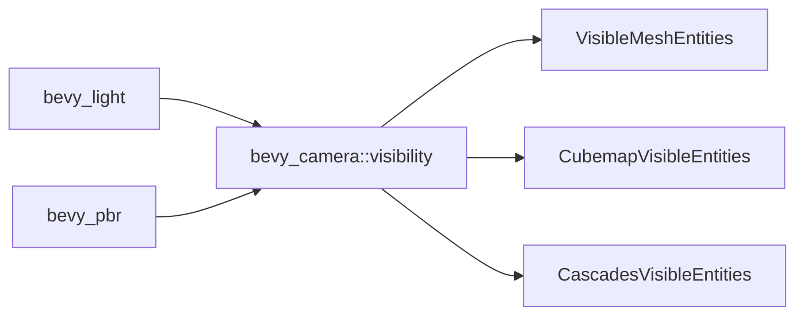

+++
title = "#19954 move some Visibility stuff to bevy_camera::visibility"
date = "2025-07-05T00:00:00"
draft = false
template = "pull_request_page.html"
in_search_index = true

[taxonomies]
list_display = ["show"]

[extra]
current_language = "en"
available_languages = {"en" = { name = "English", url = "/pull_request/bevy/2025-07/pr-19954-en-20250705" }, "zh-cn" = { name = "中文", url = "/pull_request/bevy/2025-07/pr-19954-zh-cn-20250705" }}
labels = ["A-Rendering"]
+++

## move some Visibility stuff to bevy_camera::visibility

### Basic Information
- **Title**: move some Visibility stuff to bevy_camera::visibility
- **PR Link**: https://github.com/bevyengine/bevy/pull/19954
- **Author**: atlv24
- **Status**: MERGED
- **Labels**: A-Rendering, S-Ready-For-Final-Review
- **Created**: 2025-07-05T04:25:33Z
- **Merged**: 2025-07-05T13:43:37Z
- **Merged By**: alice-i-cecile

### Description Translation
# Objective
- Make bevy_light possible

## Solution
- Move some stuff it needs out of somewhere it cant depend on. Plus it makes sense, visibility stuff goes in visibility.

## Testing
- 3d_scene runs

Note: no breaking changes thanks to re-exports

### The Story of This Pull Request
The PR addresses a dependency issue blocking the development of `bevy_light`, a new lighting system. Visibility components required by both lighting and rendering systems were previously located in `bevy_pbr`, creating an undesirable dependency chain where `bevy_light` would need to depend on the full PBR system. This architectural limitation prevented clean separation of concerns.

The solution reorganizes visibility-related components by moving them from `bevy_pbr` to the more logically appropriate `bevy_camera::visibility` module. This relocation achieves two key objectives:
1. It eliminates the forced dependency of `bevy_light` on `bevy_pbr`
2. It centralizes visibility logic in a dedicated module

Three core components were migrated:
1. `VisibleMeshEntities` - tracks mesh entities visible for lighting
2. `CubemapVisibleEntities` - manages visibility for cubemap faces
3. `CascadesVisibleEntities` - handles visibility cascades for shadow mapping

The implementation maintains backward compatibility through re-exports from `bevy_pbr::components`. This ensures existing systems continue working without modification. The changes include:
- Adding component definitions to `bevy_camera`
- Registering types for reflection in the camera crate
- Adding `bevy_camera` as a dependency to `bevy_pbr`
- Removing duplicate definitions from `bevy_pbr`
- Preserving rendering-specific variants like `RenderVisibleMeshEntities`

Testing confirmed no regressions in the 3D scene rendering pipeline. The relocation follows Bevy's modular architecture principles and enables cleaner separation between lighting and rendering systems.

### Visual Representation


### Key Files Changed

1. **crates/bevy_camera/src/visibility/mod.rs** (+48/-1)  
   Added visibility components previously in PBR:
   ```rust
   // Added components
   #[derive(Component, Clone, Debug, Default, Reflect, Deref, DerefMut)]
   #[reflect(Component, Debug, Default, Clone)]
   pub struct VisibleMeshEntities {
       #[reflect(ignore, clone)]
       pub entities: Vec<Entity>,
   }
   
   #[derive(Component, Clone, Debug, Default, Reflect)]
   #[reflect(Component, Debug, Default, Clone)]
   pub struct CubemapVisibleEntities {
       #[reflect(ignore, clone)]
       data: [VisibleMeshEntities; 6],
   }
   
   #[derive(Component, Clone, Debug, Default, Reflect)]
   #[reflect(Component, Default, Clone)]
   pub struct CascadesVisibleEntities {
       #[reflect(ignore, clone)]
       pub entities: EntityHashMap<Vec<VisibleMeshEntities>>,
   }
   ```
   Registered new types for reflection:
   ```rust
   .register_type::<CascadesVisibleEntities>()
   .register_type::<VisibleMeshEntities>()
   .register_type::<CubemapVisibleEntities>()
   ```

2. **crates/bevy_pbr/Cargo.toml** (+1/-0)  
   Added dependency to access moved components:
   ```toml
   bevy_camera = { path = "../bevy_camera", version = "0.17.0-dev" }
   ```

3. **crates/bevy_pbr/src/components.rs** (+3/-43)  
   Replaced local definitions with re-exports:
   ```rust
   // Before:
   pub struct VisibleMeshEntities { /* ... */ }
   
   // After:
   pub use bevy_camera::visibility::{
       CascadesVisibleEntities, CubemapVisibleEntities, VisibleMeshEntities,
   };
   ```
   Preserved render-specific components:
   ```rust
   #[derive(Component, Clone, Debug, Default, Reflect, Deref, DerefMut)]
   #[reflect(Component, Debug, Default, Clone)]
   pub struct RenderVisibleMeshEntities {
       pub entities: Vec<(Entity, MainEntity)>,
   }
   ```

4. **crates/bevy_pbr/src/lib.rs** (+0/-3)  
   Removed reflection registration for moved components:
   ```rust
   // Removed:
   .register_type::<CascadesVisibleEntities>()
   .register_type::<VisibleMeshEntities>()
   .register_type::<CubemapVisibleEntities>()
   ```

### Further Reading
1. [Bevy ECS Guide](https://bevyengine.org/learn/book/getting-started/ecs/)  
2. [Rendering Architecture Overview](https://github.com/bevyengine/bevy/blob/main/docs/plugins_guidelines.md#rendering)  
3. [Component Reflection Documentation](https://docs.rs/bevy_reflect/latest/bevy_reflect/#component-reflection)