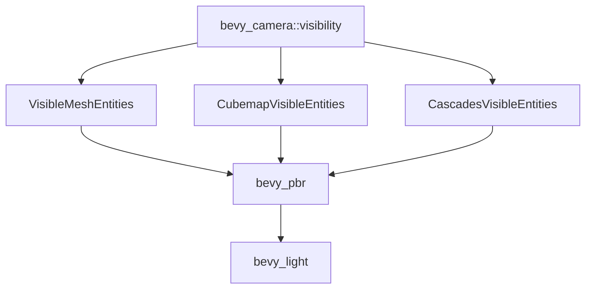

+++
title = "#19954 move some Visibility stuff to bevy_camera::visibility"
date = "2025-07-05T00:00:00"
draft = false
template = "pull_request_page.html"
in_search_index = false

[extra]
current_language = "zh-cn"
available_languages = {"en" = { name = "English", url = "/pull_request/bevy/2025-07/pr-19954-en-20250705" }, "zh-cn" = { name = "中文", url = "/pull_request/bevy/2025-07/pr-19954-zh-cn-20250705" }}
+++

## move some Visibility stuff to bevy_camera::visibility

### 基本信息  
- **标题**: move some Visibility stuff to bevy_camera::visibility  
- **PR链接**: https://github.com/bevyengine/bevy/pull/19954  
- **作者**: atlv24  
- **状态**: 已合并  
- **标签**: A-Rendering, S-Ready-For-Final-Review  
- **创建时间**: 2025-07-05T04:25:33Z  
- **合并时间**: 2025-07-05T13:43:37Z  
- **合并人**: alice-i-cecile  

### 描述翻译  
**目标**  
- 实现 bevy_light 功能  

**解决方案**  
- 将所需组件从不可依赖的模块移出。从设计角度看更合理：可见性相关组件应归属可见性模块  

**测试验证**  
- 3d_scene 场景运行正常  

注：通过重新导出(re-exports)避免破坏性变更  

### PR技术分析  
该PR的核心目标是解决模块间的循环依赖问题，为`bevy_light`模块的开发铺平道路。问题根源在于`bevy_pbr`中定义了多个可见性组件（如`VisibleMeshEntities`），而计划开发的`bevy_light`模块需要访问这些组件，但不应依赖完整的PBR渲染管线。  

解决方案采用模块重构策略：  
1. 将与摄像机可见性强相关的组件迁移至`bevy_camera::visibility`模块  
2. 在原始位置通过重新导出维持API兼容性  
3. 清理`bevy_pbr`的组件注册逻辑  

迁移的三个核心组件：  
- `VisibleMeshEntities`: 存储光源视锥内可见的网格实体  
- `CubemapVisibleEntities`: 立方体贴图六个面的可见实体集合  
- `CascadesVisibleEntities`: 级联阴影各子视锥的可见实体映射  

技术实现的关键点：  
1. **组件迁移** - 直接将组件定义从`bevy_pbr/src/components.rs`移至`bevy_camera/src/visibility/mod.rs`：  
   ```rust
   // 迁移后新增在bevy_camera的组件
   #[derive(Component, Clone, Debug, Default, Reflect, Deref, DerefMut)]
   #[reflect(Component, Debug, Default, Clone)]
   pub struct VisibleMeshEntities {
       #[reflect(ignore, clone)]
       pub entities: Vec<Entity>,
   }
   ```
   
2. **重新导出机制** - 在`bevy_pbr`中通过pub use保持兼容：  
   ```rust
   // bevy_pbr/src/components.rs
   pub use bevy_camera::visibility::{
       CascadesVisibleEntities, CubemapVisibleEntities, VisibleMeshEntities,
   };
   ```
   
3. **依赖管理** - 在`bevy_pbr/Cargo.toml`显式添加对`bevy_camera`的依赖：  
   ```toml
   bevy_camera = { path = "../bevy_camera", version = "0.17.0-dev" }
   ```

4. **类型注册优化** - 精简`bevy_pbr`的类型注册：  
   ```diff
   - .register_type::<CascadesVisibleEntities>()
   - .register_type::<VisibleMeshEntities>()
   - .register_type::<CubemapVisibleEntities>()
   ```

该方案实现了零破坏性变更，既解除了模块间的循环依赖，又保持了现有项目的兼容性。迁移后`bevy_camera`成为可见性数据的权威模块，而`bevy_pbr`和未来的`bevy_light`可平等访问这些基础组件。

### 组件关系图


### 关键文件变更
1. **crates/bevy_camera/src/visibility/mod.rs**  
   新增三个可见性组件定义：  
   ```rust
   // 新增组件定义
   #[derive(Component, Clone, Debug, Default, Reflect, Deref, DerefMut)]
   #[reflect(Component, Debug, Default, Clone)]
   pub struct VisibleMeshEntities {
       #[reflect(ignore, clone)]
       pub entities: Vec<Entity>,
   }
   
   #[derive(Component, Clone, Debug, Default, Reflect)]
   #[reflect(Component, Debug, Default, Clone)]
   pub struct CubemapVisibleEntities { ... }
   
   #[derive(Component, Clone, Debug, Default, Reflect)]
   #[reflect(Component, Default, Clone)]
   pub struct CascadesVisibleEntities { ... }
   ```
   同时扩展类型注册范围：  
   ```rust
   .register_type::<CascadesVisibleEntities>()
   .register_type::<VisibleMeshEntities>()
   .register_type::<CubemapVisibleEntities>()
   ```

2. **crates/bevy_pbr/src/components.rs**  
   移除组件定义，改为重新导出：  
   ```diff
   + pub use bevy_camera::visibility::{
   +     CascadesVisibleEntities, CubemapVisibleEntities, VisibleMeshEntities,
   + };
   - pub struct VisibleMeshEntities { ... }
   - pub struct CubemapVisibleEntities { ... }
   - pub struct CascadesVisibleEntities { ... }
   ```

3. **crates/bevy_pbr/Cargo.toml**  
   添加必要依赖：  
   ```toml
   bevy_camera = { path = "../bevy_camera", version = "0.17.0-dev" }
   ```

4. **crates/bevy_pbr/src/lib.rs**  
   清理冗余的类型注册：  
   ```diff
   - .register_type::<CascadesVisibleEntities>()
   - .register_type::<VisibleMeshEntities>()
   - .register_type::<CubemapVisibleEntities>()
   ```

### 延伸阅读  
1. [Bevy模块系统设计](https://bevyengine.org/learn/book/getting-started/ecs/)  
2. [实体组件系统(ECS)模式详解](https://en.wikipedia.org/wiki/Entity_component_system)  
3. [Rust模块可见性控制](https://doc.rust-lang.org/book/ch07-02-defining-modules-to-control-scope-and-privacy.html)