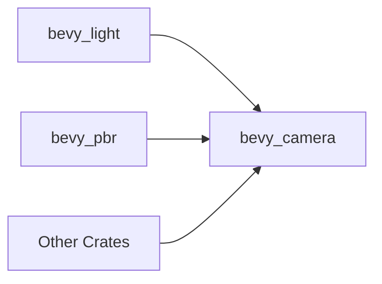

+++
title = "#19955 move Cubemap stuff alongside CubemapFrusta in bevy_camera::primitives"
date = "2025-07-05T00:00:00"
draft = false
template = "pull_request_page.html"
in_search_index = true

[taxonomies]
list_display = ["show"]

[extra]
current_language = "en"
available_languages = {"en" = { name = "English", url = "/pull_request/bevy/2025-07/pr-19955-en-20250705" }, "zh-cn" = { name = "中文", url = "/pull_request/bevy/2025-07/pr-19955-zh-cn-20250705" }}
labels = ["A-Rendering"]
+++

## Analysis of PR #19955: Move Cubemap Stuff Alongside CubemapFrusta

### Basic Information
- **Title**: move Cubemap stuff alongside CubemapFrusta in bevy_camera::primitives
- **PR Link**: https://github.com/bevyengine/bevy/pull/19955
- **Author**: atlv24
- **Status**: MERGED
- **Labels**: A-Rendering, S-Ready-For-Final-Review
- **Created**: 2025-07-05T04:35:07Z
- **Merged**: 2025-07-05T16:02:05Z
- **Merged By**: alice-i-cecile

### The Story of This Pull Request

The primary motivation for this change was to enable development of `bevy_light`, which required access to cubemap-related functionality that was previously only available in `bevy_pbr`. The core problem was that `bevy_light` couldn't reasonably depend on `bevy_pbr` since it's a higher-level abstraction, creating a circular dependency issue.

The solution involved relocating cubemap primitives (`CubeMapFace`, `CUBE_MAP_FACES`, and `face_index_to_name`) from `bevy_pbr` to `bevy_camera`, where the related `CubemapFrusta` primitive already resided. This makes architectural sense since these primitives are camera-related concepts rather than being specific to PBR rendering. The implementation maintains backward compatibility by re-exporting these symbols from `bevy_pbr`'s `render/light` module.

Key implementation steps:
1. Moved cubemap definitions to `bevy_camera::primitives`
2. Added `bevy_camera` dependency to `bevy_pbr`
3. Re-exported moved symbols from `bevy_pbr` to avoid breaking changes

The coordinate system considerations were preserved in the comments, noting that cubemaps use left-handed y-up coordinates while Bevy generally uses right-handed y-up. This is important for maintaining correct face orientation during rendering.

```rust
// Before in bevy_pbr:
pub(crate) struct CubeMapFace {
    pub(crate) target: Vec3,
    pub(crate) up: Vec3,
}

// After in bevy_camera:
pub struct CubeMapFace {
    pub target: Vec3,
    pub up: Vec3,
}
```

The visibility changed from `pub(crate)` to `pub`, making these primitives available to other crates. This enables `bevy_light` to access them without depending on `bevy_pbr`.

The changes were validated by ensuring the 3d_scene example still runs correctly, confirming no functional regressions. The re-exports prevent breaking changes for existing users of these symbols from `bevy_pbr`.

### Visual Representation



### Key Files Changed

1. **crates/bevy_camera/src/primitives.rs** (+57/-0)  
Added cubemap primitives alongside existing camera frustum types.

```rust
pub struct CubeMapFace {
    pub target: Vec3,
    pub up: Vec3,
}

pub const CUBE_MAP_FACES: [CubeMapFace; 6] = [
    // +X
    CubeMapFace {
        target: Vec3::X,
        up: Vec3::Y,
    },
    // ... other faces
];

pub fn face_index_to_name(face_index: usize) -> &'static str {
    match face_index {
        0 => "+x",
        // ... other cases
    }
}
```

2. **crates/bevy_pbr/src/render/light.rs** (+1/-57)  
Removed local definitions and re-exported from `bevy_camera`.

```rust
// Removed:
// pub(crate) struct CubeMapFace { ... }
// pub(crate) const CUBE_MAP_FACES: [CubeMapFace; 6] = ...
// fn face_index_to_name(face_index: usize) -> ... 

// Added re-exports:
pub use bevy_camera::primitives::{face_index_to_name, CubeMapFace, CUBE_MAP_FACES};
```

3. **crates/bevy_pbr/Cargo.toml** (+1/-0)  
Added dependency on `bevy_camera`.

```toml
bevy_camera = { path = "../bevy_camera", version = "0.17.0-dev" }
```

### Further Reading
1. [WebGPU Texture View Creation](https://www.w3.org/TR/webgpu/#texture-view-creation)  
2. [Vulkan Cube Map Face Selection](https://registry.khronos.org/vulkan/specs/1.2/html/chap16.html#_cube_map_face_selection)  
3. [Bevy Camera Primitives Documentation](https://docs.rs/bevy_camera/latest/bevy_camera/primitives/index.html)