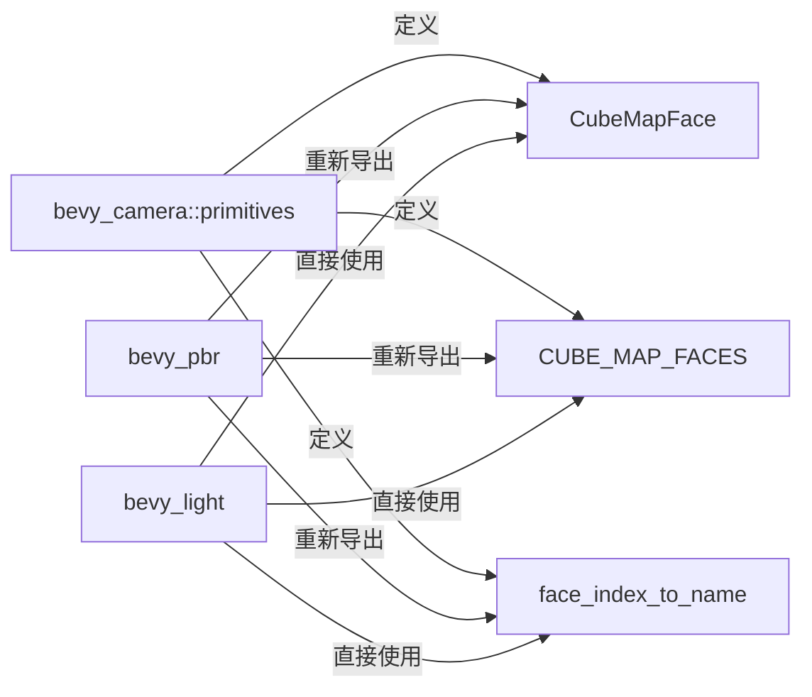

+++
title = "#19955 move Cubemap stuff alongside CubemapFrusta in bevy_camera::primitives"
date = "2025-07-05T00:00:00"
draft = false
template = "pull_request_page.html"
in_search_index = false

[extra]
current_language = "zh-cn"
available_languages = {"en" = { name = "English", url = "/pull_request/bevy/2025-07/pr-19955-en-20250705" }, "zh-cn" = { name = "中文", url = "/pull_request/bevy/2025-07/pr-19955-zh-cn-20250705" }}
labels = ["A-Rendering"]
+++

# PR #19955: move Cubemap stuff alongside CubemapFrusta in bevy_camera::primitives

## Basic Information
- **Title**: move Cubemap stuff alongside CubemapFrusta in bevy_camera::primitives
- **PR Link**: https://github.com/bevyengine/bevy/pull/19955
- **Author**: atlv24
- **Status**: MERGED
- **Labels**: A-Rendering, S-Ready-For-Final-Review
- **Created**: 2025-07-05T04:35:07Z
- **Merged**: 2025-07-05T16:02:05Z
- **Merged By**: alice-i-cecile

## Description Translation
### 目标
- 为 `bevy_light` 的实现铺平道路

### 解决方案
- 将 `bevy_light` 所需的一些代码从它无法依赖的地方移出来。此外，这样安排也更合理，cubemap 相关的代码应该和 cubemap 相关的代码放在一起。

### 测试
- 3d_scene 正常运行

注意：由于使用了重新导出（re-exports），所以没有破坏性变更。

## The Story of This Pull Request

`bevy_light` 模块的开发需要访问 cubemap 面（cube map faces）的定义，但这些定义原本位于 `bevy_pbr` 的渲染模块中。这造成了模块依赖问题，因为 `bevy_light` 不应依赖 `bevy_pbr` 这样的高级渲染模块。开发者需要将这些基础定义移动到更通用的位置。

解决方案是将 `CubeMapFace` 结构体、`CUBE_MAP_FACES` 常量数组和 `face_index_to_name` 函数从 `bevy_pbr/src/render/light.rs` 迁移到 `bevy_camera/src/primitives.rs`。这个位置更合理，因为这些定义本质上是描述相机投影的几何原语（primitives），与现有的 `CubemapFrusta` 结构体在概念上属于同一范畴。

在实现上，首先在 `bevy_camera` 的 primitives 模块中新增了这些定义：
```rust
pub struct CubeMapFace {
    pub target: Vec3,
    pub up: Vec3,
}

pub const CUBE_MAP_FACES: [CubeMapFace; 6] = [
    // +X
    CubeMapFace {
        target: Vec3::X,
        up: Vec3::Y,
    },
    // ...其他面定义
];

pub fn face_index_to_name(face_index: usize) -> &'static str {
    match face_index {
        0 => "+x",
        // ...其他分支
    }
}
```

随后从 `bevy_pbr` 中移除了这些重复定义，改为通过重新导出（re-export）来访问：
```rust
pub use bevy_camera::primitives::{face_index_to_name, CubeMapFace, CUBE_MAP_FACES};
```

为了维护模块依赖关系，在 `bevy_pbr/Cargo.toml` 中显式添加了对 `bevy_camera` 的依赖：
```toml
bevy_camera = { path = "../bevy_camera", version = "0.17.0-dev" }
```

这个重构的关键技术点在于：
1. 通过重新导出保持向后兼容性，避免破坏现有代码
2. 遵循 Khronos/Vulkan 的立方体贴图坐标系约定
3. 保留所有原始注释说明坐标系差异（右手系 vs 左手系）
4. 验证 3D 场景渲染不受影响

迁移后，`bevy_light` 可以直接从 `bevy_camera` 导入这些定义，无需依赖 `bevy_pbr`。同时代码组织更合理——立方体贴图相关的几何定义现在与 `CubemapFrusta` 集中存放在相机原语模块中，提高了可发现性和可维护性。

## Visual Representation



## Key Files Changed

### 1. `crates/bevy_camera/src/primitives.rs` (+57/-0)
新增了 cubemap 相关的基础定义：
```rust
pub struct CubeMapFace {
    pub target: Vec3,
    pub up: Vec3,
}

// ...Vulkan 坐标系注释...

pub const CUBE_MAP_FACES: [CubeMapFace; 6] = [
    // +X
    CubeMapFace {
        target: Vec3::X,
        up: Vec3::Y,
    },
    // -X
    CubeMapFace {
        target: Vec3::NEG_X,
        up: Vec3::Y,
    },
    // +Y
    CubeMapFace {
        target: Vec3::Y,
        up: Vec3::Z,
    },
    // -Y
    CubeMapFace {
        target: Vec3::NEG_Y,
        up: Vec3::NEG_Z,
    },
    // +Z
    CubeMapFace {
        target: Vec3::NEG_Z,
        up: Vec3::Y,
    },
    // -Z
    CubeMapFace {
        target: Vec3::Z,
        up: Vec3::Y,
    },
];

pub fn face_index_to_name(face_index: usize) -> &'static str {
    match face_index {
        0 => "+x",
        1 => "-x",
        2 => "+y",
        3 => "-y",
        4 => "+z",
        5 => "-z",
        _ => "invalid",
    }
}
```

### 2. `crates/bevy_pbr/Cargo.toml` (+1/-0)
添加必要依赖：
```toml
bevy_camera = { path = "../bevy_camera", version = "0.17.0-dev" }
```

### 3. `crates/bevy_pbr/src/render/light.rs` (+1/-57)
移除原有定义并重新导出：
```rust
// 移除前：
pub(crate) struct CubeMapFace { /* ... */ }
pub(crate) const CUBE_MAP_FACES: [CubeMapFace; 6] = [ /* ... */ ];
fn face_index_to_name(face_index: usize) -> &'static str { /* ... */ }

// 修改后：
pub use bevy_camera::primitives::{face_index_to_name, CubeMapFace, CUBE_MAP_FACES};
```

## Further Reading
- [WebGPU Texture View Creation](https://www.w3.org/TR/webgpu/#texture-view-creation)：立方体贴图面顺序规范
- [Vulkan Cube Map Face Selection](https://registry.khronos.org/vulkan/specs/1.2/html/chap16.html#_cube_map_face_selection)：坐标系差异说明
- Bevy 模块依赖管理最佳实践