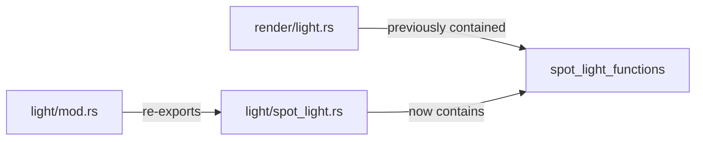

+++
title = "#19956 move spot light function into spot light file"
date = "2025-07-05T00:00:00"
draft = false
template = "pull_request_page.html"
in_search_index = true

[taxonomies]
list_display = ["show"]

[extra]
current_language = "en"
available_languages = {"en" = { name = "English", url = "/pull_request/bevy/2025-07/pr-19956-en-20250705" }, "zh-cn" = { name = "中文", url = "/pull_request/bevy/2025-07/pr-19956-zh-cn-20250705" }}
labels = ["A-Rendering"]
+++

## PR Analysis: move spot light function into spot light file (#19956)

### Basic Information
- **Title**: move spot light function into spot light file
- **PR Link**: https://github.com/bevyengine/bevy/pull/19956
- **Author**: atlv24
- **Status**: MERGED
- **Labels**: A-Rendering, S-Ready-For-Final-Review
- **Created**: 2025-07-05T05:20:34Z
- **Merged**: 2025-07-05T14:59:29Z
- **Merged By**: alice-i-cecile

### Description Translation
# Objective

- Make bevy_light possible

## Solution

- Move some stuff it needs out of somewhere it cant depend on. Plus it makes sense, spotlight stuff goes in spotlight file.

## Testing

- 3d_scene runs

Note: no breaking changes thanks to re-exports

---

### The Story of This Pull Request

**The Problem and Context**  
The Bevy engine's rendering system contained two spotlight-related utility functions (`spot_light_world_from_view` and `spot_light_clip_from_view`) in an inappropriate location - the `render/light.rs` module. This placement created architectural issues for the planned `bevy_light` module, which needed access to these spotlight calculations but couldn't depend on render-specific modules due to dependency constraints. The functions were logically related to spotlight functionality but physically separated from their conceptual home.

**The Solution Approach**  
The developer identified that moving these functions to the existing `light/spot_light.rs` module would resolve the dependency issue while improving code organization. This approach maintained the existing public API through re-exports in `light/mod.rs`, preventing breaking changes. The implementation required:
1. Removing the functions from their original location
2. Adding them to the spotlight module
3. Creating public re-exports in the light module

**The Implementation**  
The core changes involved relocating the matrix calculation functions without modification. The `spot_light_world_from_view` function constructs a transformation matrix for spotlights by deriving orthogonal vectors from a light's direction. The `spot_light_clip_from_view` calculates the clip space projection matrix based on the spotlight's angular coverage:

```rust
// In spot_light.rs
pub fn spot_light_world_from_view(transform: &GlobalTransform) -> Mat4 {
    // Implementation unchanged from original
    ...
}

pub fn spot_light_clip_from_view(angle: f32, near_z: f32) -> Mat4 {
    // Implementation unchanged from original
    ...
}
```

A critical implementation detail was preserving the exact vector math operations to maintain consistency with the fragment shader implementations that use the same algorithms. The comments explicitly note this requirement to prevent future divergence if the glam library changes.

**Technical Insights**  
The matrix construction in `spot_light_world_from_view` uses a non-standard basis derivation that matches glam's `any_orthonormal_pair` implementation. This consistency is essential because the same calculations occur in shaders. The function:
1. Uses the light's back vector as the z-axis
2. Constructs orthogonal up/right vectors using sign-corrected cross products
3. Handles edge cases through copysign operations

The projection matrix calculation in `spot_light_clip_from_view` correctly sets the field of view to twice the spotlight's angle, matching physical light behavior where coverage extends from center to outer edge.

**The Impact**  
This change improves architectural organization by:
1. Removing render dependencies from core light calculations
2. Enabling future development of `bevy_light`
3. Maintaining backward compatibility through re-exports
4. Grouping related functionality for better discoverability

Testing confirmed existing functionality works (3d_scene runs), and the re-export strategy prevented breaking changes. The relocation also makes the spotlight implementation more self-contained, reducing cognitive load when working with light systems.

---

### Visual Representation



---

### Key Files Changed

1. **crates/bevy_pbr/src/light/spot_light.rs** (+32/-0)  
Added spotlight transformation functions previously located in render module.

```rust
// After:
pub fn spot_light_world_from_view(transform: &GlobalTransform) -> Mat4 {
    // the matrix z_local (opposite of transform.forward())
    let fwd_dir = transform.back().extend(0.0);

    let sign = 1f32.copysign(fwd_dir.z);
    let a = -1.0 / (fwd_dir.z + sign);
    let b = fwd_dir.x * fwd_dir.y * a;
    let up_dir = Vec4::new(
        1.0 + sign * fwd_dir.x * fwd_dir.x * a,
        sign * b,
        -sign * fwd_dir.x,
        0.0,
    );
    let right_dir = Vec4::new(-b, -sign - fwd_dir.y * fwd_dir.y * a, fwd_dir.y, 0.0);

    Mat4::from_cols(
        right_dir,
        up_dir,
        fwd_dir,
        transform.translation().extend(1.0),
    )
}

pub fn spot_light_clip_from_view(angle: f32, near_z: f32) -> Mat4 {
    // spot light projection FOV is 2x the angle from spot light center to outer edge
    Mat4::perspective_infinite_reverse_rh(angle * 2.0, 1.0, near_z)
}
```

2. **crates/bevy_pbr/src/render/light.rs** (+0/-32)  
Removed spotlight-specific functions to reduce render module responsibilities.

```rust
// Before:
pub(crate) fn spot_light_world_from_view(transform: &GlobalTransform) -> Mat4 {
    // ... (same implementation as above)
}

pub(crate) fn spot_light_clip_from_view(angle: f32, near_z: f32) -> Mat4 {
    // ... (same implementation as above)
}
```

3. **crates/bevy_pbr/src/light/mod.rs** (+1/-0)  
Added re-exports to maintain public API compatibility.

```rust
// After:
use bevy_utils::Parallel;
use core::{marker::PhantomData, ops::DerefMut};

use crate::*;
pub use light::spot_light::{spot_light_clip_from_view, spot_light_world_from_view};
```

---

### Further Reading
1. [Bevy Lighting Documentation](https://bevyengine.org/learn/book/features/pbr/)
2. [Coordinate System Transformations (LearnOpenGL)](https://learnopengl.com/Getting-started/Coordinate-Systems)
3. [Projection Matrices (Songho.ca)](http://www.songho.ca/opengl/gl_projectionmatrix.html)
4. [Orthonormal Basis Derivation (Mathematics Stack Exchange)](https://math.stackexchange.com/questions/133177/finding-a-unit-vector-perpendicular-to-another-vector)