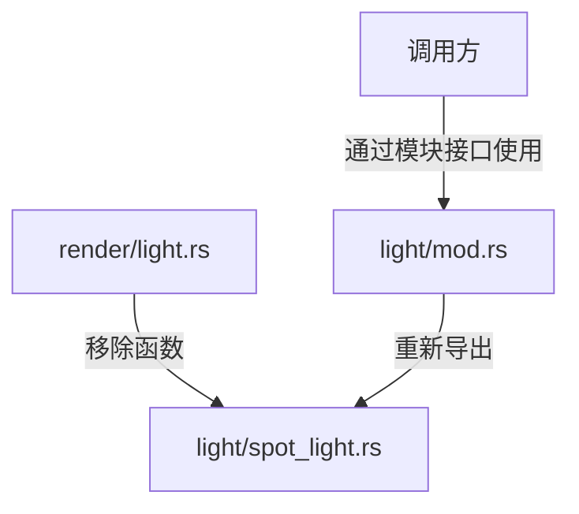

+++
title = "#19956 move spot light function into spot light file"
date = "2025-07-05T00:00:00"
draft = false
template = "pull_request_page.html"
in_search_index = false

[extra]
current_language = "zh-cn"
available_languages = {"en" = { name = "English", url = "/pull_request/bevy/2025-07/pr-19956-en-20250705" }, "zh-cn" = { name = "中文", url = "/pull_request/bevy/2025-07/pr-19956-zh-cn-20250705" }}
+++

# move spot light function into spot light file

## 基本信息
- **标题**: move spot light function into spot light file
- **PR链接**: https://github.com/bevyengine/bevy/pull/19956
- **作者**: atlv24
- **状态**: MERGED
- **标签**: A-Rendering, S-Ready-For-Final-Review
- **创建时间**: 2025-07-05T05:20:34Z
- **合并时间**: 2025-07-05T14:59:29Z
- **合并人**: alice-i-cecile

## 描述翻译
# Objective

- 实现 bevy_light 的可能性

## Solution

- 将所需功能从无法依赖的位置移出。同时这也更合理，聚光灯相关功能应放在聚光灯文件中。

## Testing

- 3d_scene 正常运行

注意：通过重新导出避免了破坏性变更

## 该PR的技术分析

该PR的主要目标是解决模块依赖问题，为未来实现`bevy_light`模块创造条件。问题核心在于两个聚光灯相关的功能函数`spot_light_world_from_view`和`spot_light_clip_from_view`原本位于`render/light.rs`文件中，但`light`模块无法依赖`render`模块。这种位置安排导致模块依赖关系不合理，限制了代码的组织灵活性。

开发者采取的解决方案是代码重组：将这两个函数物理移动到更符合其功能归属的位置——`light/spot_light.rs`文件。这种移动不仅仅是文件路径的改变，更重要的是解决了模块依赖问题。通过保留原始函数实现不变，仅调整其位置和可见性，确保了零功能变更的重构。

关键实现步骤如下：
1. 在`spot_light.rs`中原样添加这两个函数，仅将可见性从`pub(crate)`改为`pub`
2. 从`render/light.rs`中完全移除这两个函数
3. 在`light/mod.rs`中通过`pub use`重新导出这些函数，保持公共API不变

这种处理方式确保了：
- 现有调用代码无需任何修改
- 编译时兼容性得到维护
- 测试场景`3d_scene`验证了功能完整性

技术实现上，这两个函数涉及聚光灯的视图矩阵计算：
1. `spot_light_world_from_view`基于`GlobalTransform`计算世界空间到视图空间的变换矩阵
2. `spot_light_clip_from_view`根据聚光灯角度和近平面距离计算投影矩阵

这些函数内部使用了特定数学构造方法，确保与shader中的实现完全匹配。例如`spot_light_world_from_view`中使用的基向量构造方法与`glam::Vec3::any_orthonormal_pair`保持一致，避免因库更新导致的潜在不一致问题。

该重构带来的主要收益：
1. 解决了`light`模块对`render`模块的逆向依赖问题
2. 为未来`bevy_light`模块的独立实现铺平道路
3. 提升代码组织结构合理性（聚光灯功能集中到聚光灯文件）
4. 保持完全向后兼容（通过重新导出机制）

## 视觉表示



## 关键文件变更

### 文件: crates/bevy_pbr/src/light/mod.rs
```diff
@@ -20,6 +20,7 @@ use bevy_utils::Parallel;
 use core::{marker::PhantomData, ops::DerefMut};
 
 use crate::*;
+pub use light::spot_light::{spot_light_clip_from_view, spot_light_world_from_view};
 
 mod ambient_light;
 pub use ambient_light::AmbientLight;
```
- **变更原因**：重新导出spot_light模块中的函数，保持公共API不变
- **影响**：外部模块继续通过相同路径访问这些函数

### 文件: crates/bevy_pbr/src/light/spot_light.rs
```diff
@@ -140,3 +140,35 @@ impl Default for SpotLight {
         }
     }
 }
+
+// this method of constructing a basis from a vec3 is used by glam::Vec3::any_orthonormal_pair
+// we will also construct it in the fragment shader and need our implementations to match,
+// so we reproduce it here to avoid a mismatch if glam changes. we also switch the handedness
+// could move this onto transform but it's pretty niche
+pub fn spot_light_world_from_view(transform: &GlobalTransform) -> Mat4 {
+    // the matrix z_local (opposite of transform.forward())
+    let fwd_dir = transform.back().extend(0.0);
+
+    let sign = 1f32.copysign(fwd_dir.z);
+    let a = -1.0 / (fwd_dir.z + sign);
+    let b = fwd_dir.x * fwd_dir.y * a;
+    let up_dir = Vec4::new(
+        1.0 + sign * fwd_dir.x * fwd_dir.x * a,
+        sign * b,
+        -sign * fwd_dir.x,
+        0.0,
+    );
+    let right_dir = Vec4::new(-b, -sign - fwd_dir.y * fwd_dir.y * a, fwd_dir.y, 0.0);
+
+    Mat4::from_cols(
+        right_dir,
+        up_dir,
+        fwd_dir,
+        transform.translation().extend(1.0),
+    )
+}
+
+pub fn spot_light_clip_from_view(angle: f32, near_z: f32) -> Mat4 {
+    // spot light projection FOV is 2x the angle from spot light center to outer edge
+    Mat4::perspective_infinite_reverse_rh(angle * 2.0, 1.0, near_z)
+}
```
- **变更原因**：将聚光灯核心功能移至逻辑归属位置
- **技术细节**：
  - 函数实现完全保留，仅修改可见性为`pub`
  - `spot_light_world_from_view`计算聚光灯视图矩阵
  - `spot_light_clip_from_view`计算聚光灯投影矩阵

### 文件: crates/bevy_pbr/src/render/light.rs
```diff
@@ -711,38 +711,6 @@ pub fn calculate_cluster_factors(
     }
 }
 
-// this method of constructing a basis from a vec3 is used by glam::Vec3::any_orthonormal_pair
-// we will also construct it in the fragment shader and need our implementations to match,
-// so we reproduce it here to avoid a mismatch if glam changes. we also switch the handedness
-// could move this onto transform but it's pretty niche
-pub(crate) fn spot_light_world_from_view(transform: &GlobalTransform) -> Mat4 {
-    // the matrix z_local (opposite of transform.forward())
-    let fwd_dir = transform.back().extend(0.0);
-
-    let sign = 1f32.copysign(fwd_dir.z);
-    let a = -1.0 / (fwd_dir.z + sign);
-    let b = fwd_dir.x * fwd_dir.y * a;
-    let up_dir = Vec4::new(
-        1.0 + sign * fwd_dir.x * fwd_dir.x * a,
-        sign * b,
-        -sign * fwd_dir.x,
-        0.0,
-    );
-    let right_dir = Vec4::new(-b, -sign - fwd_dir.y * fwd_dir.y * a, fwd_dir.y, 0.0);
-
-    Mat4::from_cols(
-        right_dir,
-        up_dir,
-        fwd_dir,
-        transform.translation().extend(1.0),
-    )
-}
-
-pub(crate) fn spot_light_clip_from_view(angle: f32, near_z: f32) -> Mat4 {
-    // spot light projection FOV is 2x the angle from spot light center to outer edge
-    Mat4::perspective_infinite_reverse_rh(angle * 2.0, 1.0, near_z)
-}
-
 pub fn prepare_lights(
     mut commands: Commands,
     mut texture_cache: ResMut<TextureCache>,
```
- **变更原因**：从渲染模块移除不应属于此处的功能
- **影响**：清理渲染模块职责，专注渲染相关逻辑

## 延伸阅读

1. Bevy渲染架构概览：
   https://bevyengine.org/learn/book/getting-started/rendering/
   
2. 模块化设计原则：
   https://en.wikipedia.org/wiki/Modular_programming

3. 游戏引擎光照系统基础：
   https://learnopengl.com/Lighting/Basic-Lighting

4. 投影矩阵数学原理：
   https://www.scratchapixel.com/lessons/3d-basic-rendering/perspective-and-orthographic-projection-matrix