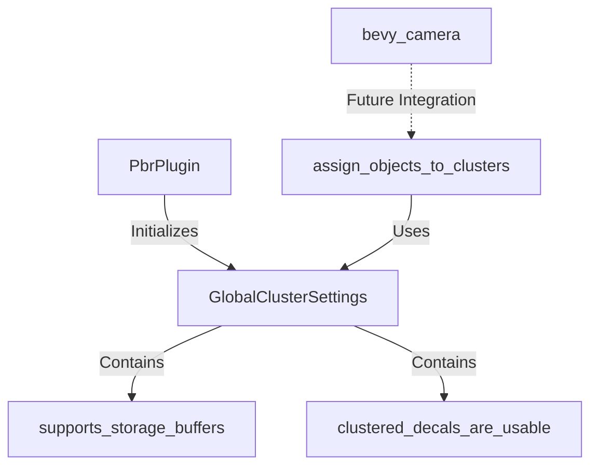

+++
title = "#19957 make cluster assign not depend on RenderAdapter/RenderDevice"
date = "2025-07-05T00:00:00"
draft = false
template = "pull_request_page.html"
in_search_index = true

[taxonomies]
list_display = ["show"]

[extra]
current_language = "en"
available_languages = {"en" = { name = "English", url = "/pull_request/bevy/2025-07/pr-19957-en-20250705" }, "zh-cn" = { name = "中文", url = "/pull_request/bevy/2025-07/pr-19957-zh-cn-20250705" }}
labels = ["A-Rendering"]
+++

## Technical Report: Refactoring Cluster Assignment Dependencies in Bevy

### Basic Information
- **Title**: make cluster assign not depend on RenderAdapter/RenderDevice
- **PR Link**: https://github.com/bevyengine/bevy/pull/19957
- **Author**: atlv24
- **Status**: MERGED
- **Labels**: A-Rendering, S-Ready-For-Final-Review
- **Created**: 2025-07-05T06:20:03Z
- **Merged**: 2025-07-05T14:59:29Z
- **Merged By**: alice-i-cecile

### Description Translation
# Objective
- Enable bevy_light development by allowing clusterable functionality to be moved to bevy_camera

## Solution
- Replace runtime calculations based on RenderAdapter/RenderDevice with a precomputed resource for cluster settings

## Testing
- Verified functionality using the 3d_scene example

### The Story of This Pull Request

#### Problem and Context
The cluster assignment system in Bevy's rendering pipeline had a direct dependency on `RenderAdapter` and `RenderDevice` resources. This created a tight coupling between the clustering logic and the render hardware abstraction layer. The immediate need was to enable moving clustering functionality to `bevy_camera` as part of the `bevy_light` initiative, but this architectural dependency prevented that separation since `bevy_camera` shouldn't depend on renderer-specific resources.

The core issue manifested in the `assign_objects_to_clusters` system, which performed runtime checks for hardware capabilities:
```rust
let clustered_forward_buffer_binding_type = render_device.get_supported_read_only_binding_type(...);
let supports_storage_buffers = matches!(...);
```
These checks occurred every frame and tied the clustering logic to specific render hardware, making the system difficult to reuse or relocate within the engine architecture.

#### Solution Approach
The solution centered on precomputing hardware-dependent settings at initialization time and providing them through a dedicated resource. This approach:
1. Moves hardware capability checks to plugin initialization
2. Encapsulates results in a new `GlobalClusterSettings` resource
3. Modifies the cluster assignment system to consume this resource
4. Maintains identical runtime behavior while removing direct hardware dependencies

The key engineering decision was to create a minimal abstraction layer that preserves existing functionality while enabling architectural flexibility. Alternative approaches like trait-based abstraction were considered but rejected as over-engineering for this specific use case.

#### Implementation
The implementation introduced a new resource type in `cluster/mod.rs`:
```rust
#[derive(Resource)]
pub struct GlobalClusterSettings {
    pub supports_storage_buffers: bool,
    pub clustered_decals_are_usable: bool,
}
```
This resource is populated during plugin initialization using a new function:
```rust
pub(crate) fn make_global_cluster_settings(world: &World) -> GlobalClusterSettings {
    let device = world.resource::<RenderDevice>();
    let adapter = world.resource::<RenderAdapter>();
    let clustered_decals_are_usable = crate::decal::clustered::clustered_decals_are_usable(device, adapter);
    let supports_storage_buffers = matches!(
        device.get_supported_read_only_binding_type(CLUSTERED_FORWARD_STORAGE_BUFFER_COUNT),
        BufferBindingType::Storage { .. }
    );
    GlobalClusterSettings { supports_storage_buffers, clustered_decals_are_usable }
}
```
In `lib.rs`, this resource is inserted during plugin setup:
```rust
let global_cluster_settings = make_global_cluster_settings(render_app.world());
app.insert_resource(global_cluster_settings);
```
The cluster assignment system was refactored to use this resource instead of direct hardware queries:
```rust
// Before:
let (Some(render_device), Some(render_adapter)) = ...;
let supports_storage_buffers = ...;

// After:
let Some(global_cluster_settings) = global_cluster_settings else { return };
if global_cluster_settings.supports_storage_buffers { ... }
```
This change reduced the system's parameter list from 12 items to 10 while maintaining identical conditional logic for light probes and decals.

#### Technical Insights
The refactor demonstrates several important patterns:
1. **Initialization-time computation**: Moves invariant hardware checks from per-frame systems to one-time initialization
2. **Dependency inversion**: Cluster assignment now depends on an abstract settings resource rather than concrete hardware types
3. **Resource encapsulation**: Groups related settings into a single resource for cleaner system signatures

Performance characteristics remain unchanged since the same boolean checks occur at runtime, just with precomputed values. The resource initialization has negligible overhead as it only occurs once during app startup.

#### Impact
This change enables critical architectural improvements for the bevy_light initiative by:
1. Removing barriers to extracting clustering functionality to bevy_camera
2. Reducing system complexity by eliminating direct hardware dependencies
3. Maintaining backward compatibility with existing rendering behavior
4. Simplifying future maintenance of cluster assignment logic

The changes affect 19 lines of code across 3 files but enable significant architectural improvements. The approach demonstrates how to decouple systems from hardware dependencies through careful resource design.

### Visual Representation


### Key Files Changed

1. **crates/bevy_pbr/src/cluster/assign.rs** (+8/-19)
   - Replaced hardware queries with resource access
   - Simplified system parameter list
   - Maintained identical conditional logic using precomputed values

   Key change:
   ```rust
   // Before:
   (render_device, render_adapter): (Option<Res<RenderDevice>>, Option<Res<RenderAdapter>>)
   
   // After:
   global_cluster_settings: Option<Res<GlobalClusterSettings>>
   ```

2. **crates/bevy_pbr/src/cluster/mod.rs** (+22/-1)
   - Added GlobalClusterSettings resource definition
   - Implemented resource initialization logic
   - Centralized hardware capability checks

   New resource:
   ```rust
   #[derive(Resource)]
   pub struct GlobalClusterSettings {
       pub supports_storage_buffers: bool,
       pub clustered_decals_are_usable: bool,
   }
   ```

3. **crates/bevy_pbr/src/lib.rs** (+3/-0)
   - Integrated resource creation during plugin setup
   - Maintained existing initialization flow

   Insertion point:
   ```rust
   let global_cluster_settings = make_global_cluster_settings(render_app.world());
   app.insert_resource(global_cluster_settings);
   ```

### Further Reading
1. [Bevy ECS Resources Documentation](https://bevyengine.org/learn/book/next/features/ecs/resources/)
2. [Render Hardware Abstraction in Game Engines](https://www.gamedeveloper.com/programming/abstraction-patterns-for-graphics-rendering)
3. [Cluster-Based Forward Rendering Techniques](https://advances.realtimerendering.com/s2016/)