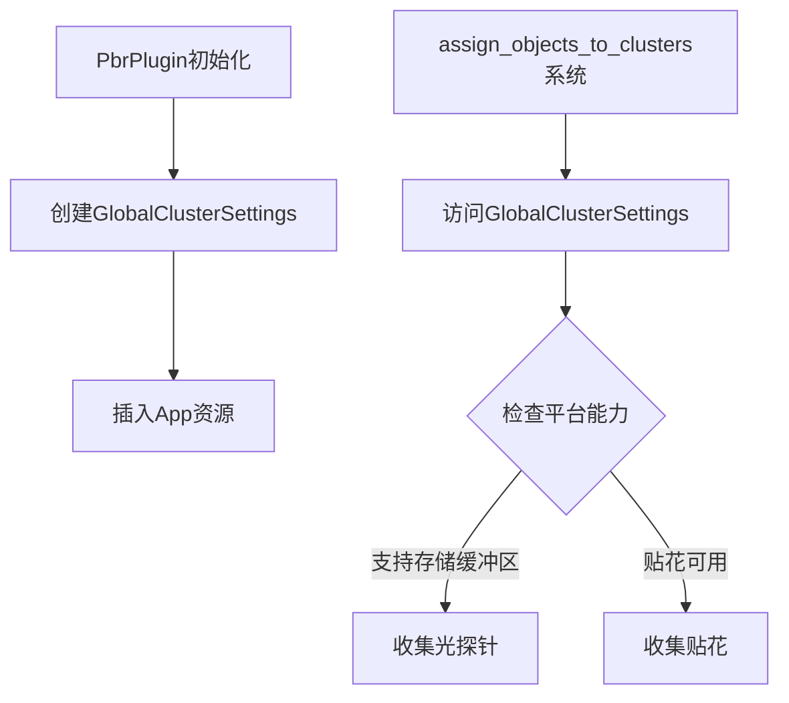

+++
title = "#19957 make cluster assign not depend on RenderAdapter/RenderDevice"
date = "2025-07-05T00:00:00"
draft = false
template = "pull_request_page.html"
in_search_index = false

[extra]
current_language = "zh-cn"
available_languages = {"en" = { name = "English", url = "/pull_request/bevy/2025-07/pr-19957-en-20250705" }, "zh-cn" = { name = "中文", url = "/pull_request/bevy/2025-07/pr-19957-zh-cn-20250705" }}
+++

## 基础信息
- **标题**: make cluster assign not depend on RenderAdapter/RenderDevice
- **PR链接**: https://github.com/bevyengine/bevy/pull/19957
- **作者**: atlv24
- **状态**: 已合并
- **标签**: A-Rendering, S-Ready-For-Final-Review
- **创建时间**: 2025-07-05T06:20:03Z
- **合并时间**: 2025-07-05T14:59:29Z
- **合并者**: alice-i-cecile

## 描述翻译
### Objective
- 通过将可集群化(clusterable)功能拆分到bevy_camera模块中，使bevy_light成为可能

### Solution
- 使用资源(resource)存储集群设置，而不是每次从渲染适配器(render adapter)/设备(render device)重新计算

### Testing
- 3d_scene运行正常

## PR分析

### 问题背景
在Bevy的集群化渲染(clustered rendering)系统中，`assign_objects_to_clusters`函数每帧都需要直接访问`RenderDevice`和`RenderAdapter`资源。这导致两个主要问题：
1. **性能浪费**：每帧重复查询设备能力（如是否支持存储缓冲区storage buffers），而这些信息在运行期间是常量
2. **模块耦合**：该函数依赖渲染硬件抽象层，阻碍了将集群功能拆分到独立的`bevy_camera`模块

具体来说，原实现需要每帧计算：
```rust
// 旧实现（部分）
let clustered_forward_buffer_binding_type = 
    render_device.get_supported_read_only_binding_type(...);
let supports_storage_buffers = matches!(...);
let clustered_decals_are_usable = 
    decal::clustered::clustered_decals_are_usable(...);
```

### 解决方案
引入全局资源`GlobalClusterSettings`预计算并缓存设备能力，消除每帧的冗余查询。核心变更包括：
1. 创建新资源存储设备能力状态
2. 在插件初始化时一次性计算这些状态
3. 修改集群分配系统使用该资源而非直接查询设备

### 实现细节
#### 1. 新增全局集群设置资源
在`cluster/mod.rs`中定义资源结构体并添加初始化逻辑：
```rust
#[derive(Resource)]
pub struct GlobalClusterSettings {
    pub supports_storage_buffers: bool,
    pub clustered_decals_are_usable: bool,
}

pub(crate) fn make_global_cluster_settings(world: &World) -> GlobalClusterSettings {
    let device = world.resource::<RenderDevice>();
    let adapter = world.resource::<RenderAdapter>();
    let clustered_decals_are_usable = 
        crate::decal::clustered::clustered_decals_are_usable(device, adapter);
    let supports_storage_buffers = matches!(
        device.get_supported_read_only_binding_type(...),
        BufferBindingType::Storage { .. }
    );
    GlobalClusterSettings {
        supports_storage_buffers,
        clustered_decals_are_usable,
    }
}
```
该资源包含两个关键字段：
- `supports_storage_buffers`: 指示平台是否支持存储缓冲区
- `clustered_decals_are_usable`: 指示集群贴花是否可用

#### 2. 资源初始化
在PBR插件初始化时创建该资源：
```rust
// lib.rs
let global_cluster_settings = make_global_cluster_settings(render_app.world());
app.insert_resource(global_cluster_settings);
```

#### 3. 重构集群分配系统
修改`assign_objects_to_clusters`系统使用新资源：
```rust
// assign.rs
pub(crate) fn assign_objects_to_clusters(
    ...
    global_cluster_settings: Option<Res<GlobalClusterSettings>>, // 改为使用新资源
) {
    let Some(global_cluster_settings) = global_cluster_settings else {
        return;
    };

    // 使用预计算的能力标志
    if global_cluster_settings.supports_storage_buffers {
        // 收集光探针(light probes)
    }
    
    if global_cluster_settings.clustered_decals_are_usable {
        // 收集贴花(decals)
    }
}
```
关键优化点：
- 移除对`RenderDevice`和`RenderAdapter`的直接依赖
- 将每帧的设备能力检查替换为资源字段访问
- 保持原有条件逻辑不变，但使用预计算值

### 技术洞察
1. **资源化常量数据**：将运行期不变的设备能力抽象为资源，符合ECS设计原则
2. **初始化时计算**：在应用启动时一次性计算设备能力，避免每帧开销
3. **解耦渲染硬件依赖**：使集群分配逻辑不直接依赖具体硬件实现
4. **条件收集优化**：保留原有的条件对象收集逻辑，但使用更高效的方式判断：
   - 仅当支持存储缓冲区时才收集光探针（因索引数据量较大）
   - 仅当贴花可用时才收集贴花

### 影响分析
1. **性能提升**：消除每帧的设备能力查询，特别是对于WebGL等能力检测较重的平台
2. **模块解耦**：为将集群功能拆分到`bevy_camera`模块扫清障碍
3. **代码简化**：
   - `assign.rs`减少19行代码(+8/-27)
   - 系统参数从元组变为单一资源，提高可读性
4. **向后兼容**：保持所有原有功能不变，仅改变实现方式

## 可视化


## 关键文件变更
### 1. `crates/bevy_pbr/src/cluster/mod.rs`
**变更**：新增全局集群设置资源  
**代码片段**：
```rust
#[derive(Resource)]
pub struct GlobalClusterSettings {
    pub supports_storage_buffers: bool,
    pub clustered_decals_are_usable: bool,
}

pub(crate) fn make_global_cluster_settings(world: &World) -> GlobalClusterSettings {
    // 设备能力计算逻辑
}
```

### 2. `crates/bevy_pbr/src/cluster/assign.rs`
**变更**：重构系统使用新资源  
**前后对比**：
```rust
// 之前：
let (Some(render_device), Some(render_adapter)) = ...;
let supports_storage_buffers = ...; // 每帧计算
let clustered_decals_are_usable = ...; // 每帧计算

// 之后：
let Some(global_cluster_settings) = ...;
if global_cluster_settings.supports_storage_buffers { ... }
```

### 3. `crates/bevy_pbr/src/lib.rs`
**变更**：插件初始化时创建资源  
**代码片段**：
```rust
let global_cluster_settings = make_global_cluster_settings(render_app.world());
app.insert_resource(global_cluster_settings);
```

## 延伸阅读
1. [Bevy ECS资源系统](https://bevyengine.org/learn/book/next/programming/ecs#resources)
2. 集群渲染原理：[Clustered Shading (2013)](http://www.aortiz.me/2018/12/21/CG.html)
3. WebGL限制：[WebGL 2 Storage Buffers](https://developer.mozilla.org/en-US/docs/Web/API/WebGL2RenderingContext/bindBufferBase)