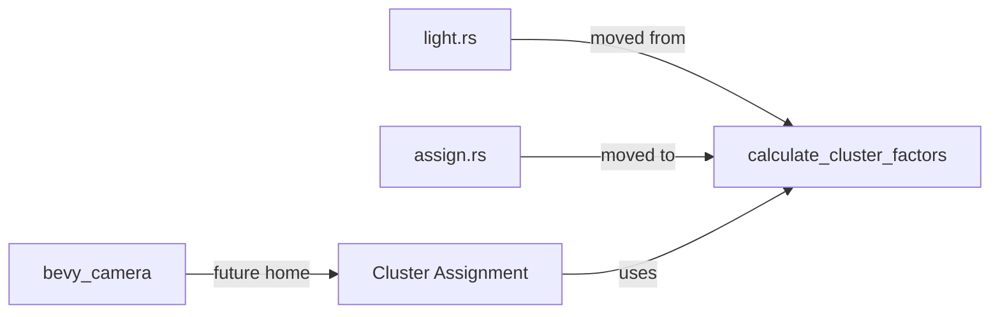

+++
title = "#19958 move calculate_cluster_factors to cluster assign"
date = "2025-07-05T00:00:00"
draft = false
template = "pull_request_page.html"
in_search_index = true

[taxonomies]
list_display = ["show"]

[extra]
current_language = "en"
available_languages = {"en" = { name = "English", url = "/pull_request/bevy/2025-07/pr-19958-en-20250705" }, "zh-cn" = { name = "中文", url = "/pull_request/bevy/2025-07/pr-19958-zh-cn-20250705" }}
labels = ["A-Rendering"]
+++

## PR Analysis: move calculate_cluster_factors to cluster assign

### Basic Information
- **Title**: move calculate_cluster_factors to cluster assign
- **PR Link**: https://github.com/bevyengine/bevy/pull/19958
- **Author**: atlv24
- **Status**: MERGED
- **Labels**: A-Rendering, S-Ready-For-Final-Review
- **Created**: 2025-07-05T06:32:22Z
- **Merged**: 2025-07-05T16:02:05Z
- **Merged By**: alice-i-cecile

### Description Translation
# Objective
- Make bevy_light possible by making it possible to split out clusterable into bevy_camera

## Solution
- Move some stuff so i can split it out cleanly.

## Testing
- 3d_scene runs

### The Story of This Pull Request
The core issue addressed in this PR is a code organization problem that was blocking architectural improvements to Bevy's rendering system. The `calculate_cluster_factors` function was originally located in `light.rs`, but its logic is fundamentally tied to cluster assignment operations rather than light-specific behavior. This misplaced dependency was preventing the clean extraction of cluster-related functionality into a separate `bevy_camera` crate - a necessary step for enabling the new `bevy_light` module.

The solution involved relocating the mathematical utility function to its logical home in the cluster assignment module. By moving `calculate_cluster_factors` from `render/light.rs` to `cluster/assign.rs`, we achieve two key objectives: First, we eliminate an unnecessary dependency between light handling and cluster assignment logic. Second, we enable the cluster functionality to be cleanly separated into its own crate without dragging light-specific code along with it.

The implementation is straightforward but surgically precise. The function is physically moved between files while maintaining its exact implementation. At the call site within `assign_objects_to_clusters`, the reference is updated to use the now-local function without the `crate::` prefix:

```rust
// Before:
let cluster_factors = crate::calculate_cluster_factors(...);

// After:
let cluster_factors = calculate_cluster_factors(...);
```

This change maintains identical runtime behavior while significantly improving code organization. The function calculates depth distribution factors used for partitioning the view frustum into clusters - work that's inherently part of the cluster assignment pipeline rather than light management. The math itself remains unchanged, using the same logarithmic distribution for perspective projections and linear distribution for orthographic projections.

The impact is primarily architectural: this relocation enables future extraction of the cluster system. Without this change, any attempt to move cluster functionality would create awkward dependencies or require duplicating the calculation logic. The PR maintains full backward compatibility, verified by confirming that the 3d_scene example runs correctly after the changes.

### Visual Representation


### Key Files Changed

1. **crates/bevy_pbr/src/cluster/assign.rs** (+18/-1)
   - Added the `calculate_cluster_factors` implementation
   - Updated call site to reference local function

```rust
// Added function implementation:
pub fn calculate_cluster_factors(
    near: f32,
    far: f32,
    z_slices: f32,
    is_orthographic: bool,
) -> Vec2 {
    if is_orthographic {
        Vec2::new(-near, z_slices / (-far - -near))
    } else {
        let z_slices_of_ln_zfar_over_znear = (z_slices - 1.0) / ops::ln(far / near);
        Vec2::new(
            z_slices_of_ln_zfar_over_znear,
            ops::ln(near) * z_slices_of_ln_zfar_over_znear,
        )
    }
}

// Call site updated:
let cluster_factors = calculate_cluster_factors(
    first_slice_depth,
    far_z,
    requested_cluster_dimensions.z as f32,
    is_orthographic,
);
```

2. **crates/bevy_pbr/src/render/light.rs** (+2/-17)
   - Removed the function implementation
   - Added import from new location

```rust
// Before:
pub fn calculate_cluster_factors(...) -> Vec2 { ... }

// After:
use crate::assign::calculate_cluster_factors;
// (Function implementation removed)
```

### Further Reading
1. [Bevy's Cluster-Based Forward Rendering](https://bevyengine.org/news/bevy-0-13/#cluster-based-forward-lighting) - Overview of the clustering system
2. [Frustum Clustering Techniques](https://developer.nvidia.com/gpugems/gpugems2/part-i-geometric-complexity/chapter-8-clustered-forward-rendering) - Fundamental clustering concepts
3. [Rust Module System Best Practices](https://doc.rust-lang.org/book/ch07-02-defining-modules-to-control-scope-and-privacy.html) - Structuring Rust codebases