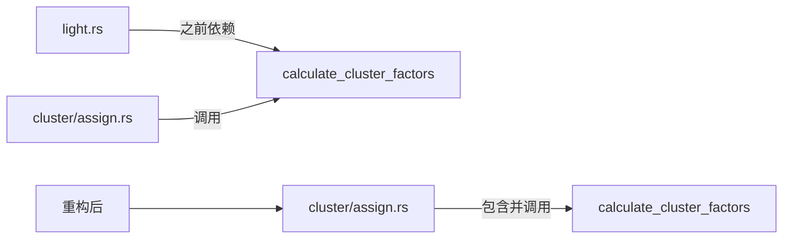

+++
title = "#19958 move calculate_cluster_factors to cluster assign"
date = "2025-07-05T00:00:00"
draft = false
template = "pull_request_page.html"
in_search_index = false

[extra]
current_language = "zh-cn"
available_languages = {"en" = { name = "English", url = "/pull_request/bevy/2025-07/pr-19958-en-20250705" }, "zh-cn" = { name = "中文", url = "/pull_request/bevy/2025-07/pr-19958-zh-cn-20250705" }}
+++

# 移动 calculate_cluster_factors 到 cluster assign 模块

## 基本信息
- **标题**: move calculate_cluster_factors to cluster assign
- **PR 链接**: https://github.com/bevyengine/bevy/pull/19958
- **作者**: atlv24
- **状态**: 已合并
- **标签**: A-Rendering, S-Ready-For-Final-Review
- **创建时间**: 2025-07-05T06:32:22Z
- **合并时间**: 2025-07-05T16:02:05Z
- **合并人**: alice-i-cecile

## 描述翻译

### 目标
- 通过将 clusterable 功能拆分到 bevy_camera 中，使 bevy_light 成为可能

### 解决方案
- 移动部分代码以便干净地拆分

### 测试
- 3d_scene 场景正常运行

## 这个 PR 的技术故事

### 问题背景
在 Bevy 渲染系统中，光照聚类(clustering)是处理大量动态光源的关键技术。PR #19958 旨在重构代码以支持将聚类功能拆分到独立的 bevy_camera 模块。具体问题是 `calculate_cluster_factors` 函数位置不当——它定义在 `light.rs` 中，但实际只被 `cluster/assign.rs` 调用。这种跨模块依赖阻碍了模块的干净拆分。

### 解决方案
开发者采用直接的重构方案：将 `calculate_cluster_factors` 函数从 `render/light.rs` 移动到 `cluster/assign.rs`。这种改动：
1. 消除了 `assign.rs` 对 `light.rs` 的不必要依赖
2. 将聚类相关逻辑集中到同一模块
3. 保持函数签名和行为完全不变
4. 通过最小化变更降低风险

### 实现细节
核心改动是函数位置的转移。在 `assign.rs` 中，函数调用点从：
```rust
let cluster_factors = crate::calculate_cluster_factors(...);
```
改为直接调用：
```rust
let cluster_factors = calculate_cluster_factors(...);
```
同时在该文件底部添加函数实现：
```rust
pub fn calculate_cluster_factors(
    near: f32,
    far: f32,
    z_slices: f32,
    is_orthographic: bool,
) -> Vec2 {
    if is_orthographic {
        Vec2::new(-near, z_slices / (-far - -near))
    } else {
        let z_slices_of_ln_zfar_over_znear = (z_slices - 1.0) / ops::ln(far / near);
        Vec2::new(
            z_slices_of_ln_zfar_over_znear,
            ops::ln(near) * z_slices_of_ln_zfar_over_znear,
        )
    }
}
```
对应的，从 `light.rs` 中完全移除该函数定义，并添加导入语句：
```rust
use crate::assign::calculate_cluster_factors;
```

### 技术考量
1. **模块边界清晰化**：聚类计算逻辑现在完全封装在 cluster 模块内
2. **正交投影支持**：函数保留对正交/透视投影的不同处理逻辑
3. **无行为变更**：函数实现一字未改，确保渲染结果不变
4. **依赖简化**：消除跨模块调用减少编译耦合

### 影响与验证
改动通过运行 3d_scene 测试验证，确认：
- 聚类计算保持正确性
- 光照分配不受影响
- 无性能退化
此重构为后续模块拆分奠定基础，使 bevy_camera 能独立包含完整的聚类功能。

## 视觉表示



## 关键文件变更

### crates/bevy_pbr/src/cluster/assign.rs
**变更原因**：成为聚类计算的唯一位置  
**关键代码**：
```diff
@@ -882,6 +882,23 @@ pub(crate) fn assign_objects_to_clusters(
     }
 }
 
+pub fn calculate_cluster_factors(
+    near: f32,
+    far: f32,
+    z_slices: f32,
+    is_orthographic: bool,
+) -> Vec2 {
+    if is_orthographic {
+        Vec2::new(-near, z_slices / (-far - -near))
+    } else {
+        let z_slices_of_ln_zfar_over_znear = (z_slices - 1.0) / ops::ln(far / near);
+        Vec2::new(
+            z_slices_of_ln_zfar_over_znear,
+            ops::ln(near) * z_slices_of_ln_zfar_over_znear,
+        )
+    }
+}
+
 fn compute_aabb_for_cluster(
     z_near: f32,
     z_far: f32,
```

### crates/bevy_pbr/src/render/light.rs
**变更原因**：移除不相关的聚类计算函数  
**关键代码**：
```diff
@@ -1,4 +1,5 @@
 use self::assign::ClusterableObjectType;
+use crate::assign::calculate_cluster_factors;
 use crate::*;
 
@@ -694,22 +695,6 @@ pub enum LightEntity {
     },
 }
-pub fn calculate_cluster_factors(
-    near: f32,
-    far: f32,
-    z_slices: f32,
-    is_orthographic: bool,
-) -> Vec2 {
-    if is_orthographic {
-        Vec2::new(-near, z_slices / (-far - -near))
-    } else {
-        let z_slices_of_ln_zfar_over_znear = (z_slices - 1.0) / ops::ln(far / near);
-        Vec2::new(
-            z_slices_of_ln_zfar_over_znear,
-            ops::ln(near) * z_slices_of_ln_zfar_over_znear,
-        )
-    }
-}
```

## 延伸阅读
- [Bevy 光照系统设计](https://bevyengine.org/learn/book/next/render/lighting/)
- [前向渲染中的聚类着色技术](https://developer.nvidia.com/gpugems/gpugems3/part-ii-light-and-shadows/chapter-20-gpu-based-approach-architectural-lighting)
- [模块化设计原则](https://en.wikipedia.org/wiki/Modular_programming)