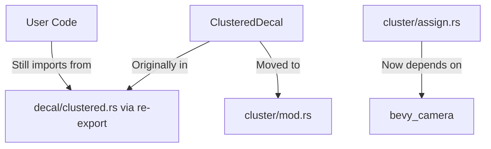

+++
title = "#19959 move ClusteredDecal to cluster module"
date = "2025-07-05T00:00:00"
draft = false
template = "pull_request_page.html"
in_search_index = true

[taxonomies]
list_display = ["show"]

[extra]
current_language = "en"
available_languages = {"en" = { name = "English", url = "/pull_request/bevy/2025-07/pr-19959-en-20250705" }, "zh-cn" = { name = "中文", url = "/pull_request/bevy/2025-07/pr-19959-zh-cn-20250705" }}
labels = ["A-Rendering"]
+++

# Technical Analysis: Move ClusteredDecal to Cluster Module (PR #19959)

## Basic Information
- **Title**: move ClusteredDecal to cluster module
- **PR Link**: https://github.com/bevyengine/bevy/pull/19959
- **Author**: atlv24
- **Status**: MERGED
- **Labels**: A-Rendering, S-Needs-Review
- **Created**: 2025-07-05T07:12:01Z
- **Merged**: 2025-07-05T19:52:31Z
- **Merged By**: superdump

## Description Translation
# Objective
- Make bevy_light possible by making it possible to split out clusterable into bevy_camera

## Solution
- move ClusteredDecal to cluster module
- Depends on #19957 (because of the imports shuffling around) (draft until thats merged)

## Testing
- 3d_scene runs

Note: no breaking changes thanks to re-exports

## The Story of This Pull Request

### Motivation and Problem Context
The primary goal was to enable extraction of clusterable objects into a separate `bevy_camera` crate. The `ClusteredDecal` component was originally located in the `decal` module, but it belongs logically with other clusterable objects like lights. This misplacement created an architectural hurdle for modularization efforts, specifically blocking progress on `bevy_light`. The challenge was to relocate this component without introducing breaking changes or disrupting existing rendering functionality.

### Solution Approach
The solution involved moving `ClusteredDecal` from `bevy_pbr/src/decal/clustered.rs` to `bevy_pbr/src/cluster/mod.rs`. This required:
1. Relocating the component definition and its associated traits
2. Adjusting import statements across multiple files
3. Maintaining backward compatibility through re-exports
4. Ensuring all visibility and rendering systems remained functional

The implementation leveraged Rust's module system and Bevy's ECS architecture to cleanly separate concerns while preserving existing behavior. No functional changes were made to `ClusteredDecal` itself - this was purely an organizational refactor.

### Implementation Details
The changes required modifications in three key files:

1. **Cluster Assignment Logic (`assign.rs`):**
   - Updated imports to use `bevy_camera` primitives instead of `bevy_render`
   - This aligns with the architectural direction of moving camera-related functionality to `bevy_camera`
   - Critical imports changed:

```rust
// Before:
use bevy_render::{
    camera::Camera,
    primitives::{Aabb, Frustum, HalfSpace, Sphere},
    view::{RenderLayers, ViewVisibility},
};

// After:
use bevy_camera::{
    primitives::{Aabb, Frustum, HalfSpace, Sphere},
    visibility::{RenderLayers, ViewVisibility},
    Camera,
};
```

2. **Cluster Module (`mod.rs`):**
   - Added the full `ClusteredDecal` component definition
   - Maintained identical component attributes and functionality
   - Updated the visibility class registration to use `bevy_camera::visibility`

```rust
#[derive(Component, Debug, Clone, Reflect, ExtractComponent)]
#[reflect(Component, Debug, Clone)]
#[require(Transform, Visibility, VisibilityClass)]
#[component(on_add = visibility::add_visibility_class::<LightVisibilityClass>)]
pub struct ClusteredDecal {
    pub image: Handle<Image>,
    pub tag: u32,
}
```

3. **Decal Module (`clustered.rs`):**
   - Removed the `ClusteredDecal` definition
   - Added a re-export to maintain backward compatibility
   - Reduced file size by 38 lines while preserving other decal-related systems

```rust
// Before contained full ClusteredDecal definition
// After:
pub use crate::ClusteredDecal;
```

### Technical Insights
Key architectural decisions:
1. **Logical Grouping:** Clusterable objects (lights, decals) now reside together in the cluster module, improving discoverability and reducing cross-module dependencies
2. **Import Hygiene:** Updated import statements reflect the new dependency chain where camera-related types come from `bevy_camera` instead of `bevy_render`
3. **Zero-Cost Refactor:** Backward compatibility maintained through re-exports means existing user code continues working without modification
4. **Testing Approach:** Verified functionality by running the 3d_scene example, ensuring core rendering behavior remained intact

The changes demonstrate Bevy's evolving architecture where:
- `bevy_camera` becomes the source of truth for camera-related primitives
- `bevy_pbr` focuses specifically on physically-based rendering components
- Cluster management becomes a distinct subsystem within PBR

### Impact and Future Work
This refactor enables further modularization of the engine, specifically:
1. Paves the way for extracting cluster management to `bevy_camera`
2. Reduces coupling between rendering and camera systems
3. Creates clearer boundaries between PBR subsystems
4. Sets precedent for similar organizational improvements

No performance impact is expected since this is purely an organizational change. The PR demonstrates how to safely relocate core components in a large ECS-based engine while maintaining backward compatibility.

## Visual Representation



## Key Files Changed

1. **crates/bevy_pbr/src/cluster/assign.rs** (+12/-9)
   - Updated imports to use `bevy_camera` instead of `bevy_render` for camera-related types
   - Adjusted internal imports to reference `ClusteredDecal` from parent module

```diff
+ use bevy_camera::{
+     primitives::{Aabb, Frustum, HalfSpace, Sphere},
+     visibility::{RenderLayers, ViewVisibility},
+     Camera,
+ };
- use bevy_render::{
-     camera::Camera,
-     primitives::{Aabb, Frustum, HalfSpace, Sphere},
-     view::{RenderLayers, ViewVisibility},
- };
```

2. **crates/bevy_pbr/src/cluster/mod.rs** (+35/-1)
   - Added `ClusteredDecal` component definition
   - Included necessary derives and attributes
   - Updated visibility system registration

```rust
#[derive(Component, Debug, Clone, Reflect, ExtractComponent)]
#[reflect(Component, Debug, Clone)]
#[require(Transform, Visibility, VisibilityClass)]
#[component(on_add = visibility::add_visibility_class::<LightVisibilityClass>)]
pub struct ClusteredDecal {
    pub image: Handle<Image>,
    pub tag: u32,
}
```

3. **crates/bevy_pbr/src/decal/clustered.rs** (+6/-38)
   - Removed `ClusteredDecal` definition
   - Added re-export to maintain compatibility
   - Cleaned up unnecessary imports

```diff
- pub struct ClusteredDecal { ... }
+ pub use crate::ClusteredDecal;
```

## Further Reading
1. [Bevy's ECS Architecture](https://bevyengine.org/learn/book/getting-started/ecs/)
2. [Clustered Forward Rendering](https://google.github.io/filament/Filament.html#clusteredforwardrendering)
3. [Rust Module System](https://doc.rust-lang.org/book/ch07-02-defining-modules-to-control-scope-and-privacy.html)
4. [PR #19957 - Import reorganization](https://github.com/bevyengine/bevy/pull/19957)