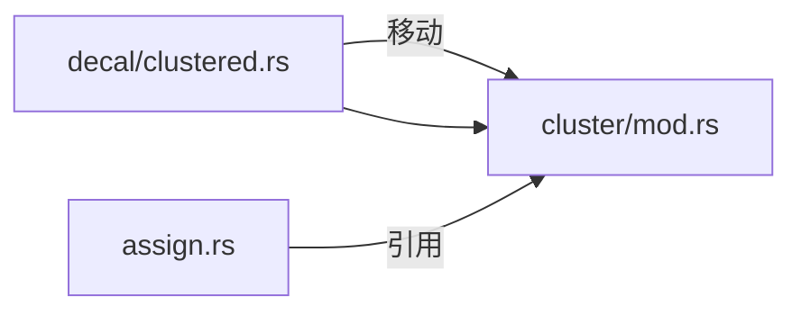

+++
title = "#19959 move ClusteredDecal to cluster module"
date = "2025-07-05T00:00:00"
draft = false
template = "pull_request_page.html"
in_search_index = false

[extra]
current_language = "zh-cn"
available_languages = {"en" = { name = "English", url = "/pull_request/bevy/2025-07/pr-19959-en-20250705" }, "zh-cn" = { name = "中文", url = "/pull_request/bevy/2025-07/pr-19959-zh-cn-20250705" }}
+++

# 分析报告：将 ClusteredDecal 移动到集群模块

## 基本信息
- **标题**: move ClusteredDecal to cluster module
- **PR链接**: https://github.com/bevyengine/bevy/pull/19959
- **作者**: atlv24
- **状态**: 已合并
- **标签**: A-Rendering, S-Needs-Review
- **创建时间**: 2025-07-05T07:12:01Z
- **合并时间**: 2025-07-05T19:52:31Z
- **合并人**: superdump

## 描述翻译
### 目标
- 通过使 clusterable 能够拆分到 bevy_camera 中，使 bevy_light 成为可能

### 解决方案
- 将 ClusteredDecal 移动到 cluster 模块
- 依赖于 #19957（由于导入重排的原因）（在 #19957 合并前为草案）

### 测试
- 3d_scene 运行正常

注意：由于重新导出，没有破坏性变更

## 本次PR的技术分析

### 问题背景与上下文
在 Bevy 的渲染架构中，`ClusteredDecal`（集群化贴花）组件最初位于 `bevy_pbr/src/decal/clustered.rs` 模块中。这个位置导致几个问题：
1. 集群化逻辑分散在不同模块，影响代码组织
2. `bevy_light` 模块的实现需要依赖集群化功能，但无法直接访问
3. 集群分配系统 (`assign.rs`) 需要跨模块导入贴花类型，增加耦合度

核心问题在于架构组织 - 集群贴花本质上属于集群化对象（clusterable objects），应该与集群管理逻辑放在一起，而不是与贴花渲染实现耦合。

### 解决方案与实现
PR 的核心操作是将 `ClusteredDecal` 结构体及其相关定义从贴花模块迁移到集群模块：



#### 具体迁移步骤
1. **从贴花模块移除 `ClusteredDecal` 定义**  
   从 `decal/clustered.rs` 中完全移除该结构体定义：
   ```diff
   -// 原位置：crates/bevy_pbr/src/decal/clustered.rs
   -#[derive(Component, Debug, Clone, Reflect, ExtractComponent)]
   -#[reflect(Component, Debug, Clone)]
   -#[require(Transform, Visibility, VisibilityClass)]
   -#[component(on_add = view::add_visibility_class::<LightVisibilityClass>)]
   -pub struct ClusteredDecal {
   -    pub image: Handle<Image>,
   -    pub tag: u32,
   -}
   ```

2. **在集群模块添加 `ClusteredDecal` 定义**  
   在 `cluster/mod.rs` 中重建该结构体：
   ```rust
   // 新位置：crates/bevy_pbr/src/cluster/mod.rs
   #[derive(Component, Debug, Clone, Reflect, ExtractComponent)]
   #[reflect(Component, Debug, Clone)]
   #[require(Transform, Visibility, VisibilityClass)]
   #[component(on_add = visibility::add_visibility_class::<LightVisibilityClass>)]
   pub struct ClusteredDecal {
       pub image: Handle<Image>,
       pub tag: u32,
   }
   ```

3. **调整集群分配系统的导入**  
   更新 `cluster/assign.rs` 的导入路径，使用新的模块位置：
   ```diff
   +use super::{ClusterConfig, ClusterFarZMode, ClusteredDecal, ...};
   -use crate::decal::clustered::ClusteredDecal;
   ```

### 关键变更与技术细节

#### 1. 文件：`crates/bevy_pbr/src/decal/clustered.rs`
**变更**：移除 `ClusteredDecal` 定义  
**原因**：该组件本质上属于集群管理系统，不应放在贴花渲染实现模块  
**代码变更**：
```diff
- pub struct ClusteredDecal {
-     pub image: Handle<Image>,
-     pub tag: u32,
- }
+ pub use crate::ClusteredDecal;  // 重新导出保持兼容
```

#### 2. 文件：`crates/bevy_pbr/src/cluster/mod.rs`
**变更**：添加 `ClusteredDecal` 定义  
**原因**：集群贴花是集群化对象，应与集群管理逻辑共存  
**代码变更**：
```rust
// 添加完整的结构体定义
pub struct ClusteredDecal {
    pub image: Handle<Image>,
    pub tag: u32,
}
```

#### 3. 文件：`crates/bevy_pbr/src/cluster/assign.rs`
**变更**：导入路径重构  
**原因**：适应 `ClusteredDecal` 的新位置  
**代码变更**：
```diff
+ use bevy_camera::{
+     primitives::{Aabb, Frustum, HalfSpace, Sphere},
+     visibility::{RenderLayers, ViewVisibility},
+     Camera,
+ };
- use bevy_render::{
-     camera::Camera,
-     primitives::{Aabb, Frustum, HalfSpace, Sphere},
-     view::{RenderLayers, ViewVisibility},
- };
```

### 技术影响与考量
1. **架构改进**：
   - 集群贴花现在与点光源、聚光灯等集群对象统一管理
   - 减少模块间耦合，符合单一职责原则

2. **兼容性处理**：
   - 通过重新导出保持向后兼容：`pub use crate::ClusteredDecal`
   - 现有使用 `bevy_pbr::decal::ClusteredDecal` 的代码不受影响

3. **依赖关系重构**：
   - 将渲染相关导入 (`bevy_render`) 替换为相机相关导入 (`bevy_camera`)
   - 为后续将集群功能拆分到 `bevy_camera` 模块做准备

4. **性能影响**：
   - 纯代码组织变更，不影响运行时性能
   - 编译时可能因模块结构调整有微小影响

### 潜在改进方向
1. 后续可考虑将整个集群系统迁移到 `bevy_camera`
2. 可统一集群对象的抽象接口（灯光/贴花等）
3. 优化集群分配系统的数据访问模式

## 关键文件变更

### `crates/bevy_pbr/src/decal/clustered.rs`
**变更描述**：移除 ClusteredDecal 定义，改为重新导出  
**关键代码**：
```diff
- #[derive(Component, ...)]
- pub struct ClusteredDecal { ... }
+ pub use crate::ClusteredDecal;
```

### `crates/bevy_pbr/src/cluster/mod.rs`
**变更描述**：添加 ClusteredDecal 结构体定义  
**关键代码**：
```rust
#[derive(Component, Debug, Clone, Reflect, ExtractComponent)]
#[reflect(Component, Debug, Clone)]
#[require(Transform, Visibility, VisibilityClass)]
#[component(on_add = visibility::add_visibility_class::<LightVisibilityClass>)]
pub struct ClusteredDecal {
    pub image: Handle<Image>,
    pub tag: u32,
}
```

### `crates/bevy_pbr/src/cluster/assign.rs`
**变更描述**：更新导入路径和依赖  
**关键代码**：
```diff
+ use bevy_camera::{
+     primitives::{Aabb, Frustum, HalfSpace, Sphere},
+     visibility::{RenderLayers, ViewVisibility},
+     Camera,
+ };
+ use super::{ClusteredDecal, ...};
```

## 进一步阅读
1. [Bevy 集群化渲染架构](https://bevyengine.org/learn/book/introduction/)
2. 现代图形引擎中的集群化渲染技术：
   - Olsson, O., & Assarsson, U. (2011). Clustered deferred and forward shading.
3. [Bevy 模块系统设计原则](https://github.com/bevyengine/bevy/discussions/3562)