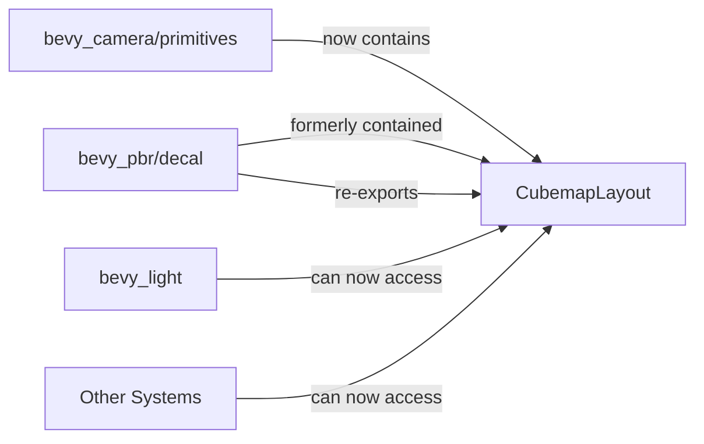

+++
title = "#19960 Move CubemapLayout out of decal code"
date = "2025-07-05T00:00:00"
draft = false
template = "pull_request_page.html"
in_search_index = true

[taxonomies]
list_display = ["show"]

[extra]
current_language = "en"
available_languages = {"en" = { name = "English", url = "/pull_request/bevy/2025-07/pr-19960-en-20250705" }, "zh-cn" = { name = "中文", url = "/pull_request/bevy/2025-07/pr-19960-zh-cn-20250705" }}
labels = ["A-Rendering"]
+++

# PR Analysis: Move CubemapLayout out of decal code

## Basic Information
- **Title**: Move CubemapLayout out of decal code
- **PR Link**: https://github.com/bevyengine/bevy/pull/19960
- **Author**: atlv24
- **Status**: MERGED
- **Labels**: A-Rendering, S-Ready-For-Final-Review
- **Created**: 2025-07-05T07:18:10Z
- **Merged**: 2025-07-05T16:01:14Z
- **Merged By**: alice-i-cecile

## Description Translation
# Objective

- Make bevy_light possible by making it possible to split out clusterable into bevy_camera

## Solution

- Move cubemap stuff next to cubemap stuff.

## Testing

- 3d_scene runs

Note: no breaking changes thanks to re-exports

## The Story of This Pull Request

### The Problem and Context
The `CubemapLayout` enum was originally defined in `bevy_pbr/src/decal/clustered.rs`, but this placement created an architectural issue. The enum is a fundamental primitive describing how cubemap faces are arranged in texture atlases, unrelated to decal-specific functionality. Its location in the decal module forced a dependency on the PBR crate for any system needing cubemap layout information, blocking efforts to extract camera-related functionality (like clusterable rendering) into the separate `bevy_camera` crate.

### The Solution Approach
The straightforward solution was to relocate `CubemapLayout` to a more appropriate home in `bevy_camera/src/primitives.rs` alongside other core rendering primitives. To maintain backward compatibility, the original location was modified to re-export the type from its new position using `pub use bevy_render::primitives::CubemapLayout`. This approach required no API changes while enabling better code organization.

### The Implementation
The implementation consisted of two coordinated changes:
1. Adding the `CubemapLayout` definition to `bevy_camera`
2. Removing the redundant definition from `bevy_pbr` and replacing it with a re-export

The `CubemapLayout` enum itself remains unchanged - it's simply moved to a more appropriate location. The enum defines four common cubemap packing formats with ASCII visualizations:

```rust
pub enum CubemapLayout {
    /// layout in a vertical cross format
    /// ```text
    ///    +y
    /// -x -z +x
    ///    -y
    ///    +z
    /// ```
    #[default]
    CrossVertical = 0,
    // Other variants follow same pattern...
}
```

### Technical Insights
The key insight here is that core primitives should live in foundational crates rather than feature-specific modules. This relocation:
1. Reduces unnecessary dependencies (bevy_light no longer needs PBR for cubemap layouts)
2. Improves code discoverability (cubemap-related types now grouped together)
3. Follows Rust's best practice of re-exporting to maintain API stability

The PR demonstrates effective dependency management through careful type relocation. By using re-exports, the change achieves architectural improvements without breaking existing code.

### The Impact
This change enables further modularization of Bevy's rendering system, specifically unblocking work to move clusterable rendering into `bevy_camera`. The 3D scene test confirms no regressions in core functionality. Long-term, this cleanup makes the codebase more maintainable by reducing cross-crate dependencies for fundamental types.

## Visual Representation



## Key Files Changed

1. `crates/bevy_camera/src/primitives.rs`
   - Added the `CubemapLayout` enum definition
   - This provides a proper home for the primitive alongside other camera-related types

```rust
// Added code:
/// Cubemap layout defines the order of images in a packed cubemap image.
#[derive(Default, Reflect, Debug, Clone, Copy)]
pub enum CubemapLayout {
    /// layout in a vertical cross format
    /// ```text
    ///    +y
    /// -x -z +x
    ///    -y
    ///    +z
    /// ```
    #[default]
    CrossVertical = 0,
    // Additional variants omitted for brevity...
}
```

2. `crates/bevy_pbr/src/decal/clustered.rs`
   - Removed the local `CubemapLayout` definition
   - Added a re-export to maintain backward compatibility

```rust
// Before:
pub enum CubemapLayout { /* ... full definition ... */ }

// After:
pub use bevy_render::primitives::CubemapLayout;
```

## Further Reading
- [Rust Module System and Re-exports](https://doc.rust-lang.org/book/ch07-04-bringing-paths-into-scope-with-the-use-keyword.html#re-exporting-names-with-pub-use)
- [Bevy Engine Architecture](https://github.com/bevyengine/bevy/tree/main/docs/plugins_guidelines)
- [Cubemap Texture Layouts](https://learn.microsoft.com/en-us/windows/win32/direct3ddds/dds-file-layout-for-cube-maps)