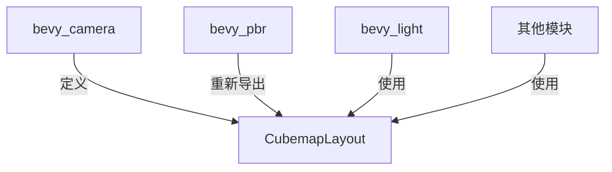

+++
title = "#19960 Move CubemapLayout out of decal code"
date = "2025-07-05T00:00:00"
draft = false
template = "pull_request_page.html"
in_search_index = false

[extra]
current_language = "zh-cn"
available_languages = {"en" = { name = "English", url = "/pull_request/bevy/2025-07/pr-19960-en-20250705" }, "zh-cn" = { name = "中文", url = "/pull_request/bevy/2025-07/pr-19960-zh-cn-20250705" }}
+++

# Move CubemapLayout out of decal code

## 基本信息
- **标题**: Move CubemapLayout out of decal code
- **PR链接**: https://github.com/bevyengine/bevy/pull/19960
- **作者**: atlv24
- **状态**: MERGED
- **标签**: A-Rendering, S-Ready-For-Final-Review
- **创建时间**: 2025-07-05T07:18:10Z
- **合并时间**: 2025-07-05T16:01:14Z
- **合并者**: alice-i-cecile

## 描述翻译
# Objective

- 通过将 clusterable 功能拆分到 bevy_camera 中，使 bevy_light 成为可能

## Solution

- 将立方体贴图相关内容移动到立方体贴图相关位置

## Testing

- 3d_scene 正常运行

注意：通过重新导出避免了破坏性更改

## PR 分析

### 问题背景
在 Bevy 的渲染系统中，`CubemapLayout` 枚举原本定义在 `bevy_pbr/src/decal/clustered.rs` 文件中。这个枚举定义了立方体贴图的不同布局格式（如垂直十字、水平十字等），属于通用的图形学概念。然而，它被放置在贴花(decal)模块中，导致以下问题：

1. **模块耦合**：相机系统(`bevy_camera`)需要访问立方体贴图布局信息，但无法直接引用贴花模块中的类型
2. **代码组织不合理**：立方体贴图布局是底层渲染原语(primitive)，不属于贴花特有的概念
3. **阻碍架构演进**：无法将 clusterable 功能拆分到相机模块，限制了 `bevy_light` 的开发

### 解决方案
通过代码重构解决上述问题：
1. 将 `CubemapLayout` 从贴花模块迁移到相机模块的 primitives 部分
2. 在原始位置保留重新导出(pub use)以维持向后兼容性
3. 保持枚举定义完全不变，仅改变其物理位置

### 实现细节
核心变更涉及两个文件：

1. **从贴花模块移除 `CubemapLayout`**  
   在 `bevy_pbr/src/decal/clustered.rs` 中：
   ```rust
   // 删除原有枚举定义
   -/// Cubemap layout defines the order of images in a packed cubemap image.
   -#[derive(Default, Reflect, Debug, Clone, Copy)]
   -pub enum CubemapLayout {
   -    /// layout in a vertical cross format
   -    /// ```text
   -    ///    +y
   -    /// -x -z +x
   -    ///    -y
   -    ///    +z
   -    /// ```
   -    #[default]
   -    CrossVertical = 0,
   -    // ...其他变体定义...
   -}
   
   // 添加重新导出
   +pub use bevy_render::primitives::CubemapLayout;
   ```

2. **在相机模块添加 `CubemapLayout`**  
   在 `bevy_camera/src/primitives.rs` 中：
   ```rust
   +/// Cubemap layout defines the order of images in a packed cubemap image.
   +#[derive(Default, Reflect, Debug, Clone, Copy)]
   +pub enum CubemapLayout {
   +    /// layout in a vertical cross format
   +    /// ```text
   +    ///    +y
   +    /// -x -z +x
   +    ///    -y
   +    ///    +z
   +    /// ```
   +    #[default]
   +    CrossVertical = 0,
   +    // ...完整枚举定义保持不变...
   +}
   ```

关键实现要点：
- **零功能变更**：仅移动代码位置，不修改任何实现逻辑
- **兼容性处理**：通过 `pub use` 保持原有导出路径有效
- **逻辑位置优化**：将渲染原语置于相机模块更符合架构设计

### 技术影响
1. **解耦渲染系统**：相机系统现在可直接访问立方体贴图布局，无需依赖贴花模块
2. **支持架构演进**：为 clusterable 功能拆分到 `bevy_camera` 铺平道路
3. **代码组织优化**：
   - 贴花模块聚焦贴花特定逻辑（减少36行无关代码）
   - 相机模块集中管理渲染原语（新增36行相关代码）
4. **无破坏性变更**：现有用户代码通过重新导出保持兼容

### 验证与测试
验证方式：
1. 运行基础测试场景（3d_scene）
2. 确保所有使用 `CubemapLayout` 的代码路径不受影响
3. 验证重新导出的类型与原始类型完全兼容

## 架构关系



## 关键文件变更

### `crates/bevy_pbr/src/decal/clustered.rs` (+1/-36)
**变更目的**：移除与贴花核心功能无关的立方体贴图布局定义  
**关键变更**：
```diff
+ pub use bevy_render::primitives::CubemapLayout;

- // 完整移除 CubemapLayout 枚举定义
- /// Cubemap layout defines the order of images...
- #[derive(Default, Reflect, Debug, Clone, Copy)]
- pub enum CubemapLayout {
-     // ...枚举变体定义...
- }
```

### `crates/bevy_camera/src/primitives.rs` (+36/-0)
**变更目的**：在合适位置添加通用渲染原语定义  
**关键变更**：
```rust
+ /// Cubemap layout defines the order of images...
+ #[derive(Default, Reflect, Debug, Clone, Copy)]
+ pub enum CubemapLayout {
+     /// layout in a vertical cross format
+     /// ```text
+     ///    +y
+     /// -x -z +x
+     ///    -y
+     ///    +z
+     /// ```
+     #[default]
+     CrossVertical = 0,
+     
+     // 其他变体保持相同定义
+     CrossHorizontal = 1,
+     SequenceVertical = 2,
+     SequenceHorizontal = 3,
+ }
```

## 完整代码差异
```diff
diff --git a/crates/bevy_camera/src/primitives.rs b/crates/bevy_camera/src/primitives.rs
index ddde695423554..e08422b052fc8 100644
--- a/crates/bevy_camera/src/primitives.rs
+++ b/crates/bevy_camera/src/primitives.rs
@@ -363,6 +363,42 @@ impl CubemapFrusta {
     }
 }
 
+/// Cubemap layout defines the order of images in a packed cubemap image.
+#[derive(Default, Reflect, Debug, Clone, Copy)]
+pub enum CubemapLayout {
+    /// layout in a vertical cross format
+    /// ```text
+    ///    +y
+    /// -x -z +x
+    ///    -y
+    ///    +z
+    /// ```
+    #[default]
+    CrossVertical = 0,
+    /// layout in a horizontal cross format
+    /// ```text
+    ///    +y
+    /// -x -z +x +z
+    ///    -y
+    /// ```
+    CrossHorizontal = 1,
+    /// layout in a vertical sequence
+    /// ```text
+    ///   +x
+    ///   -y
+    ///   +y
+    ///   -y
+    ///   -z
+    ///   +z
+    /// ```
+    SequenceVertical = 2,
+    /// layout in a horizontal sequence
+    /// ```text
+    /// +x -y +y -y -z +z
+    /// ```
+    SequenceHorizontal = 3,
+}
+
 #[derive(Component, Debug, Default, Reflect, Clone)]
 #[reflect(Component, Default, Debug, Clone)]
 pub struct CascadesFrusta {
diff --git a/crates/bevy_pbr/src/decal/clustered.rs b/crates/bevy_pbr/src/decal/clustered.rs
index ec386670eccf8..d89c91c7ab0d0 100644
--- a/crates/bevy_pbr/src/decal/clustered.rs
+++ b/crates/bevy_pbr/src/decal/clustered.rs
@@ -32,6 +32,7 @@ use bevy_image::Image;
 use bevy_math::Mat4;
 use bevy_platform::collections::HashMap;
 use bevy_reflect::Reflect;
+pub use bevy_render::primitives::CubemapLayout;
 use bevy_render::{
     extract_component::{ExtractComponent, ExtractComponentPlugin},
     load_shader_library,
@@ -95,42 +96,6 @@ pub struct ClusteredDecal {
     pub tag: u32,
 }
 
-/// Cubemap layout defines the order of images in a packed cubemap image.
-#[derive(Default, Reflect, Debug, Clone, Copy)]
-pub enum CubemapLayout {
-    /// layout in a vertical cross format
-    /// ```text
-    ///    +y
-    /// -x -z +x
-    ///    -y
-    ///    +z
-    /// ```
-    #[default]
-    CrossVertical = 0,
-    /// layout in a horizontal cross format
-    /// ```text
-    ///    +y
-    /// -x -z +x +z
-    ///    -y
-    /// ```
-    CrossHorizontal = 1,
-    /// layout in a vertical sequence
-    /// ```text
-    ///   +x
-    ///   -y
-    ///   +y
-    ///   -y
-    ///   -z
-    ///   +z
-    /// ```
-    SequenceVertical = 2,
-    /// layout in a horizontal sequence
-    /// ```text
-    /// +x -y +y -y -z +z
-    /// ```
-    SequenceHorizontal = 3,
-}
-
 /// Add to a [`PointLight`] to add a light texture effect.
 /// A texture mask is applied to the light source to modulate its intensity,  
 /// simulating patterns like window shadows, gobo/cookie effects, or soft falloffs.
```

## 延伸阅读
1. Bevy 渲染架构概览:  
   https://bevyengine.org/learn/book/getting-started/rendering/
2. 立方体贴图技术详解:  
   https://learnopengl.com/Advanced-OpenGL/Cubemaps
3. Rust 模块系统与 pub use:  
   https://doc.rust-lang.org/book/ch07-04-bringing-paths-into-scope-with-the-use-keyword.html#re-exporting-names-with-pub-use
4. 游戏引擎中的解耦设计:  
   https://gameprogrammingpatterns.com/component.html