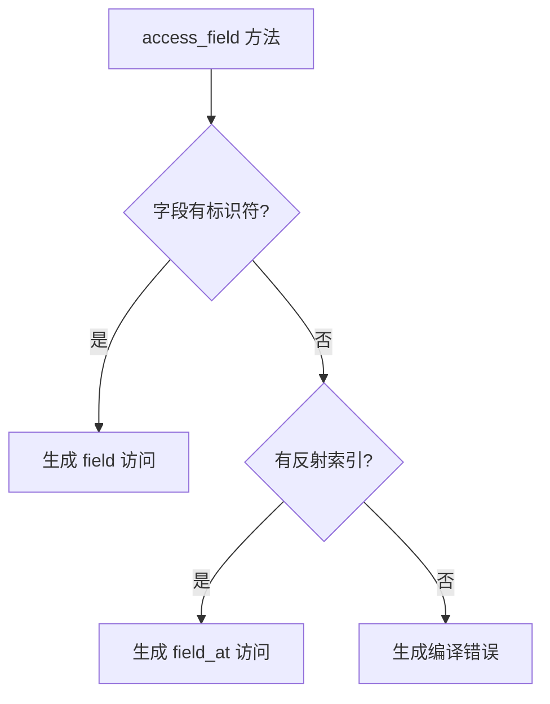

+++
title = "#19961 Minor code readability improvement in enum_utility.access_field"
date = "2025-07-05T00:00:00"
draft = false
template = "pull_request_page.html"
in_search_index = false

[extra]
current_language = "zh-cn"
available_languages = {"en" = { name = "English", url = "/pull_request/bevy/2025-07/pr-19961-en-20250705" }, "zh-cn" = { name = "中文", url = "/pull_request/bevy/2025-07/pr-19961-zh-cn-20250705" }}
+++

# Minor code readability improvement in enum_utility.access_field

## 基本信息
- **标题**: Minor code readability improvement in enum_utility.access_field
- **PR链接**: https://github.com/bevyengine/bevy/pull/19961
- **作者**: theotherphil
- **状态**: 已合并
- **标签**: D-Trivial, C-Code-Quality, S-Ready-For-Final-Review, A-Reflection
- **创建时间**: 2025-07-05T07:32:06Z
- **合并时间**: 2025-07-05T16:01:15Z
- **合并者**: alice-i-cecile

## 描述翻译
小型清理，复制自 https://github.com/bevyengine/bevy/pull/16250

## PR分析

### 问题背景
在`bevy_reflect`派生宏的`enum_utility.rs`模块中，`VariantBuilder` trait的`access_field`方法实现存在可读性问题。原始代码使用嵌套的`match`和`if let`结构处理字段访问逻辑：
```rust
match &field.field.data.ident {
    Some(field_ident) => {
        let name = field_ident.to_string();
        quote!(#this.field(#name))
    }
    None => {
        if let Some(field_index) = field.field.reflection_index {
            quote!(#this.field_at(#field_index))
        } else {
            // 错误处理
        }
    }
}
```
这种嵌套结构增加了认知负担，特别是在处理None分支中的额外条件检查时。代码需要先匹配字段标识符是否存在，然后在None情况下再检查反射索引(reflection_index)，导致逻辑层次过深。

### 解决方案
采用更线性的条件链(chain of conditions)替代嵌套结构。将原始方案改为：
```rust
if let Some(field_ident) = &field.field.data.ident {
    // 处理命名字段
} else if let Some(field_index) = field.field.reflection_index {
    // 处理索引字段
} else {
    // 错误处理
}
```
这种重构保持原有功能不变，但通过消除嵌套使代码更符合人脑处理条件分支的自然顺序。修改后：
1. 首先检查字段是否有标识符(对应命名结构体字段)
2. 其次检查反射索引是否存在(对应元组或索引访问)
3. 最后处理错误情况

### 实现细节
核心改动在`access_field`方法中，使用连续的`if let`条件替代原来的`match`表达式。关键变化如下：

修改前：
```rust
fn access_field(&self, this: &Ident, field: VariantField) -> TokenStream {
    match &field.field.data.ident {
        Some(field_ident) => {
            let name = field_ident.to_string();
            quote!(#this.field(#name))
        }
        None => {
            if let Some(field_index) = field.field.reflection_index {
                quote!(#this.field_at(#field_index))
            } else {
                quote!(::core::compile_error!(
                    "internal bevy_reflect error: field should be active"
                ))
            }
        }
    }
}
```

修改后：
```rust
fn access_field(&self, this: &Ident, field: VariantField) -> TokenStream {
    if let Some(field_ident) = &field.field.data.ident {
        let name = field_ident.to_string();
        quote!(#this.field(#name))
    } else if let Some(field_index) = field.field.reflection_index {
        quote!(#this.field_at(#field_index))
    } else {
        quote!(::core::compile_error!(
            "internal bevy_reflect error: field should be active"
        ))
    }
}
```
这种改写减少了代码缩进层级，将原先的两层嵌套（match + if let）简化为单层条件链，同时保持完全相同的功能行为。

### 技术考量
1. **条件顺序重要性**：必须保持原逻辑的执行顺序 - 先检查字段标识符(data.ident)，再检查反射索引(reflection_index)
2. **错误处理不变性**：最终分支仍使用`compile_error!`宏确保无效字段访问在编译期报错
3. **性能零影响**：控制流变化不影响生成代码，纯编译时操作
4. **模式匹配优化**：Rust的`if let`链在可读性上优于深层嵌套的match表达式

### 实际影响
1. **可维护性提升**：代码结构更平坦，逻辑分支更清晰
2. **认知负担降低**：减少需要跟踪的嵌套层级
3. **贡献友好性**：符合Rust社区对条件处理的常见习惯
4. **无功能变更**：完全保持原有行为，属于纯重构

## 可视化表示



## 关键文件变更

### crates/bevy_reflect/derive/src/enum_utility.rs
**变更说明**：重构`access_field`方法控制流，提升可读性

修改前代码：
```rust
fn access_field(&self, this: &Ident, field: VariantField) -> TokenStream {
    match &field.field.data.ident {
        Some(field_ident) => {
            let name = field_ident.to_string();
            quote!(#this.field(#name))
        }
        None => {
            if let Some(field_index) = field.field.reflection_index {
                quote!(#this.field_at(#field_index))
            } else {
                quote!(::core::compile_error!(
                    "internal bevy_reflect error: field should be active"
                ))
            }
        }
    }
}
```

修改后代码：
```rust
fn access_field(&self, this: &Ident, field: VariantField) -> TokenStream {
    if let Some(field_ident) = &field.field.data.ident {
        let name = field_ident.to_string();
        quote!(#this.field(#name))
    } else if let Some(field_index) = field.field.reflection_index {
        quote!(#this.field_at(#field_index))
    } else {
        quote!(::core::compile_error!(
            "internal bevy_reflect error: field should be active"
        ))
    }
}
```

## 扩展阅读
1. Rust条件表达式文档：https://doc.rust-lang.org/book/ch06-02-match.html#patterns-that-bind-to-values
2. Rust宏编程指南：https://doc.rust-lang.org/reference/macros-by-example.html
3. Bevy反射系统设计：https://bevyengine.org/learn/book/migration-guides/0.12-to-0.13/#reflect-changes