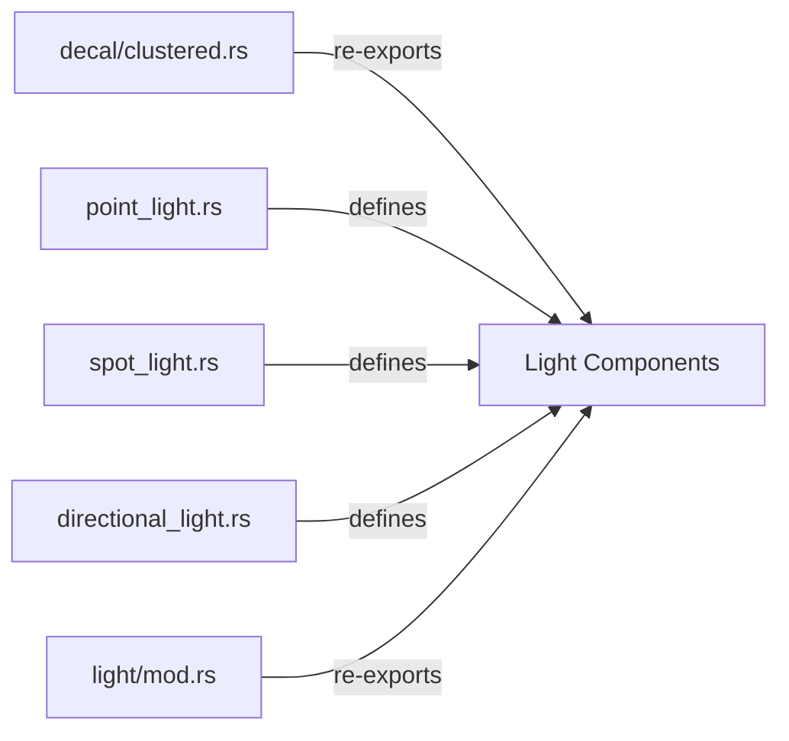

+++
title = "#19962 move light stuff out of decal cluster"
date = "2025-07-05T00:00:00"
draft = false
template = "pull_request_page.html"
in_search_index = true

[taxonomies]
list_display = ["show"]

[extra]
current_language = "en"
available_languages = {"en" = { name = "English", url = "/pull_request/bevy/2025-07/pr-19962-en-20250705" }, "zh-cn" = { name = "中文", url = "/pull_request/bevy/2025-07/pr-19962-zh-cn-20250705" }}
labels = ["A-Rendering"]
+++

## Analysis of PR #19962: move light stuff out of decal cluster

### Basic Information
- **Title**: move light stuff out of decal cluster
- **PR Link**: https://github.com/bevyengine/bevy/pull/19962
- **Author**: atlv24
- **Status**: MERGED
- **Labels**: A-Rendering, S-Ready-For-Final-Review
- **Created**: 2025-07-05T07:39:02Z
- **Merged**: 2025-07-05T17:23:33Z
- **Merged By**: superdump

### Description Translation
# Objective

- Make bevy_light possible

## Solution

- Move light stuff into light module

## Testing

- 3d_scene runs

Note: no breaking changes thanks to re-exports

### The Story of This Pull Request

The PR addresses a code organization issue where light texture components were incorrectly placed in the decal clustering module. This architectural inconsistency made it difficult to extract lighting functionality into a separate `bevy_light` crate, a key goal for the Bevy engine's modularization efforts.

The core problem was that three light texture components (`PointLightTexture`, `SpotLightTexture`, and `DirectionalLightTexture`) were defined in `decal/clustered.rs` despite being fundamentally light-related. This placement created an unnecessary dependency between the decal and lighting systems. The solution involved relocating these components to their respective light modules while maintaining backward compatibility through re-exports.

Implementation began by removing the light texture definitions from `decal/clustered.rs` and adding them to their logical homes:
- `PointLightTexture` moved to `light/point_light.rs`
- `SpotLightTexture` moved to `light/spot_light.rs`
- `DirectionalLightTexture` moved to `light/directional_light.rs`

To prevent breaking existing code, the PR added re-exports in `light/mod.rs`:
```rust
// Before:
pub use point_light::PointLight;

// After:
pub use point_light::{PointLight, PointLightTexture};
```
Additionally, `decal/clustered.rs` gained a re-export to maintain the original import path:
```rust
pub use crate::{DirectionalLightTexture, PointLightTexture, SpotLightTexture};
```

The `PointLightTexture` component required special handling because it depends on `CubemapLayout` from the decal module. This was resolved by adding a targeted import in `point_light.rs`:
```rust
use crate::decal::clustered::CubemapLayout;
```
This minimal cross-module dependency preserves logical separation while enabling necessary functionality.

Testing confirmed that the 3D scene example runs correctly, verifying that the structural changes didn't introduce runtime regressions. The solution achieves better code organization with zero breaking changes, satisfying both immediate needs and long-term architectural goals.

### Visual Representation



### Key Files Changed

1. **crates/bevy_pbr/src/decal/clustered.rs** (+2/-40)  
   Removed light texture definitions and added re-exports:
   ```rust
   // Before:
   pub struct PointLightTexture { ... }
   pub struct SpotLightTexture { ... }
   pub struct DirectionalLightTexture { ... }
   
   // After:
   pub use crate::{DirectionalLightTexture, PointLightTexture, SpotLightTexture};
   ```

2. **crates/bevy_pbr/src/light/point_light.rs** (+15/-0)  
   Added point light texture component definition:
   ```rust
   #[derive(Clone, Component, Debug, Reflect)]
   #[require(PointLight)]
   pub struct PointLightTexture {
       pub image: Handle<Image>,
       pub cubemap_layout: CubemapLayout,
   }
   ```

3. **crates/bevy_pbr/src/light/directional_light.rs** (+13/-0)  
   Added directional light texture component:
   ```rust
   #[derive(Clone, Component, Debug, Reflect)]
   #[require(DirectionalLight)]
   pub struct DirectionalLightTexture {
       pub image: Handle<Image>,
       pub tiled: bool,
   }
   ```

4. **crates/bevy_pbr/src/light/spot_light.rs** (+12/-0)  
   Added spot light texture component:
   ```rust
   #[derive(Clone, Component, Debug, Reflect)]
   #[require(SpotLight)]
   pub struct SpotLightTexture {
       pub image: Handle<Image>,
   }
   ```

5. **crates/bevy_pbr/src/light/mod.rs** (+3/-3)  
   Updated re-exports to include texture components:
   ```rust
   // Before:
   pub use point_light::PointLight;
   pub use spot_light::SpotLight;
   pub use directional_light::DirectionalLight;
   
   // After:
   pub use point_light::{PointLight, PointLightTexture};
   pub use spot_light::{SpotLight, SpotLightTexture};
   pub use directional_light::{DirectionalLight, DirectionalLightTexture};
   ```

### Further Reading
- Bevy's Modular Architecture RFC: https://github.com/bevyengine/rfcs/pull/1
- Rust Module System: https://doc.rust-lang.org/book/ch07-02-defining-modules-to-control-scope-and-privacy.html
- Component-Based Architecture: https://en.wikipedia.org/wiki/Component-based_software_engineering