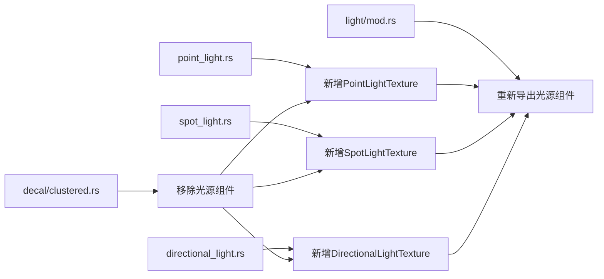

+++
title = "#19962 move light stuff out of decal cluster"
date = "2025-07-05T00:00:00"
draft = false
template = "pull_request_page.html"
in_search_index = false

[extra]
current_language = "zh-cn"
available_languages = {"en" = { name = "English", url = "/pull_request/bevy/2025-07/pr-19962-en-20250705" }, "zh-cn" = { name = "中文", url = "/pull_request/bevy/2025-07/pr-19962-zh-cn-20250705" }}
+++

# 移动光源组件从贴花集群模块重构分析

## 基本信息
- **标题**: move light stuff out of decal cluster
- **PR链接**: https://github.com/bevyengine/bevy/pull/19962
- **作者**: atlv24
- **状态**: MERGED
- **标签**: A-Rendering, S-Ready-For-Final-Review
- **创建时间**: 2025-07-05T07:39:02Z
- **合并时间**: 2025-07-05T17:23:33Z
- **合并者**: superdump

## 描述翻译
### 目标
- 实现 bevy_light 功能

### 解决方案
- 将与光源相关的组件移动到 light 模块

### 测试
- 3d_scene 场景可正常运行

注：通过重新导出(re-exports)避免了破坏性变更

## 本次PR的技术分析

### 问题背景与重构动机
在Bevy渲染系统的原始实现中，光源纹理组件(PointLightTexture, SpotLightTexture, DirectionalLightTexture)被放置在`bevy_pbr/src/decal/clustered.rs`模块中。这种组织方式存在明显问题：
1. **逻辑归属错误**：这些组件本质上是光源的扩展功能，而非贴花(decal)系统的一部分
2. **模块耦合度高**：光源实现需要访问贴花模块的内部类型(如CubemapLayout)
3. **阻碍架构演进**：这种不合理的位置阻碍了计划中的bevy_light模块开发

原始代码结构违反了关注点分离原则，导致光源相关功能分散在不同模块，增加了维护成本和理解难度。

### 解决方案与实现
核心重构方案是将光源纹理组件迁移到对应的光源模块中：
1. 从`decal/clustered.rs`完全移除光源纹理组件定义
2. 将各光源纹理组件分别添加到对应的光源实现文件中
3. 在light模块的mod.rs中重新导出这些组件
4. 在原始位置(decal模块)添加重新导出以保持兼容性

**关键实现细节**：
- 使用`#[require(...)]`属性确保组件依赖关系不变
- 保留所有组件的反射(reflect)功能
- 通过重新导出维持现有API兼容性
- 处理跨模块依赖(CubemapLayout从decal导入)

```rust
// PointLightTexture移动到light/point_light.rs
#[derive(Clone, Component, Debug, Reflect)]
#[reflect(Component, Debug)]
#[require(PointLight)]
pub struct PointLightTexture {
    pub image: Handle<Image>,
    pub cubemap_layout: CubemapLayout,
}
```

### 技术洞察
1. **模块边界优化**：
   - 将功能组件放置在其逻辑归属模块
   - 消除不合理的跨模块依赖
   - 提升代码可发现性和可维护性

2. **兼容性处理**：
   ```rust
   // 在decal/clustered.rs添加重新导出
   pub use crate::{DirectionalLightTexture, PointLightTexture, SpotLightTexture};
   ```
   这种技术确保现有代码无需修改即可继续使用原路径访问组件

3. **依赖管理**：
   - PointLightTexture需要从decal模块导入CubemapLayout
   - 这种跨模块依赖是可接受的，因为CubemapLayout是简单的枚举类型
   - 未来可考虑将CubemapLayout移到更通用的位置

### 影响与收益
1. **架构改进**：
   - 光源系统实现更内聚
   - 贴花模块职责更单一
   - 为bevy_light模块奠定基础

2. **维护性提升**：
   - 开发者更容易定位光源相关功能
   - 减少意外引入的模块耦合
   - 代码变更的影响范围更清晰

3. **零破坏性变更**：
   - 通过重新导出保持API兼容
   - 现有项目无需修改代码
   - 测试验证(3d_scene)确保功能不受影响

## 组件关系变化


## 关键文件变更

### 1. `crates/bevy_pbr/src/decal/clustered.rs` (+2/-40)
**变更说明**：移除光源纹理组件定义，添加重新导出  
**关键代码**：
```rust
// 移除前：
#[derive(Clone, Component, Debug, Reflect)]
#[reflect(Component, Debug)]
#[require(PointLight)]
pub struct PointLightTexture {
    pub image: Handle<Image>,
    pub cubemap_layout: CubemapLayout,
}

// 变更后：
pub use crate::{DirectionalLightTexture, PointLightTexture, SpotLightTexture};
```

### 2. `crates/bevy_pbr/src/light/point_light.rs` (+15/-0)
**变更说明**：添加PointLightTexture组件定义  
**关键代码**：
```rust
#[derive(Clone, Component, Debug, Reflect)]
#[reflect(Component, Debug)]
#[require(PointLight)]
pub struct PointLightTexture {
    pub image: Handle<Image>,
    pub cubemap_layout: CubemapLayout,
}
```

### 3. `crates/bevy_pbr/src/light/directional_light.rs` (+13/-0)
**变更说明**：添加DirectionalLightTexture组件定义  
**关键代码**：
```rust
#[derive(Clone, Component, Debug, Reflect)]
#[reflect(Component, Debug)]
#[require(DirectionalLight)]
pub struct DirectionalLightTexture {
    pub image: Handle<Image>,
    pub tiled: bool,
}
```

### 4. `crates/bevy_pbr/src/light/spot_light.rs` (+12/-0)
**变更说明**：添加SpotLightTexture组件定义  
**关键代码**：
```rust
#[derive(Clone, Component, Debug, Reflect)]
#[reflect(Component, Debug)]
#[require(SpotLight)]
pub struct SpotLightTexture {
    pub image: Handle<Image>,
}
```

### 5. `crates/bevy_pbr/src/light/mod.rs` (+3/-3)
**变更说明**：更新模块导出语句  
**关键代码**：
```rust
// 变更前：
pub use point_light::PointLight;
pub use spot_light::SpotLight;
pub use directional_light::DirectionalLight;

// 变更后：
pub use point_light::{PointLight, PointLightTexture};
pub use spot_light::{SpotLight, SpotLightTexture};
pub use directional_light::{DirectionalLight, DirectionalLightTexture};
```

## 进一步阅读
1. Bevy模块系统文档：  
   https://bevyengine.org/learn/book/getting-started/modules/
2. Rust模块系统最佳实践：  
   https://doc.rust-lang.org/book/ch07-00-managing-growing-projects-with-packages-crates-and-modules.html
3. 组件化架构设计原则：  
   https://en.wikipedia.org/wiki/Component-based_software_engineering
4. Bevy渲染管线解析：  
   https://bevy-cheatbook.github.io/features/pbr.html