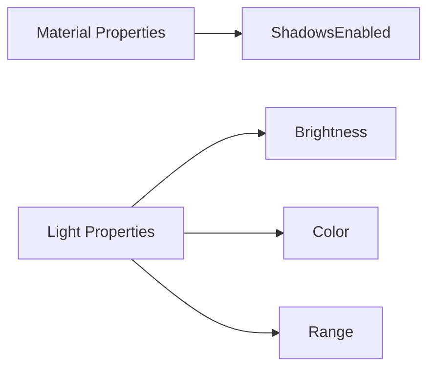

+++
title = "#19963 move ShadowsEnabled to material"
date = "2025-07-05T00:00:00"
draft = false
template = "pull_request_page.html"
in_search_index = true

[taxonomies]
list_display = ["show"]

[extra]
current_language = "en"
available_languages = {"en" = { name = "English", url = "/pull_request/bevy/2025-07/pr-19963-en-20250705" }, "zh-cn" = { name = "中文", url = "/pull_request/bevy/2025-07/pr-19963-zh-cn-20250705" }}
labels = ["A-Rendering"]
+++

## Technical Analysis: Move ShadowsEnabled to Material  

### Basic Information  
- **Title**: move ShadowsEnabled to material  
- **PR Link**: https://github.com/bevyengine/bevy/pull/19963  
- **Author**: atlv24  
- **Status**: MERGED  
- **Labels**: A-Rendering, S-Ready-For-Final-Review  
- **Created**: 2025-07-05T08:08:03Z  
- **Merged**: 2025-07-05T17:24:55Z  
- **Merged By**: superdump  

### Description Translation  
**Objective**  
- Enable development of bevy_light  

**Solution**  
- Move non-light functionality out of light module (ShadowsEnabled marker indicates whether a material should cast shadows - a material property, not a light property)  

**Testing**  
- Verified with 3d_scene execution  

### The Story of This Pull Request  

#### Problem and Context  
The core issue was misplaced ownership of shadow configuration logic. The `ShadowsEnabled` marker resource was incorrectly located in the light module, despite representing a **material property** rather than a light property. This architectural misplacement created conceptual inconsistency and hindered development of the bevy_light module, as shadow casting behavior is fundamentally tied to materials, not light sources.  

#### Solution Approach  
The solution involves relocating `ShadowsEnabled` from `light/mod.rs` to `material.rs` - a more logical home since:  
1. Shadow casting is determined by material properties (e.g., opacity, surface characteristics)  
2. Materials define how light interacts with surfaces  
3. This separation aligns with Physically Based Rendering (PBR) principles  

No alternatives were considered since this is a straightforward architectural correction. The change maintains all existing functionality while improving code organization.  

#### Implementation  
The implementation consists of two atomic operations:  
1. Removing `ShadowsEnabled` and its dependencies from the light module  
2. Reinstating it in the material module with identical functionality  

Key modifications include:  
- Removing phantom data imports from light module  
- Preserving the `ShadowsEnabled` API contract during relocation  
- Maintaining default implementation behavior  

#### Technical Insights  
The change leverages Rust's phantom types for type-safe material configuration:  
```rust  
pub struct ShadowsEnabled<M: Material>(PhantomData<M>);  
```  
This generic marker associates shadow configuration with specific material types, ensuring compile-time validation of material-specific shadow settings. The relocation doesn't alter functionality but improves:  
- **Conceptual clarity**: Shadow behavior now owned by materials  
- **Cohesion**: Related material properties colocated  
- **Decoupling**: Light module focuses purely on illumination  

#### Impact  
This change enables two key improvements:  
1. Clears path for bevy_light development by resolving architectural inconsistency  
2. Improves codebase maintainability through proper separation of concerns  
3. Reduces cognitive load: developers now intuitively find shadow configuration where material properties are defined  

Testing confirmed no regression: The 3d_scene example runs correctly with shadows functioning as before.  

### Visual Representation  



### Key Files Changed  

#### `crates/bevy_pbr/src/light/mod.rs`  
**Changes**: Removed `ShadowsEnabled` resource and related imports  
**Purpose**: Clean light module of material-specific properties  
**Code Diff**:  
```diff  
- use core::{marker::PhantomData, ops::DerefMut};  
+ use core::ops::DerefMut;  

- /// Marker resource for whether shadows are enabled for this material type  
- #[derive(Resource, Debug)]  
- pub struct ShadowsEnabled<M: Material>(PhantomData<M>);  
-  
- impl<M: Material> Default for ShadowsEnabled<M> {  
-     fn default() -> Self {  
-         Self(PhantomData)  
-     }  
- }  
```  

#### `crates/bevy_pbr/src/material.rs`  
**Changes**: Added `ShadowsEnabled` resource at module level  
**Purpose**: Colocate shadow configuration with material properties  
**Code Diff**:  
```diff  
+ /// Marker resource for whether shadows are enabled for this material type  
+ #[derive(Resource, Debug)]  
+ pub struct ShadowsEnabled<M: Material>(PhantomData<M>);  
+  
+ impl<M: Material> Default for ShadowsEnabled<M> {  
+     fn default() -> Self {  
+         Self(PhantomData)  
+     }  
+ }  
```  

### Further Reading  
1. [Bevy Material System Documentation](https://bevyengine.org/learn/book/next/render/materials/)  
2. [Phantom Data in Rust](https://doc.rust-lang.org/std/marker/struct.PhantomData.html)  
3. [PBR Theory: Shadowing/Masking](https://learnopengl.com/PBR/Theory)