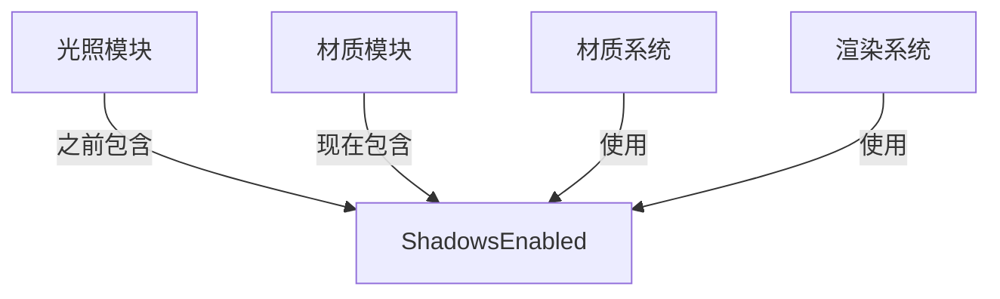

+++
title = "#19963 move ShadowsEnabled to material"
date = "2025-07-05T00:00:00"
draft = false
template = "pull_request_page.html"
in_search_index = false

[extra]
current_language = "zh-cn"
available_languages = {"en" = { name = "English", url = "/pull_request/bevy/2025-07/pr-19963-en-20250705" }, "zh-cn" = { name = "中文", url = "/pull_request/bevy/2025-07/pr-19963-zh-cn-20250705" }}
+++

# 移动 ShadowsEnabled 到材质模块的技术分析报告

## 基本信息
- **标题**: move ShadowsEnabled to material
- **PR 链接**: https://github.com/bevyengine/bevy/pull/19963
- **作者**: atlv24
- **状态**: MERGED
- **标签**: A-Rendering, S-Ready-For-Final-Review
- **创建时间**: 2025-07-05T08:08:03Z
- **合并时间**: 2025-07-05T17:24:55Z
- **合并人**: superdump

## 描述翻译
### Objective
- 为 bevy_light 功能做准备

### Solution
- 将非光照相关功能移出光照模块（ShadowsEnabled 是标记材质是否应投射阴影的标识，这是材质属性而非光照属性）

### Testing
- 3d_scene 场景运行正常

## 本次 PR 的技术分析

### 问题背景
在 Bevy 渲染系统中，`ShadowsEnabled` 被错误地放置在光照模块(light module)中。这个标记资源决定材质是否投射阴影，从概念上讲属于材质属性(material property)而非光照属性(light property)。这种不合理的代码组织：
1. 违反了关注点分离原则
2. 阻碍了 `bevy_light` 功能的开发
3. 增加了未来维护的复杂性

### 解决方案
将 `ShadowsEnabled` 结构体及其实现从光照模块迁移到材质模块，使其逻辑位置与实际功能相符。这种重构：
1. 保持完全相同的功能
2. 不改变任何运行时行为
3. 仅调整代码位置以匹配其语义

### 具体实现
核心变更包含两个文件修改：

1. **从光照模块移除 ShadowsEnabled**
```diff
// crates/bevy_pbr/src/light/mod.rs
- use core::{marker::PhantomData, ops::DerefMut};
+ use core::ops::DerefMut;

- /// Marker resource for whether shadows are enabled for this material type
- #[derive(Resource, Debug)]
- pub struct ShadowsEnabled<M: Material>(PhantomData<M>);
-
- impl<M: Material> Default for ShadowsEnabled<M> {
-     fn default() -> Self {
-         Self(PhantomData)
-     }
- }
```
这个修改移除了光照模块中与材质阴影相关的定义，使光照模块更专注于核心光照功能。

2. **在材质模块添加 ShadowsEnabled**
```diff
// crates/bevy_pbr/src/material.rs
+ /// Marker resource for whether shadows are enabled for this material type
+ #[derive(Resource, Debug)]
+ pub struct ShadowsEnabled<M: Material>(PhantomData<M>);
+
+ impl<M: Material> Default for ShadowsEnabled<M> {
+     fn default() -> Self {
+         Self(PhantomData)
+     }
+ }
```
在材质模块末尾添加完全相同的定义，使阴影控制成为材质系统的自然组成部分。

### 技术要点
1. **泛型设计**：`ShadowsEnabled<M: Material>` 使用泛型参数确保可以为不同材质类型独立配置阴影
2. **标记资源(Marker Resource)**：作为 ECS 资源存储全局阴影启用状态
3. **零成本抽象**：使用 `PhantomData` 避免实际存储开销
4. **模块边界清晰化**：
   - 光照模块：专注光源属性（位置、强度、衰减等）
   - 材质模块：管理表面属性（颜色、纹理、阴影投射等）

### 影响分析
1. **功能不变**：运行时行为完全一致
2. **代码可维护性提升**：相关概念聚合在正确模块
3. **架构改进**：为光照系统解耦铺平道路
4. **无性能影响**：纯代码位置调整，不改变执行逻辑

### 测试验证
作者确认基础场景(3d_scene)正常运行，未引入回归问题。由于这是纯重构(refactoring)，无需额外测试覆盖。

## 组件关系图


## 关键文件变更

### 1. `crates/bevy_pbr/src/light/mod.rs`
**变更描述**: 移除 ShadowsEnabled 及其相关导入  
**原因**: 该结构体属于材质属性而非光照属性  
**代码变更**:
```diff
- use core::{marker::PhantomData, ops::DerefMut};
+ use core::ops::DerefMut;

- #[derive(Resource, Debug)]
- pub struct ShadowsEnabled<M: Material>(PhantomData<M>);
- 
- impl<M: Material> Default for ShadowsEnabled<M> {
-     fn default() -> Self {
-         Self(PhantomData)
-     }
- }
```

### 2. `crates/bevy_pbr/src/material.rs`
**变更描述**: 在材质模块添加 ShadowsEnabled 定义  
**原因**: 阴影启用状态是材质的固有属性  
**代码变更**:
```diff
+ /// Marker resource for whether shadows are enabled for this material type
+ #[derive(Resource, Debug)]
+ pub struct ShadowsEnabled<M: Material>(PhantomData<M>);
+
+ impl<M: Material> Default for ShadowsEnabled<M> {
+     fn default() -> Self {
+         Self(PhantomData)
+     }
+ }
```

## 延伸阅读
1. Bevy ECS 资源系统: https://bevyengine.org/learn/book/ecs/resources/  
2. Rust 泛型和 PhantomData: https://doc.rust-lang.org/rust-by-example/generics/phantom.html  
3. 渲染系统架构设计原则: https://github.com/bevyengine/bevy/blob/main/docs/architecture.md