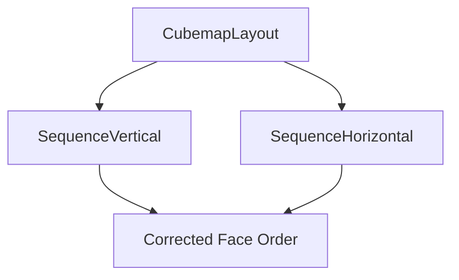

+++
title = "#19964 fix a couple typos in CubemapLayout"
date = "2025-07-05T00:00:00"
draft = false
template = "pull_request_page.html"
in_search_index = true

[taxonomies]
list_display = ["show"]

[extra]
current_language = "en"
available_languages = {"en" = { name = "English", url = "/pull_request/bevy/2025-07/pr-19964-en-20250705" }, "zh-cn" = { name = "中文", url = "/pull_request/bevy/2025-07/pr-19964-zh-cn-20250705" }}
labels = ["A-Rendering"]
+++

# Analysis of PR #19964: fix a couple typos in CubemapLayout

## Basic Information
- **Title**: fix a couple typos in CubemapLayout
- **PR Link**: https://github.com/bevyengine/bevy/pull/19964
- **Author**: atlv24
- **Status**: MERGED
- **Labels**: A-Rendering, S-Needs-Review
- **Created**: 2025-07-05T16:21:13Z
- **Merged**: 2025-07-05T17:24:55Z
- **Merged By**: superdump

## Description Translation
# Objective

- Rob pointed out a couple typos in #19960 (i just did a copy paste, but the original had an issue)

## Solution

- Fix

## The Story of This Pull Request

This PR addresses two documentation typos in the `CubemapLayout` enum within Bevy's camera primitives. The issue was identified during code review of a previous PR (#19960) where Rob noticed incorrect cube face labels in the layout documentation. 

The `CubemapLayout` enum defines how cube map textures are arranged in memory, which is critical for correct rendering operations. The documentation includes ASCII diagrams showing the expected face order for different layouts. Two of these diagrams contained errors: the vertical sequence layout showed `-y` twice instead of `-x`, and the horizontal sequence layout had `-y` instead of `-x`.

These typos originated from a copy-paste error in a previous implementation. While they didn't affect runtime behavior since they were only in comments, incorrect documentation can mislead developers working with cube maps and cause confusion during debugging. 

The solution was straightforward: correct the face labels in both documentation comments. The vertical sequence layout now correctly lists `-x` as the second face, and the horizontal sequence layout shows the proper `-x` face instead of an incorrect `-y` reference.

This change maintains consistency with other cube map representations in the codebase and ensures developers can trust the documentation when working with cube map layouts. The fix was minimal but important for preventing future confusion.

## Visual Representation



## Key Files Changed

### `crates/bevy_camera/src/primitives.rs`
This file contains definitions for camera-related primitives, including the `CubemapLayout` enum that describes how cube map faces are arranged in texture memory.

**Changes:**
1. Corrected the face order in the `SequenceVertical` variant's documentation
2. Fixed the face list in the `SequenceHorizontal` variant's documentation

**Code Diff:**
```rust
// File: crates/bevy_camera/src/primitives.rs
// Before:
pub enum CubemapLayout {
    /// layout in a vertical sequence
    /// ```text
    ///   +x
    ///   -y
    ///   +y
    ///   -y
    ///   -z
    ///   +z
    /// ```
    SequenceVertical = 2,
    /// layout in a horizontal sequence
    /// ```text
    /// +x -y +y -y -z +z
    /// ```
    SequenceHorizontal = 3,
}

// After:
pub enum CubemapLayout {
    /// layout in a vertical sequence
    /// ```text
    ///   +x
    ///   -x
    ///   +y
    ///   -y
    ///   -z
    ///   +z
    /// ```
    SequenceVertical = 2,
    /// layout in a horizontal sequence
    /// ```text
    /// +x -x +y -y -z +z
    /// ```
    SequenceHorizontal = 3,
}
```

## Further Reading
- [Cube Mapping Concepts](https://en.wikipedia.org/wiki/Cube_mapping)
- [Bevy Rendering Documentation](https://bevyengine.org/learn/book/getting-started/rendering/)
- [Texture Mapping Techniques](https://learnopengl.com/Advanced-OpenGL/Cubemaps)