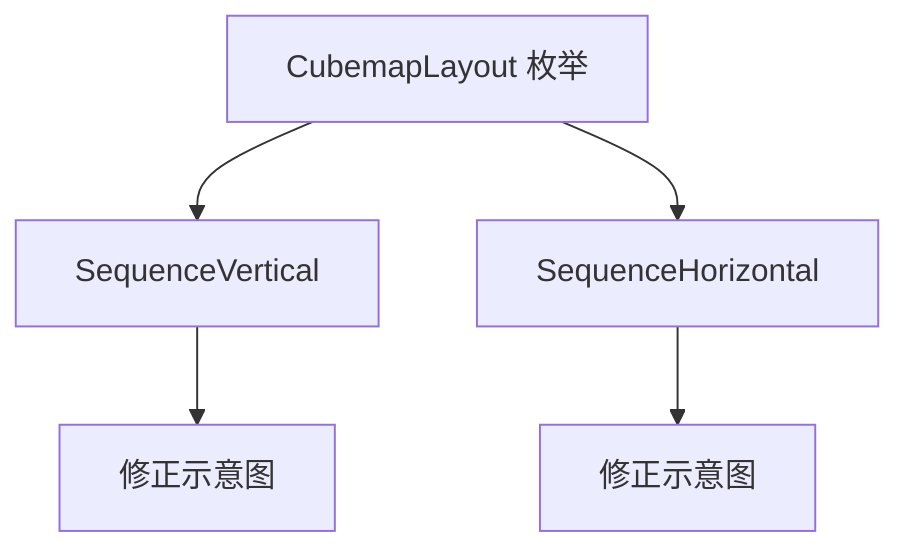

+++
title = "#19964 fix a couple typos in CubemapLayout"
date = "2025-07-05T00:00:00"
draft = false
template = "pull_request_page.html"
in_search_index = false

[extra]
current_language = "zh-cn"
available_languages = {"en" = { name = "English", url = "/pull_request/bevy/2025-07/pr-19964-en-20250705" }, "zh-cn" = { name = "中文", url = "/pull_request/bevy/2025-07/pr-19964-zh-cn-20250705" }}
+++

# 修复 CubemapLayout 中的几个拼写错误 (fix a couple typos in CubemapLayout)

## 基本信息
- **标题**: fix a couple typos in CubemapLayout
- **PR链接**: https://github.com/bevyengine/bevy/pull/19964
- **作者**: atlv24
- **状态**: 已合并
- **标签**: A-Rendering, S-Needs-Review
- **创建时间**: 2025-07-05T16:21:13Z
- **合并时间**: 2025-07-05T17:24:55Z
- **合并者**: superdump

## 描述翻译
# Objective

- Rob 在 #19960 中指出几个拼写错误（我复制粘贴时保留了原问题）

## Solution

- 修复

## 本次PR的故事

这个PR起源于对#19960的代码审查过程。在合并该PR后，开发者Rob发现CubemapLayout枚举的文档注释中存在两处拼写错误。这些错误不是新引入的，而是来自原始实现的复制粘贴，但之前未被注意到。

问题出现在描述立方体贴图布局的ASCII示意图中。在垂直序列布局(SequenceVertical)的示意图里，第二行错误地使用了"-y"而不是"-x"。类似地，在水平序列布局(SequenceHorizontal)中，示意图错误地使用了"-y"而不是"-x"。

```rust
// 错误示例：
SequenceVertical:
  +x
  -y  // 应该是 -x
  +y
  -y
  -z
  +z

SequenceHorizontal:
+x -y +y -y -z +z  // 应该是 +x -x +y -y -z +z
```

这些错误虽然看似微小，但在图形编程中具有实际影响。立方体贴图(cubemap)的六个面（+x, -x, +y, -y, +z, -z）需要准确定义，因为：
1. 渲染管线依赖这些方向正确匹配纹理坐标
2. 开发者需要准确文档来理解内存布局
3. 错误布局可能导致纹理采样错误或视觉伪影

解决方案直接明了：将两处"-y"修正为"-x"。这个修改不需要架构变更或复杂逻辑，但能确保文档准确反映实际布局约定。

## 可视化表示



## 关键文件修改

### `crates/bevy_camera/src/primitives.rs`
该文件包含定义相机相关原始类型(primitives)的代码，包括立方体贴图布局枚举。

**修改前:**
```rust
pub enum CubemapLayout {
    /// layout in a vertical sequence
    /// ```text
    ///   +x
    ///   -y
    ///   +y
    ///   -y
    ///   -z
    ///   +z
    /// ```
    SequenceVertical = 2,
    /// layout in a horizontal sequence
    /// ```text
    /// +x -y +y -y -z +z
    /// ```
    SequenceHorizontal = 3,
}
```

**修改后:**
```rust
pub enum CubemapLayout {
    /// layout in a vertical sequence
    /// ```text
    ///   +x
    ///   -x
    ///   +y
    ///   -y
    ///   -z
    ///   +z
    /// ```
    SequenceVertical = 2,
    /// layout in a horizontal sequence
    /// ```text
    /// +x -x +y -y -z +z
    /// ```
    SequenceHorizontal = 3,
}
```

修改点：
1. 将SequenceVertical的第二行从"-y"改为"-x"
2. 将SequenceHorizontal中的第二个元素从"-y"改为"-x"

## 进一步阅读
- [OpenGL立方体贴图规范](https://www.khronos.org/opengl/wiki/Cubemap_Texture) - 标准立方体贴图方向定义
- [Bevy渲染管线文档](https://bevyengine.org/learn/book/introduction/) - Bevy渲染系统概述
- 原始PR #19960 - 引入这些布局的初始实现

## 完整代码差异
```diff
diff --git a/crates/bevy_camera/src/primitives.rs b/crates/bevy_camera/src/primitives.rs
index 127a2d9c29e1a..32bb557b93774 100644
--- a/crates/bevy_camera/src/primitives.rs
+++ b/crates/bevy_camera/src/primitives.rs
@@ -442,7 +442,7 @@ pub enum CubemapLayout {
     /// layout in a vertical sequence
     /// ```text
     ///   +x
-    ///   -y
+    ///   -x
     ///   +y
     ///   -y
     ///   -z
@@ -451,7 +451,7 @@ pub enum CubemapLayout {
     SequenceVertical = 2,
     /// layout in a horizontal sequence
     /// ```text
-    /// +x -y +y -y -z +z
+    /// +x -x +y -y -z +z
     /// ```
     SequenceHorizontal = 3,
 }
```