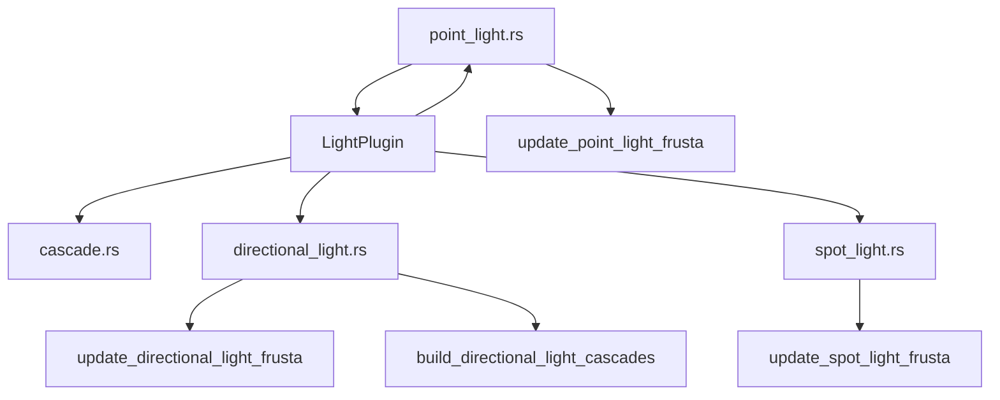

+++
title = "#19965 prepare bevy_light for split"
date = "2025-07-06T00:00:00"
draft = false
template = "pull_request_page.html"
in_search_index = true

[taxonomies]
list_display = ["show"]

[extra]
current_language = "en"
available_languages = {"en" = { name = "English", url = "/pull_request/bevy/2025-07/pr-19965-en-20250706" }, "zh-cn" = { name = "中文", url = "/pull_request/bevy/2025-07/pr-19965-zh-cn-20250706" }}
labels = ["A-Rendering"]
+++

# Analysis of PR #19965: prepare bevy_light for split

## Basic Information
- **Title**: prepare bevy_light for split
- **PR Link**: https://github.com/bevyengine/bevy/pull/19965
- **Author**: atlv24
- **Status**: MERGED
- **Labels**: A-Rendering, S-Needs-Review
- **Created**: 2025-07-05T17:49:22Z
- **Merged**: 2025-07-06T04:30:58Z
- **Merged By**: superdump

## Description Translation
# Objective

- prepare bevy_light for split

## Solution

- extract cascade module (this is not strictly necessary for bevy_light)
- clean up imports to be less globby and tangled
- move light specific stuff into light modules
- move light system and type init from pbr into new LightPlugin

## Testing

- 3d_scene, lighting

NOTE TO REVIEWERS: it may help to review commits independently.

## The Story of This Pull Request

This PR prepares the light rendering systems for extraction into a separate `bevy_light` crate. The changes focus on reorganizing existing light-related code to reduce coupling and improve modularity. The core problem being solved is the tight integration between light systems and the main PBR pipeline, which makes future extraction difficult.

The solution involves several structural changes. First, the cascade shadow mapping implementation was extracted from `light/mod.rs` into a dedicated `cascade.rs` module. While not strictly required for the split, this separation improves code organization and reduces file size. The cascade implementation remains functionally identical but is now more self-contained.

Second, the PR cleans up import statements throughout the light modules. Previously, many files used glob imports (`use super::*`) which made dependencies unclear. The changes replace these with explicit imports, improving readability and making module boundaries clearer.

Third, light-specific resources and systems were moved into their respective type modules. For example:
- `PointLightShadowMap` and its update system moved to `point_light.rs`
- `DirectionalLightShadowMap` and its update system moved to `directional_light.rs`
- Frustum update systems for spot lights moved to `spot_light.rs`

The most significant change is the introduction of `LightPlugin`, which consolidates light-related initialization that was previously handled directly in `PbrPlugin`. This new plugin now registers:
- All light component types (PointLight, DirectionalLight, SpotLight)
- Light-related resources (AmbientLight, DirectionalLightShadowMap, etc.)
- Light systems (frustum updates, cascade building, visibility checks)

The system scheduling was moved from `PbrPlugin` to `LightPlugin` but maintains the same execution order. The light systems run in the same sets (`SimulationLightSystems`) with identical dependencies and ordering constraints.

Testing was performed using existing 3D scenes and lighting examples to ensure no functional regressions. The changes are purely organizational and don't modify rendering behavior.

## Visual Representation



## Key Files Changed

### 1. crates/bevy_pbr/src/lib.rs (+3/-91)
Central PBR plugin file modified to use new LightPlugin
```rust
// Before:
// ... light type registrations ...
.register_type::<AmbientLight>()
.register_type::<CascadeShadowConfig>()
// ... more light types ...

// ... light resource initializations ...
.init_resource::<AmbientLight>()
.init_resource::<DirectionalLightShadowMap>()
.init_resource::<PointLightShadowMap>()

// ... light systems ...
.add_systems(PostUpdate, (
    update_directional_light_frusta,
    update_point_light_frusta,
    // ... other light systems ...
))

// After:
// Replaced with:
.add_plugins((
    // ... other plugins ...
    LightPlugin,
    // ... other plugins ...
))
```

### 2. crates/bevy_pbr/src/light/mod.rs (+108/-519)
Light module now houses the LightPlugin
```rust
// New LightPlugin definition
pub struct LightPlugin;

impl Plugin for LightPlugin {
    fn build(&self, app: &mut App) {
        app.register_type::<AmbientLight>()
          .register_type::<CascadeShadowConfig>()
          // ... other type registrations ...
          .init_resource::<AmbientLight>()
          .init_resource::<DirectionalLightShadowMap>()
          .init_resource::<PointLightShadowMap>()
          // ... system configurations ...
          .add_systems(PostUpdate, (
              update_directional_light_frusta,
              update_point_light_frusta,
              // ... other light systems ...
          ));
    }
}
```

### 3. crates/bevy_pbr/src/light/cascade.rs (+333/-0)
New module for cascade shadow implementation
```rust
pub struct CascadeShadowConfig { /* ... */ }
pub struct CascadeShadowConfigBuilder { /* ... */ }
pub struct Cascades { /* ... */ }
pub struct Cascade { /* ... */ }

pub fn clear_directional_light_cascades(/* ... */) { /* ... */ }
pub fn build_directional_light_cascades(/* ... */) { /* ... */ }
```

### 4. crates/bevy_pbr/src/light/point_light.rs (+97/-5)
Point light module now contains shadow map resource
```rust
// Added resource definition
#[derive(Resource, Clone, Debug, Reflect)]
pub struct PointLightShadowMap {
    pub size: usize,
}

// Added frustum update system
pub fn update_point_light_frusta(/* ... */) { /* ... */ }
```

### 5. crates/bevy_pbr/src/light/directional_light.rs (+76/-3)
Directional light module now contains shadow map resource
```rust
// Added resource definition
#[derive(Resource, Clone, Debug, Reflect)]
pub struct DirectionalLightShadowMap {
    pub size: usize,
}

// Added frustum update system
pub fn update_directional_light_frusta(/* ... */) { /* ... */ }
```

## Further Reading
- [Bevy Plugin System Documentation](https://bevyengine.org/learn/book/getting-started/plugins/)
- [ECS System Scheduling](https://bevyengine.org/learn/book/getting-started/ecs/#system-scheduling)
- [Modular Programming in Rust](https://doc.rust-lang.org/book/ch07-02-defining-modules-to-control-scope-and-privacy.html)