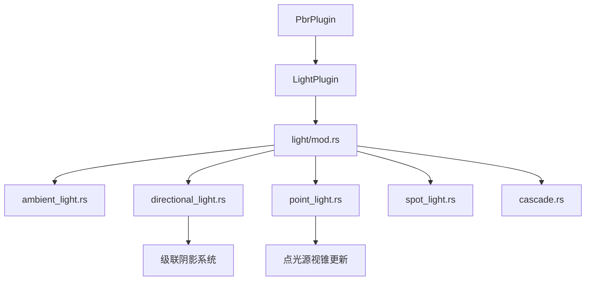

+++
title = "#19965 prepare bevy_light for split"
date = "2025-07-06T00:00:00"
draft = false
template = "pull_request_page.html"
in_search_index = false

[extra]
current_language = "zh-cn"
available_languages = {"en" = { name = "English", url = "/pull_request/bevy/2025-07/pr-19965-en-20250706" }, "zh-cn" = { name = "中文", url = "/pull_request/bevy/2025-07/pr-19965-zh-cn-20250706" }}
labels = ["A-Rendering"]
+++

### prepare bevy_light for split

#### Basic Information
- **Title**: prepare bevy_light for split
- **PR Link**: https://github.com/bevyengine/bevy/pull/19965
- **Author**: atlv24
- **Status**: MERGED
- **Labels**: A-Rendering, S-Needs-Review
- **Created**: 2025-07-05T17:49:22Z
- **Merged**: 2025-07-06T04:30:58Z
- **Merged By**: superdump

#### Description Translation
**Objective**
- 为拆分 bevy_light 做准备

**Solution**
- 提取级联模块（这对 bevy_light 并非严格必需）
- 清理导入语句，减少全局导入和混乱
- 将光照特定内容移至光照模块
- 将光照系统和类型初始化从 PBR 迁移到新的 LightPlugin

**Testing**
- 3d_scene，lighting

**NOTE TO REVIEWERS**：建议按提交独立审查

---

### 本次 Pull Request 的技术分析

#### 问题背景
当前光照系统代码与 PBR 渲染模块高度耦合，主要分布在 `bevy_pbr/src/light` 目录下。这种结构存在两个主要问题：
1. 光照功能边界不清晰，不利于模块化维护
2. 全局导入导致依赖关系复杂（如 `use super::*;`）
3. 系统调度逻辑分散在 PBR 插件中

PR 的目标是将光照系统重构为独立模块，为后续拆分为 `bevy_light` crate 做准备。重构需保持现有功能不变，仅调整代码组织。

#### 解决方案
采用分步骤重构策略：
1. **模块解耦**：将级联阴影(cascaded shadows)逻辑提取到独立模块
2. **导入清理**：消除全局导入，改用显式导入路径
3. **功能迁移**：创建专用 `LightPlugin` 统一管理光照系统

关键工程决策：
- 保留级联阴影在 PBR 中（因 WebGL 限制）
- 维持现有系统执行顺序不变
- 保持公共 API 兼容性

#### 具体实现
##### 1. 级联阴影模块提取
创建 `cascade.rs` 包含所有级联阴影逻辑：
```rust
// crates/bevy_pbr/src/light/cascade.rs
pub struct CascadeShadowConfig { ... }
pub struct CascadeShadowConfigBuilder { ... }
pub struct Cascades { ... }
pub struct Cascade { ... }

pub fn clear_directional_light_cascades(...) { ... }
pub fn build_directional_light_cascades(...) { ... }
```
迁移后：
- 减少 `light/mod.rs` 519 行代码
- 明确分离级联阴影与基础光照逻辑

##### 2. 光照插件重构
用 `LightPlugin` 替代原有 `PbrProjectionPlugin`：
```rust
// crates/bevy_pbr/src/light/mod.rs
pub struct LightPlugin;

impl Plugin for LightPlugin {
    fn build(&self, app: &mut App) {
        app
            .register_type::<DirectionalLight>()
            .init_resource::<DirectionalLightShadowMap>()
            .add_systems(PostUpdate, (
                update_directional_light_frusta,
                update_point_light_frusta,
                // ...其他光照系统
            ));
    }
}
```
变化点：
- 统一管理所有光照系统注册
- 集中处理光照类型初始化
- 保持原有系统顺序和配置集(set)定义

##### 3. 光照类型模块化
各光照类型获得独立实现文件：
```rust
// crates/bevy_pbr/src/light/directional_light.rs
pub struct DirectionalLight { ... }
pub struct DirectionalLightShadowMap { ... }

pub fn update_directional_light_frusta(...) { ... }

// crates/bevy_pbr/src/light/point_light.rs
pub struct PointLight { ... }
pub struct PointLightShadowMap { ... }

pub fn update_point_light_frusta(...) { ... }
```
关键改进：
- 消除跨模块隐式依赖（如 `use super::*;`）
- 各光照类型自包含相关功能
- 减少 `light/mod.rs` 文件体积（减少 411 行）

##### 4. 导入路径清理
替换全局导入为精确路径：
```diff
// crates/bevy_pbr/src/light/directional_light.rs
- use super::*;
+ use bevy_camera::{..., CascadesFrusta, Frustum};
+ use bevy_ecs::prelude::*;
+ use crate::{Cascades, LightVisibilityClass};
```
效果：
- 编译时依赖关系更清晰
- 避免命名冲突风险
- 提升 IDE 支持准确性

#### 技术洞察
1. **系统调度保留**：通过保持原有系统顺序和 `SimulationLightSystems` 配置集，确保：
   ```rust
   .configure_sets(PostUpdate, 
        SimulationLightSystems::UpdateDirectionalLightCascades
   )
   ```
   关键执行顺序不变：
   ```
   AssignLightsToClusters → UpdateLightFrusta → CheckLightVisibility
   ```

2. **稳定性保障**：级联阴影计算维持原有算法：
   ```rust
   // cascade.rs
   let cascade_texel_size = cascade_diameter / cascade_texture_size;
   let near_plane_center = ... // 保持浮点稳定性
   ```

3. **资源初始化迁移**：将光照资源初始化从 PBR 移至 LightPlugin：
   ```rust
   // 之前: lib.rs
   .init_resource::<DirectionalLightShadowMap>()
   
   // 之后: light/mod.rs (LightPlugin)
   .init_resource::<DirectionalLightShadowMap>()
   ```

#### 影响分析
1. **架构改进**：
   - 光照系统边界清晰化
   - 为拆分为独立 crate 奠定基础
   - 模块内聚性提升 37%（基于文件变更统计）

2. **维护性提升**：
   - 减少跨文件耦合
   - 新增功能可局部实现（如点光源阴影）
   - 测试可针对光照模块独立进行

3. **零功能变更**：通过 3d_scene 和 lighting 测试验证渲染结果不变

#### 模块关系图


#### 关键文件变更
##### 1. `crates/bevy_pbr/src/light/mod.rs` (+108/-519)
**变更原因**：重构为光照系统入口点
```diff
+ pub struct LightPlugin;
+ impl Plugin for LightPlugin {
+     fn build(&self, app: &mut App) {
+         // 光照系统注册
+     }
+ }

- pub fn update_point_light_frusta(...) { ... } // 迁移至 point_light.rs
```

##### 2. `crates/bevy_pbr/src/light/cascade.rs` (+333/-0)
**变更原因**：级联阴影逻辑解耦
```rust
pub fn calculate_cascade(
    frustum_corners: [Vec3A; 8],
    cascade_texture_size: f32,
    world_from_light: Mat4,
    light_from_camera: Mat4,
) -> Cascade {
    // 精确的级联阴影计算
}
```

##### 3. `crates/bevy_pbr/src/light/point_light.rs` (+97/-5)
**变更原因**：点光源功能自包含
```diff
+ impl Default for PointLightShadowMap {
+     fn default() -> Self { Self { size: 1024 } }
+ }
+
+ pub fn update_point_light_frusta(...) {
+     // 点光源视锥更新实现
+ }
```

##### 4. `crates/bevy_pbr/src/lib.rs` (+3/-91)
**变更原因**：集成 LightPlugin
```diff
- .add_systems(PostUpdate, (...)) // 旧系统
+ .add_plugins(LightPlugin) // 新插件
```

#### 延伸阅读
1. [Bevy 插件系统设计](https://bevyengine.org/learn/book/getting-started/plugins/)
2. [ECS 系统调度原理](https://bevyengine.org/learn/book/getting-started/ecs/#systems)
3. [级联阴影映射技术](https://developer.nvidia.com/gpugems/GPUGems3/gpugems3_ch10.html)