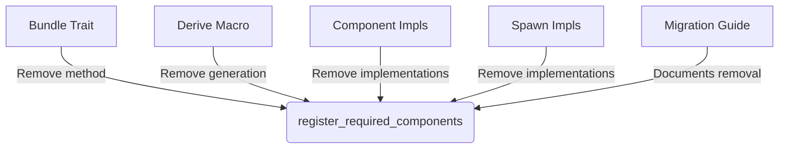

+++
title = "#19967 Removal of Unused `Bundle::register_required_components` Method"
date = "2025-07-06T00:00:00"
draft = false
template = "pull_request_page.html"
in_search_index = true

[taxonomies]
list_display = ["show"]

[extra]
current_language = "en"
available_languages = {"en" = { name = "English", url = "/pull_request/bevy/2025-07/pr-19967-en-20250706" }, "zh-cn" = { name = "中文", url = "/pull_request/bevy/2025-07/pr-19967-zh-cn-20250706" }}
labels = ["D-Trivial", "A-ECS", "C-Code-Quality"]
+++

### Title: Removal of Unused `Bundle::register_required_components` Method

## Basic Information
- **Title**: Remove `Bundle::register_required_components`
- **PR Link**: https://github.com/bevyengine/bevy/pull/19967
- **Author**: SkiFire13
- **Status**: MERGED
- **Labels**: D-Trivial, A-ECS, C-Code-Quality, S-Ready-For-Final-Review, M-Needs-Migration-Guide
- **Created**: 2025-07-05T18:31:25Z
- **Merged**: 2025-07-06T18:35:30Z
- **Merged By**: alice-i-cecile

## Description Translation
# Objective

- `Bundle::register_required_components` is not used anywhere, let's remove it

## The Story of This Pull Request

During routine code maintenance, the Bevy team identified that the `register_required_components` method in the `Bundle` trait had no active callers in the codebase. This method was originally intended to register component dependencies during ECS initialization, but the actual ECS implementation never invoked it. Since unused code adds maintenance overhead and potential for confusion, the decision was made to remove it entirely.

The removal process was straightforward since the method wasn't referenced anywhere. The implementation involved deleting:
1. The method declaration from the `Bundle` trait definition
2. All existing implementations of the method across different bundle types
3. The code generation logic in the bundle derive macro

This cleanup simplifies the Bundle trait contract and reduces cognitive load for developers working with Bevy's ECS. The change is backward-compatible since the method was never functional, but a migration guide was added to document the removal for anyone who might have implemented the method in their own code.

## Visual Representation



## Key Files Changed

### `crates/bevy_ecs/src/bundle.rs`
Removed the unused method from the Bundle trait and its implementations.

```rust
// Before:
pub unsafe trait Bundle: DynamicBundle + Send + Sync + 'static {
    // ...
    fn register_required_components(
        _components: &mut ComponentsRegistrator,
        _required_components: &mut RequiredComponents,
    );
}

// After:
pub unsafe trait Bundle: DynamicBundle + Send + Sync + 'static {
    // ... (method removed)
}
```

### `crates/bevy_ecs/macros/src/lib.rs`
Removed the method generation from the bundle derive macro.

```rust
// Before:
pub fn derive_bundle(input: TokenStream) -> TokenStream {
    // ...
    quote! {
        unsafe impl #impl_generics #ecs_path::bundle::Bundle for #struct_name #ty_generics #where_clause {
            // ...
            fn register_required_components(/* ... */) { /* ... */ }
        }
    }
}

// After:
pub fn derive_bundle(input: TokenStream) -> TokenStream {
    // ... (method generation removed)
}
```

### `crates/bevy_ecs/src/spawn.rs`
Removed method implementations from spawn-related bundles.

```rust
// Before:
unsafe impl<R: Relationship, L: SpawnableList<R> + Send + Sync + 'static> Bundle 
    for SpawnRelatedBundle<R, L> 
{
    fn register_required_components(/* ... */) { /* ... */ }
}

// After:
unsafe impl<R: Relationship, L: SpawnableList<R> + Send + Sync + 'static> Bundle 
    for SpawnRelatedBundle<R, L> 
{
    // ... (method removed)
}
```

### `release-content/migration-guides/remove_bundle_register_required_components.md`
Added migration documentation.

```markdown
---
title: Remove Bundle::register_required_components
pull_requests: [19967]
---

This method was effectively dead-code as it was never used by the ECS to compute required components, hence it was removed. If you were overriding its implementation you can just remove it, as it never did anything. If you were using it in any other way, please open an issue.
```

## Further Reading
- [Bevy ECS Documentation](https://bevyengine.org/learn/book/ecs/)
- [Rust Dead Code Detection](https://doc.rust-lang.org/rustc/lints/listing/warn-by-default.html#dead-code)
- [Component Registration in ECS](https://en.wikipedia.org/wiki/Entity_component_system#Component)

## Full Code Diff
<details>
<summary>View full diff</summary>

```diff
diff --git a/crates/bevy_ecs/macros/src/lib.rs b/crates/bevy_ecs/macros/src/lib.rs
index 20f7ad42756af..7b388f4a1446a 100644
--- a/crates/bevy_ecs/macros/src/lib.rs
+++ b/crates/bevy_ecs/macros/src/lib.rs
@@ -159,13 +159,6 @@ pub fn derive_bundle(input: TokenStream) -> TokenStream {
             ) {
                 #(<#active_field_types as #ecs_path::bundle::Bundle>::get_component_ids(components, &mut *ids);)*
             }
-
-            fn register_required_components(
-                components: &mut #ecs_path::component::ComponentsRegistrator,
-                required_components: &mut #ecs_path::component::RequiredComponents
-            ) {
-                #(<#active_field_types as #ecs_path::bundle::Bundle>::register_required_components(components, required_components);)*
-            }
         }
     };
 
diff --git a/crates/bevy_ecs/src/bundle.rs b/crates/bevy_ecs/src/bundle.rs
index 8efdc60ad9345..78948f81b1d5e 100644
--- a/crates/bevy_ecs/src/bundle.rs
+++ b/crates/bevy_ecs/src/bundle.rs
@@ -207,12 +207,6 @@ pub unsafe trait Bundle: DynamicBundle + Send + Sync + 'static {
 
     /// Gets this [`Bundle`]'s component ids. This will be [`None`] if the component has not been registered.
     fn get_component_ids(components: &Components, ids: &mut impl FnMut(Option<ComponentId>));
-
-    /// Registers components that are required by the components in this [`Bundle`].
-    fn register_required_components(
-        _components: &mut ComponentsRegistrator,
-        _required_components: &mut RequiredComponents,
-    );
 }
 
 /// Creates a [`Bundle`] by taking it from internal storage.
@@ -279,20 +273,6 @@ unsafe impl<C: Component> Bundle for C {
         ids(components.register_component::<C>());
     }
 
-    fn register_required_components(
-        components: &mut ComponentsRegistrator,
-        required_components: &mut RequiredComponents,
-    ) {
-        let component_id = components.register_component::<C>();
-        <C as Component>::register_required_components(
-            component_id,
-            components,
-            required_components,
-            0,
-            &mut Vec::new(),
-        );
-    }
-
     fn get_component_ids(components: &Components, ids: &mut impl FnMut(Option<ComponentId>)) {
         ids(components.get_id(TypeId::of::<C>()));
     }
@@ -347,13 +327,6 @@ macro_rules! tuple_impl {
             fn get_component_ids(components: &Components, ids: &mut impl FnMut(Option<ComponentId>)){
                 $(<$name as Bundle>::get_component_ids(components, ids);)*
             }
-
-            fn register_required_components(
-                components: &mut ComponentsRegistrator,
-                required_components: &mut RequiredComponents,
-            ) {
-                $(<$name as Bundle>::register_required_components(components, required_components);)*
-            }
         }
 
         #[expect(
diff --git a/crates/bevy_ecs/src/spawn.rs b/crates/bevy_ecs/src/spawn.rs
index 0c30c14b9cc54..8e1a0192220c5 100644
--- a/crates/bevy_ecs/src/spawn.rs
+++ b/crates/bevy_ecs/src/spawn.rs
@@ -199,16 +199,6 @@ unsafe impl<R: Relationship, L: SpawnableList<R> + Send + Sync + 'static> Bundle
     ) {
         <R::RelationshipTarget as Bundle>::get_component_ids(components, ids);
     }
-
-    fn register_required_components(
-        components: &mut crate::component::ComponentsRegistrator,
-        required_components: &mut crate::component::RequiredComponents,
-    ) {
-        <R::RelationshipTarget as Bundle>::register_required_components(
-            components,
-            required_components,
-        );
-    }
 }
 
 impl<R: Relationship, L: SpawnableList<R>> DynamicBundle for SpawnRelatedBundle<R, L> {
@@ -267,16 +257,6 @@ unsafe impl<R: Relationship, B: Bundle> Bundle for SpawnOneRelated<R, B> {
     ) {
         <R::RelationshipTarget as Bundle>::get_component_ids(components, ids);
     }
-
-    fn register_required_components(
-        components: &mut crate::component::ComponentsRegistrator,
-        required_components: &mut crate::component::RequiredComponents,
-    ) {
-        <R::RelationshipTarget as Bundle>::register_required_components(
-            components,
-            required_components,
-        );
-    }
 }
 
 /// [`RelationshipTarget`] methods that create a [`Bundle`] with a [`DynamicBundle::Effect`] that:
diff --git a/release-content/migration-guides/remove_bundle_register_required_components.md b/release-content/migration-guides/remove_bundle_register_required_components.md
new file mode 100644
index 0000000000000..87b65d7a911c8
--- /dev/null
+++ b/release-content/migration-guides/remove_bundle_register_required_components.md
@@ -0,0 +1,6 @@
+---
+title: Remove Bundle::register_required_components
+pull_requests: [19967]
+---
+
+This method was effectively dead-code as it was never used by the ECS to compute required components, hence it was removed. if you were overriding its implementation you can just remove it, as it never did anything. If you were using it in any other way, please open an issue.
```
</details>