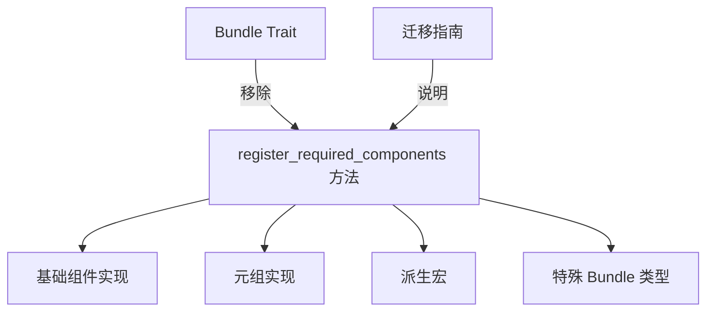

+++
title = "#19967 Remove `Bundle::register_required_components`"
date = "2025-07-06T00:00:00"
draft = false
template = "pull_request_page.html"
in_search_index = false

[extra]
current_language = "zh-cn"
available_languages = {"en" = { name = "English", url = "/pull_request/bevy/2025-07/pr-19967-en-20250706" }, "zh-cn" = { name = "中文", url = "/pull_request/bevy/2025-07/pr-19967-zh-cn-20250706" }}
labels = ["D-Trivial", "A-ECS", "C-Code-Quality"]
+++

# Remove `Bundle::register_required_components`

## Basic Information
- **Title**: Remove `Bundle::register_required_components`
- **PR Link**: https://github.com/bevyengine/bevy/pull/19967
- **Author**: SkiFire13
- **Status**: MERGED
- **Labels**: D-Trivial, A-ECS, C-Code-Quality, S-Ready-For-Final-Review, M-Needs-Migration-Guide
- **Created**: 2025-07-05T18:31:25Z
- **Merged**: 2025-07-06T18:35:30Z
- **Merged By**: alice-i-cecile

## Description Translation
# Objective

- `Bundle::register_required_components` 没有被使用，所以移除它

## The Story of This Pull Request

在 Bevy 的 ECS 实现中，`Bundle` trait 定义了一个方法 `register_required_components`，用于注册组件依赖关系。这个方法最初是为了处理组件注册时的依赖关系而设计的，但在实际实现中，ECS 系统从未调用过这个方法。经过代码审查，开发者发现该方法在整个代码库中没有任何调用点，变成了完全未使用的死代码。

死代码的存在会增加代码维护的复杂性，可能误导开发者认为这个方法有实际作用，并在未来重构中产生不必要的困惑。因此，开发者决定将其移除以简化代码结构。

解决方案是直接删除该方法及其所有实现。由于该方法从未被调用，移除操作不会影响现有功能。具体修改包括：
1. 从 `Bundle` trait 中移除方法声明
2. 删除所有 `Bundle` 实现中的具体方法定义
3. 更新 `derive(Bundle)` 宏不再生成该方法
4. 添加迁移指南说明该变更

在实现上，开发者系统性地移除了四个文件中的相关代码：
- `bundle.rs`：移除 trait 声明和基础实现
- `spawn.rs`：移除特殊 Bundle 类型的实现
- `lib.rs`（宏）：修改派生宏
- 新增迁移指南文档

迁移指南明确指出该方法从未被使用，开发者如果自定义了实现可以直接删除。如果发现任何非常规使用场景，建议提交 issue 报告。

该 PR 被标记为 trivial（D-Trivial）和代码质量改进（C-Code-Quality），因为它移除了未使用的代码而未改变功能。ECS 团队快速审查后合并了该变更，认为它能减少代码维护负担并简化 Bundle trait 的接口。

## Visual Representation



## Key Files Changed

### 1. `crates/bevy_ecs/src/bundle.rs`
**修改说明**：从 Bundle trait 中移除 register_required_components 方法，并删除其在基础组件和元组实现中的代码

```rust
// Before:
pub unsafe trait Bundle: DynamicBundle + Send + Sync + 'static {
    fn register_required_components(
        _components: &mut ComponentsRegistrator,
        _required_components: &mut RequiredComponents,
    );
}

unsafe impl<C: Component> Bundle for C {
    fn register_required_components(
        components: &mut ComponentsRegistrator,
        required_components: &mut RequiredComponents,
    ) {
        // Implementation details
    }
}

macro_rules! tuple_impl {
    ($($name: ident),*) => {
        unsafe impl<$($name: Bundle),*> Bundle for ($($name,)*) {
            fn register_required_components(
                components: &mut ComponentsRegistrator,
                required_components: &mut RequiredComponents,
            ) {
                $(<$name as Bundle>::register_required_components(components, required_components);)*
            }
        }
    }
}
```

```rust
// After:
pub unsafe trait Bundle: DynamicBundle + Send + Sync + 'static {
    // register_required_components 方法被移除
}

unsafe impl<C: Component> Bundle for C {
    // register_required_components 实现被移除
}

macro_rules! tuple_impl {
    ($($name: ident),*) => {
        unsafe impl<$($name: Bundle),*> Bundle for ($($name,)*) {
            // register_required_components 实现被移除
        }
    }
}
```

### 2. `crates/bevy_ecs/src/spawn.rs`
**修改说明**：从 SpawnRelatedBundle 和 SpawnOneRelated 的 Bundle 实现中移除该方法

```rust
// Before:
unsafe impl<R: Relationship, L: SpawnableList<R> + Send + Sync + 'static> Bundle for SpawnRelatedBundle<R, L> {
    fn register_required_components(
        components: &mut crate::component::ComponentsRegistrator,
        required_components: &mut crate::component::RequiredComponents,
    ) {
        // Implementation
    }
}

unsafe impl<R: Relationship, B: Bundle> Bundle for SpawnOneRelated<R, B> {
    fn register_required_components(
        components: &mut crate::component::ComponentsRegistrator,
        required_components: &mut crate::component::RequiredComponents,
    ) {
        // Implementation
    }
}
```

```rust
// After:
// register_required_components 方法实现被完全移除
```

### 3. `crates/bevy_ecs/macros/src/lib.rs`
**修改说明**：修改 derive(Bundle) 宏不再生成 register_required_components 方法

```rust
// Before:
fn register_required_components(
    components: &mut #ecs_path::component::ComponentsRegistrator,
    required_components: &mut #ecs_path::component::RequiredComponents
) {
    #(<#active_field_types as #ecs_path::bundle::Bundle>::register_required_components(components, required_components);)*
}
```

```rust
// After:
// 整个 register_required_components 方法生成代码被移除
```

### 4. `release-content/migration-guides/remove_bundle_register_required_components.md`
**修改说明**：新增迁移指南解释该变更

```markdown
---
title: Remove Bundle::register_required_components
pull_requests: [19967]
---

This method was effectively dead-code as it was never used by the ECS to compute required components, hence it was removed. if you were overriding its implementation you can just remove it, as it never did anything. If you were using it in any other way, please open an issue.
```

## Further Reading
1. [Bevy ECS Bundle 文档](https://bevyengine.org/learn/book/ecs/bundles/)
2. [Rust 死代码检测 (unused_code lint)](https://doc.rust-lang.org/rustc/lints/listing/warn-by-default.html#unused-code)
3. [PR 讨论与审查历史](https://github.com/bevyengine/bevy/pull/19967)