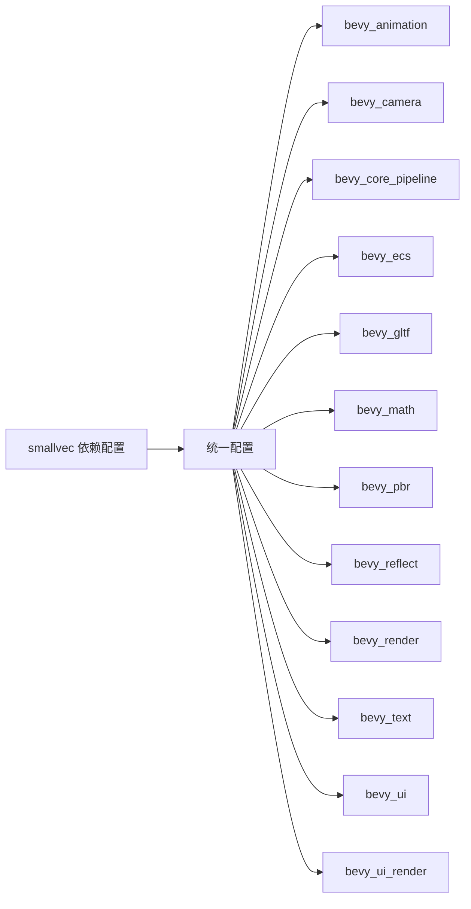

+++
title = "#19972 consistently dont use smallvec default features"
date = "2025-07-06T00:00:00"
draft = false
template = "pull_request_page.html"
in_search_index = false

[extra]
current_language = "zh-cn"
available_languages = {"en" = { name = "English", url = "/pull_request/bevy/2025-07/pr-19972-en-20250706" }, "zh-cn" = { name = "中文", url = "/pull_request/bevy/2025-07/pr-19972-zh-cn-20250706" }}
labels = ["D-Trivial", "C-Dependencies", "A-Cross-Cutting"]
+++

# consistently dont use smallvec default features

## Basic Information
- **Title**: consistently dont use smallvec default features
- **PR Link**: https://github.com/bevyengine/bevy/pull/19972
- **Author**: atlv24
- **Status**: MERGED
- **Labels**: D-Trivial, C-Dependencies, S-Ready-For-Final-Review, A-Cross-Cutting
- **Created**: 2025-07-05T21:26:20Z
- **Merged**: 2025-07-06T04:45:17Z
- **Merged By**: alice-i-cecile

## Description Translation
### 目标
- 某些 crate 为 smallvec 禁用了默认特性(default features false)，但其他没有。实际我们并不需要它们

### 解决方案
- 移除默认特性

### 测试
- 3d_scene

## The Story of This Pull Request

开发人员在审查依赖项时注意到，项目中多个 crate 对 smallvec 库的使用存在不一致：部分 crate 明确禁用了默认特性(default-features = false)，而其他 crate 则使用了默认特性。经过分析，确认这些 crate 都不需要 smallvec 的默认特性。

smallvec 是一个优化小数组存储的库，其默认特性可能包含一些可选功能。禁用不需要的特性可以减少编译时间、降低最终二进制大小，并避免引入不必要的依赖。在性能敏感场景如游戏引擎中，这些优化尤其重要。

解决方案是统一所有 crate 的 smallvec 依赖配置，显式禁用默认特性。修改涉及 12 个 crate 的 Cargo.toml 文件，将 smallvec 依赖从简单版本声明改为特性控制声明。例如在 bevy_animation 中：
```toml
# 修改前
smallvec = "1"

# 修改后
smallvec = { version = "1", default-features = false }
```

某些 crate 如 bevy_camera 需要保留特定特性(features = ["const_new"])，修改时保留了这些特性声明：
```toml
# 修改前
smallvec = { version = "1.11", features = ["const_new"] }

# 修改后
smallvec = { version = "1", default-features = false, features = ["const_new"] }
```

在 bevy_ecs 中，除了禁用默认特性，还保持了原有的联合(union)和常量泛型(const_generics)特性：
```toml
smallvec = { version = "1", default-features = false, features = [
  "union",
  "const_generics",
] }
```

修改后所有 crate 都统一禁用了 smallvec 的默认特性。测试通过运行 3d_scene 示例验证，确保核心功能不受影响。这些变更减少了潜在的不必要代码引入，保持了依赖配置的一致性，为后续维护提供了清晰标准。

## Visual Representation



## Key Files Changed

### crates/bevy_ecs/Cargo.toml
修改前 smallvec 启用默认特性和额外特性，修改后显式禁用默认特性：
```toml
# 修改前:
smallvec = { version = "1", features = ["union", "const_generics"] }

# 修改后:
smallvec = { version = "1", default-features = false, features = [
  "union",
  "const_generics",
] }
```

### crates/bevy_animation/Cargo.toml
从简单版本声明改为禁用默认特性的声明：
```toml
# 修改前:
smallvec = "1"

# 修改后:
smallvec = { version = "1", default-features = false }
```

### crates/bevy_camera/Cargo.toml
保留 const_new 特性同时禁用默认特性：
```toml
# 修改前:
smallvec = { version = "1.11", features = ["const_new"] }

# 修改后:
smallvec = { version = "1", default-features = false, features = ["const_new"] }
```

### crates/bevy_core_pipeline/Cargo.toml
从简单声明改为禁用默认特性：
```toml
# 修改前:
smallvec = "1"

# 修改后:
smallvec = { version = "1", default-features = false }
```

### crates/bevy_gltf/Cargo.toml
从带版本号的声明改为禁用默认特性：
```toml
# 修改前:
smallvec = "1.11"

# 修改后:
smallvec = { version = "1", default-features = false }
```

## Further Reading
1. [Smallvec 官方文档](https://docs.rs/smallvec/latest/smallvec/) - 了解特性配置和性能特性
2. [Cargo 特性指南](https://doc.rust-lang.org/cargo/reference/features.html) - 掌握依赖管理最佳实践
3. [Rust 二进制优化技巧](https://github.com/johnthagen/min-sized-rust) - 减小二进制体积的方法