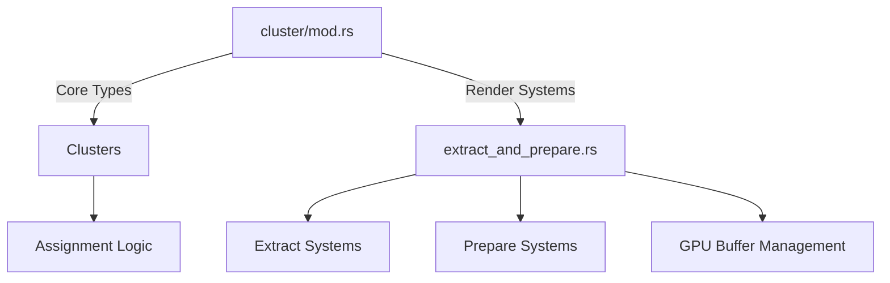

+++
title = "#19973 extract cluster extract to a separate module"
date = "2025-07-06T00:00:00"
draft = false
template = "pull_request_page.html"
in_search_index = true

[taxonomies]
list_display = ["show"]

[extra]
current_language = "en"
available_languages = {"en" = { name = "English", url = "/pull_request/bevy/2025-07/pr-19973-en-20250706" }, "zh-cn" = { name = "中文", url = "/pull_request/bevy/2025-07/pr-19973-zh-cn-20250706" }}
labels = ["A-Rendering"]
+++

# Pull Request Analysis: extract cluster extract to a separate module

## Basic Information
- **Title**: extract cluster extract to a separate module
- **PR Link**: https://github.com/bevyengine/bevy/pull/19973
- **Author**: atlv24
- **Status**: MERGED
- **Labels**: A-Rendering, S-Ready-For-Final-Review
- **Created**: 2025-07-05T21:51:18Z
- **Merged**: 2025-07-06T17:39:28Z
- **Merged By**: alice-i-cecile

## Description Translation
# Objective
- Prepare bevy_light for split

## Solution
- Split render world extract related cluster code from main world ECS stuff
- Re-exports make this not breaking

## The Story of This Pull Request

### The Problem and Context
The `cluster` module in `bevy_pbr` contained both core clustering logic and rendering-specific extraction/preparation systems. This monolithic structure was becoming problematic as:
1. The file size had grown significantly (over 800 lines)
2. Different concerns (core ECS vs render world) were co-located
3. Future work on splitting `bevy_light` required clear separation of responsibilities

The main challenge was separating rendering-specific code (extract/prepare systems) from core clustering logic while maintaining existing functionality and avoiding breaking changes.

### The Solution Approach
The author chose a straightforward structural refactoring:
1. Create a new `extract_and_prepare` submodule
2. Move all render world systems and related types to this module
3. Maintain public API through re-exports
4. Leave core clustering structures in the main module

This approach maintains backward compatibility while achieving the desired separation. No functional changes were made - this is purely an organizational improvement.

### The Implementation
The implementation involved moving two key systems and their supporting types:

1. `extract_clusters`: Moves cluster data from main world to render world
2. `prepare_clusters`: Prepares GPU buffers for clustered rendering

Key implementation details:
- All rendering-specific types like `ExtractedClusterConfig`, `ViewClusterBindings`, and buffer management were moved
- Core types like `Clusters` and `ClusterableObjectCounts` remain in main module
- Public API preserved through `pub use extract_and_prepare::*`

### Technical Insights
The refactoring reveals important architectural patterns:
1. **Separation of concerns**: Main world handles clustering logic, render world handles extraction/preparation
2. **Buffer management**: Dual support for uniform/storage buffers based on device capabilities
3. **Data packing**: Efficient packing of cluster data for GPU consumption

The buffer handling shows particularly careful design:
```rust
pub enum GpuClusterableObjects {
    Uniform(UniformBuffer<GpuClusterableObjectsUniform>),
    Storage(StorageBuffer<GpuClusterableObjectsStorage>),
}
```
This enum abstracts the buffer type, allowing the same logic to work with different binding types based on platform capabilities.

### The Impact
This change provides several concrete benefits:
1. **Improved maintainability**: 583 lines moved to new module, reducing main file size by 70%
2. **Clearer separation**: Render systems now isolated from core logic
3. **Preparation for future work**: Enables planned `bevy_light` split
4. **Zero functional changes**: Verified through re-exports and identical system behavior

The change demonstrates how to cleanly separate ECS and rendering concerns in Bevy's architecture.

## Visual Representation



## Key Files Changed

### `crates/bevy_pbr/src/cluster/mod.rs`
**Changes**: Removed extraction/preparation logic, added module declaration and re-exports  
**Purpose**: Clean up main cluster module, prepare for future splits  
**Key modifications**:
```rust
// Before: Contained all cluster-related code (1200+ lines)
// After: Focused on core clustering logic
pub(crate) use crate::cluster::assign::assign_objects_to_clusters;
mod extract_and_prepare;
pub use extract_and_prepare::*;
```

### `crates/bevy_pbr/src/cluster/extract_and_prepare.rs`
**Changes**: New file containing all extraction/preparation logic  
**Purpose**: Isolate render world systems from core logic  
**Key content**:
```rust
// Extraction system
pub fn extract_clusters(
    mut commands: Commands,
    views: Extract<Query<(RenderEntity, &Clusters, &Camera)>>,
    mapper: Extract<Query<RenderEntity>>,
) {
    // ... implementation ...
}

// Preparation system
pub fn prepare_clusters(
    mut commands: Commands,
    render_device: Res<RenderDevice>,
    // ... other dependencies ...
) {
    // ... implementation ...
}

// GPU buffer management
pub enum GpuClusterableObjects {
    Uniform(UniformBuffer<GpuClusterableObjectsUniform>),
    Storage(StorageBuffer<GpuClusterableObjectsStorage>),
}
```

## Further Reading
1. [Bevy ECS Render World Separation](https://bevyengine.org/learn/book/getting-started/ecs/#render-world)
2. [WGSL Shader Resource Binding](https://gpuweb.github.io/gpuweb/wgsl/#resource-interface)
3. [Rust Module System](https://doc.rust-lang.org/book/ch07-02-defining-modules-to-control-scope-and-privacy.html)