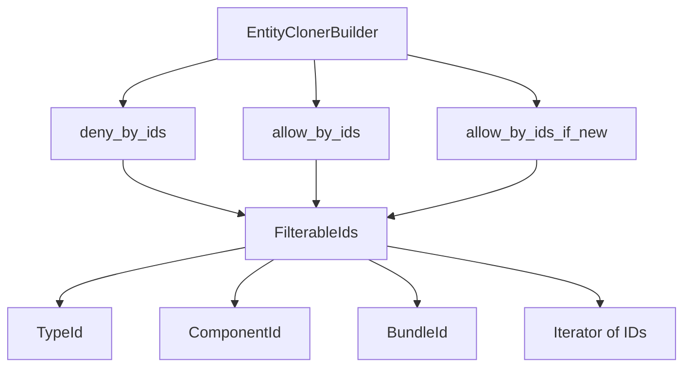

+++
title = "#19977 Unify filtering by id in `EntityClonerBuilder`"
date = "2025-07-07T00:00:00"
draft = false
template = "pull_request_page.html"
in_search_index = true

[taxonomies]
list_display = ["show"]

[extra]
current_language = "en"
available_languages = {"en" = { name = "English", url = "/pull_request/bevy/2025-07/pr-19977-en-20250707" }, "zh-cn" = { name = "中文", url = "/pull_request/bevy/2025-07/pr-19977-zh-cn-20250707" }}
labels = ["A-ECS", "C-Code-Quality", "C-Usability"]
+++

# Unify filtering by id in `EntityClonerBuilder`

## Basic Information
- **Title**: Unify filtering by id in `EntityClonerBuilder`
- **PR Link**: https://github.com/bevyengine/bevy/pull/19977
- **Author**: eugineerd
- **Status**: MERGED
- **Labels**: A-ECS, C-Code-Quality, C-Usability, S-Ready-For-Final-Review
- **Created**: 2025-07-06T13:03:19Z
- **Merged**: 2025-07-07T20:25:49Z
- **Merged By**: alice-i-cecile

## Description Translation
# Objective
#19649 introduced new `*_if_new` and `*_by_bundle_id_*` variations to `EntityClonerBuilder` filtering functionality, which resulted in increase in method permutations - there are now 8 allow variants to support various id types and 2 different insert modes.

## Solution
This PR introduces a new trait `FilterableIds` to unify all id types and their `IntoIterator` implementations, which is somewhat similar to `WorldEntityFetch`. It supports `TypeId`, `ComponentId` and `BundleId`, allowing us to reduce the number of `allow` methods to 4: `allow`, `allow_if_new`, `allow_by_ids`, `allow_by_ids_if_new`. The function signature is a bit less readable now, but the docs mention types that can be passed in.

## Testing
All existing tests pass, performance is unchanged.

## The Story of This Pull Request

### The Problem
PR #19649 expanded `EntityClonerBuilder`'s filtering capabilities by adding `*_if_new` and `*_by_bundle_id_*` method variants. This led to an explosion of method permutations: 8 variations for allowing components and 2 for denying. The API became difficult to maintain and use due to:
- Redundant methods handling different ID types (`TypeId`, `ComponentId`, `BundleId`)
- Duplicate logic across multiple method implementations
- Cognitive overhead for users navigating the API surface

### The Solution Approach
To simplify the API, we introduced a new trait `FilterableIds` that unifies handling of different ID types. The key design goals were:
1. Support all ID types (`TypeId`, `ComponentId`, `BundleId`) through a single interface
2. Handle both single values and iterators uniformly
3. Maintain backward compatibility with existing usage patterns
4. Avoid performance regressions

The solution draws inspiration from `WorldEntityFetch`'s approach to abstracting data access patterns. We used marker types to provide multiple blanket implementations of `FilterableIds` without conflicting with potential future `IntoIterator` implementations on primitive types.

### Implementation Details
The core change is the `FilterableIds` trait and its implementations:

```rust
mod private {
    pub enum FilterableId {
        Type(TypeId),
        Component(ComponentId),
        Bundle(BundleId),
    }
    
    pub trait FilterableIds<M: Marker> {
        fn filter_ids(self, ids: &mut impl FnMut(FilterableId));
    }
    
    // Implementation for iterators
    impl<I, T> FilterableIds<VectorType> for I {...}
    
    // Implementation for single values
    impl<T> FilterableIds<ScalarType> for T {...}
}
```

This trait allows us to refactor the filtering methods. For example, the deny methods were consolidated from three separate implementations into one:

```rust
// Before: Separate methods for different ID types
pub fn deny_by_bundle_id(&mut self, bundle_id: BundleId) -> &mut Self {...}
pub fn deny_by_ids(&mut self, ids: impl IntoIterator<Item = ComponentId>) -> &mut Self {...}
pub fn deny_by_type_ids(&mut self, ids: impl IntoIterator<Item = TypeId>) -> &mut Self {...}

// After: Unified method
pub fn deny_by_ids<M: Marker>(&mut self, ids: impl FilterableIds<M>) -> &mut Self {
    ids.filter_ids(&mut |id| match id {
        FilterableId::Type(type_id) => {...},
        FilterableId::Component(component_id) => {...},
        FilterableId::Bundle(bundle_id) => {...},
    });
    self
}
```

Similarly, the allow methods were refactored to use a shared helper function:

```rust
fn allow_by_ids_inner<M: Marker>(
    &mut self,
    ids: impl FilterableIds<M>,
    insert_mode: InsertMode,
) {
    ids.filter_ids(&mut |id| match id {
        ...
    });
}
```

The changes maintain all existing functionality while reducing:
- Allow method variants from 8 to 4
- Deny method variants from 4 to 2
- Total lines of code (-19 net change)

### Technical Insights
The implementation uses several Rust patterns effectively:
1. **Marker types** (`ScalarType`/`VectorType`) enable multiple blanket implementations
2. **Enum dispatch** handles different ID types uniformly
3. **Generic trait bounds** maintain flexibility for callers
4. **Inline attributes** ensure zero-cost abstraction

The `From` implementations for `FilterableId` allow ergonomic conversion from various ID types without explicit wrapping. The private module hides implementation details while exposing only the necessary public interface.

### Impact
These changes significantly improve the API by:
- Reducing method permutations by 50%
- Centralizing ID handling logic
- Maintaining identical performance characteristics
- Simplifying future maintenance
- Improving documentation clarity

The migration guide was updated to explain the new unified filtering approach, helping users transition to the simplified API.

## Visual Representation



## Key Files Changed

### `crates/bevy_ecs/src/entity/clone_entities.rs`
- Consolidated filtering methods using new `FilterableIds` trait
- Added trait implementations for unified ID handling
- Maintained all existing functionality with reduced code

**Key changes:**
```rust
// Before: Multiple specialized methods
pub fn deny_by_bundle_id(&mut self, bundle_id: BundleId) -> &mut Self {
    if let Some(bundle) = self.world.bundles().get(bundle_id) {
        let ids = bundle.explicit_components().iter();
        for &id in ids {
            self.filter.filter_deny(id, self.world);
        }
    }
    self
}

// After: Unified method using trait
pub fn deny_by_ids<M: Marker>(&mut self, ids: impl FilterableIds<M>) -> &mut Self {
    ids.filter_ids(&mut |id| match id {
        FilterableId::Bundle(bundle_id) => {
            if let Some(bundle) = self.world.bundles().get(bundle_id) {
                for &id in bundle.explicit_components() {
                    self.filter.filter_deny(id, self.world);
                }
            }
        }
        // Other variants omitted for brevity
    });
    self
}
```

### `release-content/migration-guides/entity_cloner_builder_split.md`
- Added documentation about unified ID filtering
- Explained the reduction in method permutations

**Key addition:**
```markdown
## Unified id filtering

Previously `EntityClonerBuilder` supported filtering by 2 types of ids: `ComponentId` and `TypeId`, the functions taking in `IntoIterator` for them.
Since now `EntityClonerBuilder` supports filtering by `BundleId` as well, the number of method variations would become a bit too unwieldy.
Instead, all id filtering methods were unified into generic `deny_by_ids/allow_by_ids(_if_new)` methods, which allow to filter components by
`TypeId`, `ComponentId`, `BundleId` and their `IntoIterator` variations.
```

## Further Reading
1. [Rust Trait Objects](https://doc.rust-lang.org/book/ch17-02-trait-objects.html) - Background on trait-based polymorphism
2. [Marker Pattern in Rust](https://rust-lang.github.io/api-guidelines/future-proofing.html) - Design pattern for multiple trait implementations
3. [Bevy ECS Documentation](https://bevyengine.org/learn/book/ecs/) - Core concepts behind Entity Component System