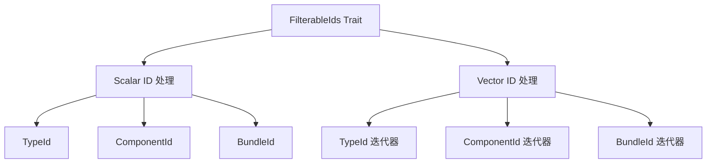

+++
title = "#19977 Unify filtering by id in `EntityClonerBuilder`"
date = "2025-07-07T00:00:00"
draft = false
template = "pull_request_page.html"
in_search_index = false

[extra]
current_language = "zh-cn"
available_languages = {"en" = { name = "English", url = "/pull_request/bevy/2025-07/pr-19977-en-20250707" }, "zh-cn" = { name = "中文", url = "/pull_request/bevy/2025-07/pr-19977-zh-cn-20250707" }}
labels = ["A-ECS", "C-Code-Quality", "C-Usability"]
+++

# Unify filtering by id in `EntityClonerBuilder`

## Basic Information
- **Title**: Unify filtering by id in `EntityClonerBuilder`
- **PR Link**: https://github.com/bevyengine/bevy/pull/19977
- **Author**: eugineerd
- **Status**: MERGED
- **Labels**: A-ECS, C-Code-Quality, C-Usability, S-Ready-For-Final-Review
- **Created**: 2025-07-06T13:03:19Z
- **Merged**: 2025-07-07T20:25:49Z
- **Merged By**: alice-i-cecile

## Description Translation
PR #19649 引入了 `EntityClonerBuilder` 的新方法 `*_if_new` 和 `*_by_bundle_id_*`，导致方法数量增加到 8 个（支持不同 ID 类型和插入模式）。本 PR 引入新 trait `FilterableIds` 统一处理 ID 类型（`TypeId`, `ComponentId`, `BundleId`），将方法减少到 4 个：`allow`, `allow_if_new`, `allow_by_ids`, `allow_by_ids_if_new`。函数签名可读性略有下降，但文档说明了可传入的类型。所有现有测试通过，性能无变化。

## The Story of This Pull Request

### 问题背景
在 PR #19649 引入 `BundleId` 支持后，`EntityClonerBuilder` 的过滤方法数量显著增加。原本需要为三种 ID 类型（`TypeId`, `ComponentId`, `BundleId`）分别实现 `allow` 和 `allow_if_new` 方法，导致：
- 8 个不同过滤方法（`allow_by_ids`, `allow_by_ids_if_new`, `allow_by_type_ids`, `allow_by_type_ids_if_new`, `allow_by_bundle_id`, `allow_by_bundle_id_if_new`, 以及两个泛型方法）
- 代码重复和维护成本增加
- API 表面复杂，用户学习曲线变陡

### 解决方案
引入 `FilterableIds` trait 统一处理所有 ID 类型，核心设计点：
1. 定义 `FilterableId` 枚举统一表示三种 ID 类型：
```rust
pub enum FilterableId {
    Type(TypeId),
    Component(ComponentId),
    Bundle(BundleId),
}
```
2. 使用 marker trait 技巧解决类型冲突：
```rust
pub trait FilterableIds<M: Marker> {
    fn filter_ids(self, ids: &mut impl FnMut(FilterableId));
}

// 为单个 ID 实现
impl<T> FilterableIds<ScalarType> for T where T: Into<FilterableId> {...}

// 为 ID 集合实现
impl<I, T> FilterableIds<VectorType> for I where I: IntoIterator<Item = T> {...}
```
3. 重构过滤方法使用统一接口：
```rust
pub fn allow_by_ids<M: Marker>(&mut self, ids: impl FilterableIds<M>) -> &mut Self {
    self.allow_by_ids_inner(ids, InsertMode::Replace);
    self
}
```

### 实现细节
主要改动集中在 `allow_by_ids` 和 `deny_by_ids` 方法：
1. 删除冗余方法：移除 `deny_by_bundle_id`, `allow_by_bundle_id`, `allow_by_type_ids` 等 6 个方法
2. 统一处理逻辑：通过模式匹配处理不同 ID 类型
```rust
ids.filter_ids(&mut |id| match id {
    FilterableId::Type(type_id) => {...}
    FilterableId::Component(component_id) => {...}
    FilterableId::Bundle(bundle_id) => {...}
});
```
3. 保持公共 API 兼容：原方法签名改为调用新统一接口
```rust
pub fn deny<T: Bundle>(&mut self) -> &mut Self {
    let bundle_id = self.world.register_bundle::<T>().id();
    self.deny_by_ids(bundle_id) // 调用统一接口
}
```

### 技术权衡
1. **类型系统技巧**：使用 marker trait (`ScalarType`/`VectorType`) 解决 blanket implementation 冲突
2. **性能考量**：闭包调用在 release 模式下会被内联，无额外开销
3. **API 设计**：牺牲少量签名可读性（需泛型参数），换取方法数量减半和扩展性

### 影响
1. **API 简化**：公共方法从 8 个减少到 4 个
2. **扩展性**：新增 ID 类型只需扩展 `FilterableId` 枚举
3. **维护性**：消除重复代码（约 100 行净减少）
4. **迁移路径**：通过文档说明新用法（见迁移指南更新）

## Visual Representation



## Key Files Changed

### crates/bevy_ecs/src/entity/clone_entities.rs (+120/-101)
重构 ID 过滤逻辑，引入统一处理机制：
```rust
// 删除多个专用方法，改为统一接口
- pub fn deny_by_bundle_id(&mut self, bundle_id: BundleId) -> &mut Self {...}
- pub fn allow_by_bundle_id(&mut self, bundle_id: BundleId) -> &mut Self {...}
- pub fn allow_by_type_ids(&mut self, ids: impl IntoIterator<Item = TypeId>) -> &mut Self {...}

// 新增统一处理实现
+ pub fn deny_by_ids<M: Marker>(&mut self, ids: impl FilterableIds<M>) -> &mut Self {
+     ids.filter_ids(&mut |ids| match ids {
+         FilterableId::Type(type_id) => {...}
+         FilterableId::Component(component_id) => {...}
+         FilterableId::Bundle(bundle_id) => {...}
+     });
+     self
+ }
```

### release-content/migration-guides/entity_cloner_builder_split.md (+10/-3)
更新迁移指南说明统一 ID 处理：
```markdown
+ ## Unified id filtering
+
+ Previously `EntityClonerBuilder` supported filtering by 2 types of ids...
+ Instead, all id filtering methods were unified into generic `deny_by_ids/allow_by_ids(_if_new)` methods...
```

## Further Reading
1. [Rust 泛型 trait 实现技巧](https://doc.rust-lang.org/book/ch19-03-advanced-traits.html)
2. [Bevy ECS 设计文档](https://bevyengine.org/learn/book/getting-started/ecs/)
3. [类型驱动 API 设计模式](https://rust-lang.github.io/api-guidelines/type-safety.html)