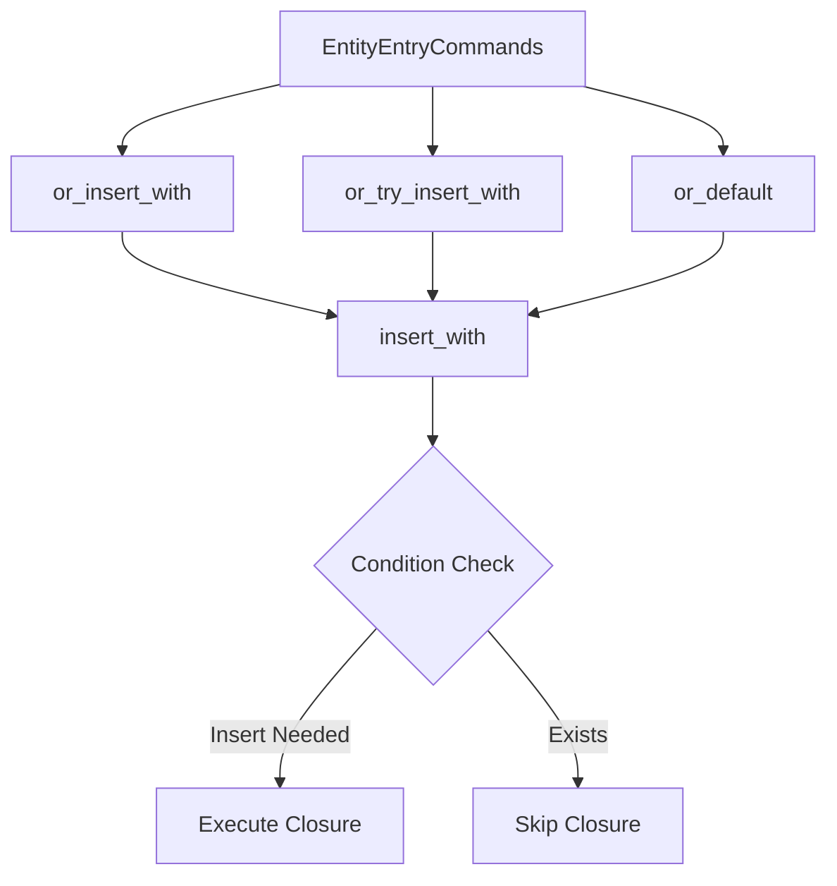

+++
title = "#19978 Avoid early function invocation in `EntityEntryCommands`"
date = "2025-07-07T00:00:00"
draft = false
template = "pull_request_page.html"
in_search_index = true

[taxonomies]
list_display = ["show"]

[extra]
current_language = "en"
available_languages = {"en" = { name = "English", url = "/pull_request/bevy/2025-07/pr-19978-en-20250707" }, "zh-cn" = { name = "中文", url = "/pull_request/bevy/2025-07/pr-19978-zh-cn-20250707" }}
labels = ["C-Bug", "A-ECS", "C-Performance", "D-Straightforward"]
+++

## Avoid early function invocation in `EntityEntryCommands`

### Basic Information
- **Title**: Avoid early function invocation in `EntityEntryCommands`
- **PR Link**: https://github.com/bevyengine/bevy/pull/19978
- **Author**: JaySpruce
- **Status**: MERGED
- **Labels**: C-Bug, A-ECS, C-Performance, S-Ready-For-Final-Review, D-Straightforward
- **Created**: 2025-07-06T13:36:16Z
- **Merged**: 2025-07-07T20:33:55Z
- **Merged By**: alice-i-cecile

### Description
Fixes #19884.

#### Solution
- Add an internal entity command `insert_with`, which takes a function returning a component and checks if the component would actually be inserted before invoking the function.
- Add the same check to `insert_from_world`, since it's a similar situation.
- Update the `or_insert_with`, `or_try_insert_with`, and `or_default` methods on `EntityEntryCommands` to use the new command.

Since the function/closure returning the component now needs to be sent into the command (rather than being invoked before the command is created), the function now has `Send + 'static` bounds. Pretty typical for command stuff, but I don't know how/if it'll affect existing users.

### The Story of This Pull Request

#### The Problem and Context
The issue (#19884) revealed a performance problem in Bevy's ECS commands system. When using methods like `EntityEntryCommands::or_insert_with`, the closure passed to generate the component was being executed immediately during command queueing, regardless of whether the component would actually be inserted. This was inefficient because:
1. For entities that already had the component, the closure executed unnecessarily
2. Computationally expensive component initialization would waste cycles
3. Side effects in closures would occur prematurely

The root cause was that closure execution happened before checking if the component already existed. This violated the principle of lazy evaluation that should optimize command execution.

#### The Solution Approach
The fix required deferring closure execution until command application time, while maintaining the existing insertion logic. The approach included:
1. Creating a new `insert_with` command that conditionally executes the closure
2. Modifying `insert_from_world` to use the same conditional check
3. Updating the `EntityEntryCommands` methods to use these optimized commands

The key engineering decision was to maintain the existing command queue architecture while adding the conditional execution guard. This ensured minimal disruption to existing systems while fixing the performance issue.

#### The Implementation
The core change introduces `insert_with`, which only executes the closure when necessary. The condition checks if we're in `InsertMode::Keep` and the component already exists:

```rust
#[track_caller]
pub fn insert_with<T: Component, F>(component_fn: F, mode: InsertMode) -> impl EntityCommand
where
    F: FnOnce() -> T + Send + 'static,
{
    let caller = MaybeLocation::caller();
    move |mut entity: EntityWorldMut| {
        if !(mode == InsertMode::Keep && entity.contains::<T>()) {
            let value = component_fn();
            entity.insert_with_caller(value, mode, caller, RelationshipHookMode::Run);
        }
    }
}
```

This same conditional logic was applied to `insert_from_world`:

```rust
#[track_caller]
pub fn insert_from_world<T: Component + FromWorld>(mode: InsertMode) -> impl EntityCommand {
    let caller = MaybeLocation::caller();
    move |mut entity: EntityWorldMut| {
        if !(mode == InsertMode::Keep && entity.contains::<T>()) {
            let value = entity.world_scope(|world| T::from_world(world));
            entity.insert_with_caller(value, mode, caller, RelationshipHookMode::Run);
        }
    }
}
```

The `EntityEntryCommands` methods were then refactored to use this new primitive:

```rust
pub fn or_insert_with<F>(&mut self, default: F) -> &mut Self
where
    F: FnOnce() -> T + Send + 'static,
{
    self.entity_commands
        .queue(entity_command::insert_with(default, InsertMode::Keep));
    self
}
```

This change required adding `Send + 'static` bounds to the closures, consistent with Bevy's command system requirements.

#### Technical Insights
The solution demonstrates several important ECS patterns:
1. **Lazy Evaluation**: Deferring expensive operations until absolutely necessary
2. **Command Composability**: Building complex commands from simpler primitives
3. **Entity Archetype Optimization**: Avoiding unnecessary component additions

The performance impact is most significant for:
- Commands used frequently in hot loops
- Components with expensive construction logic
- Systems where components often already exist

The closure bounds change (`Send + 'static`) is consistent with Bevy's command system design but might require minor adjustments in user code.

#### The Impact
This change:
1. Eliminates unnecessary computation for existing components
2. Prevents unexpected side effects from premature closure execution
3. Maintains backward compatibility through equivalent APIs
4. Adds explicit documentation about invocation guarantees

A test case was added to verify the optimized behavior:

```rust
commands
    .entity(entity)
    .entry::<W<u8>>()
    .or_insert_with(|| W(5))  // Executed
    .or_insert_with(|| unreachable!())  // Skipped
    .or_try_insert_with(|| unreachable!())  // Skipped
    .or_default()  // Skipped
    .or_from_world();  // Skipped
```

### Visual Representation



### Key Files Changed

1. **crates/bevy_ecs/src/system/commands/entity_command.rs** (+28/-2)
   - Added `insert_with` command with conditional execution
   - Modified `insert_from_world` to include conditional check

```rust
// Before:
pub fn insert_from_world<T: Component + FromWorld>(mode: InsertMode) -> impl EntityCommand {
    let caller = MaybeLocation::caller();
    move |mut entity: EntityWorldMut| {
        let value = entity.world_scope(|world| T::from_world(world));
        entity.insert_with_caller(value, mode, caller, RelationshipHookMode::Run);
    }
}

// After:
pub fn insert_from_world<T: Component + FromWorld>(mode: InsertMode) -> impl EntityCommand {
    let caller = MaybeLocation::caller();
    move |mut entity: EntityWorldMut| {
        if !(mode == InsertMode::Keep && entity.contains::<T>()) {
            let value = entity.world_scope(|world| T::from_world(world));
            entity.insert_with_caller(value, mode, caller, RelationshipHookMode::Run);
        }
    }
}
```

2. **crates/bevy_ecs/src/system/commands/mod.rs** (+40/-5)
   - Updated command methods to use new primitive
   - Added test case for verification

```rust
// Before:
pub fn or_insert_with(&mut self, default: impl Fn() -> T) -> &mut Self {
    self.or_insert(default())
}

// After:
pub fn or_insert_with<F>(&mut self, default: F) -> &mut Self
where
    F: FnOnce() -> T + Send + 'static,
{
    self.entity_commands
        .queue(entity_command::insert_with(default, InsertMode::Keep));
    self
}
```

3. **crates/bevy_ecs/src/relationship/mod.rs** (+1/-1)
   - Minor cleanup of closure capture

```rust
// Before:
.or_insert_with(|| {
    // ...
})

// After:
.or_insert_with(move || {
    // ...
})
```

### Further Reading
1. [Bevy Commands System Documentation](https://bevyengine.org/learn/book/next/ecs/commands/)
2. [Entity Component System Pattern](https://en.wikipedia.org/wiki/Entity_component_system)
3. [Rust Closure Traits](https://doc.rust-lang.org/book/ch13-01-closures.html)